Navigation Bar
=================

Here you can edit navigation bar settings for the Business Profile's Workspace. You can add different settings for the default navigation bar and for the navigation bar used in MS Teams. 

You can use several Mega Menu objects and several Action Menu objects, if needed.

When working with the layout, you can use all the sections and blocks that normally are available for pages, so the possibilities are almost endless. You can even add different layouts for different screen sizes, if needed, to fit for example both computer and mobile phone.

Home settings
***************
Here you can edit the settings for the link to the Workspace Home page. 

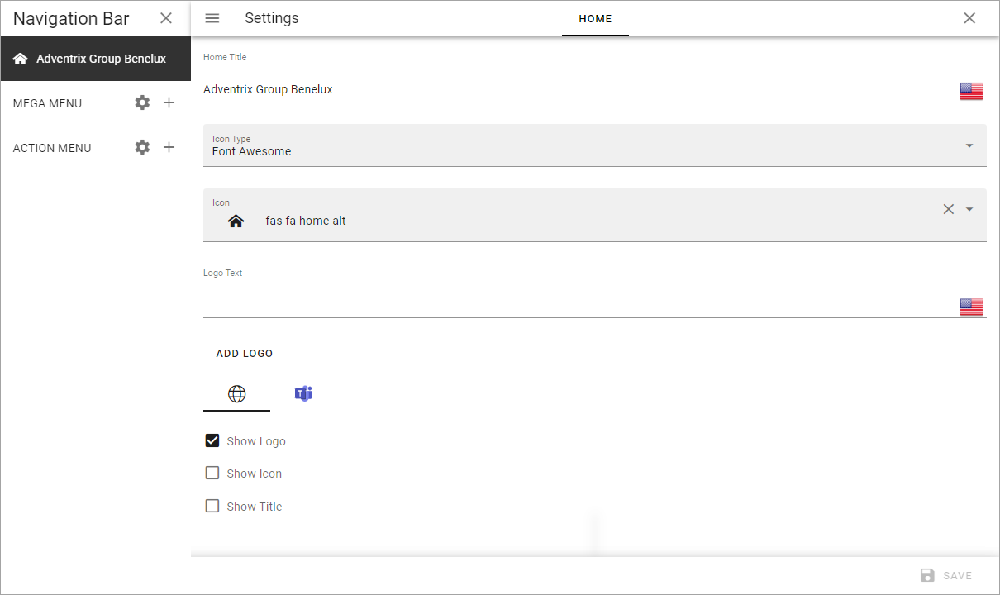

+ **Home Title**: If you would like to show a Home title, add it here, in any or all the tenant languages. Click the flag to change language. Then select "Show Title" below.
+ **Icon Type**: To show an icon, select Icon Type here. If you select "Custom" here, you can upload any image, using the Media Picker, to use as an icon. (If an Icon Type is seleted, but no icon is selected, no icon is shown).
+ **Icon**: To show an icon, select icon in the list. Then select "Show Icon" below.
+ **Logo Text**: If you would like to show a logo text by the Home title, add it here, in any or all the tenant languages. Click the flag to change language.
+ **Show Logo**: If a Logo should be displayed, select this option. Note that you use ADD LOGO to upload the logo, see below.
+ **Show Icon**: If an icon should be displayed, either an icon selected in the Icon list, or one you have uploaded, select this option.
+ **Show Title**: If the Home Title should be displayed, select this option.

Note the separate settings for the Home page in Microsoft Teams.

To add a Logo, do the following:

1. Click ADD LOGO.

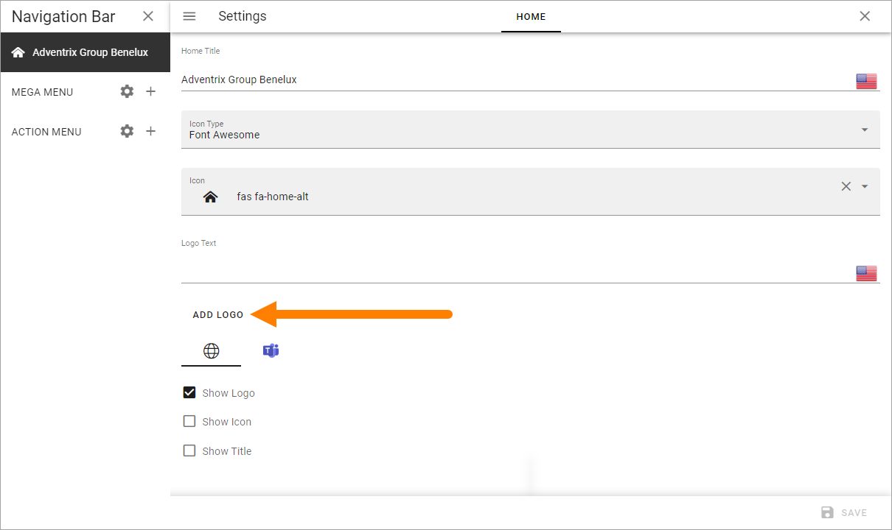

2. Use the Media Picker to find and select the image.

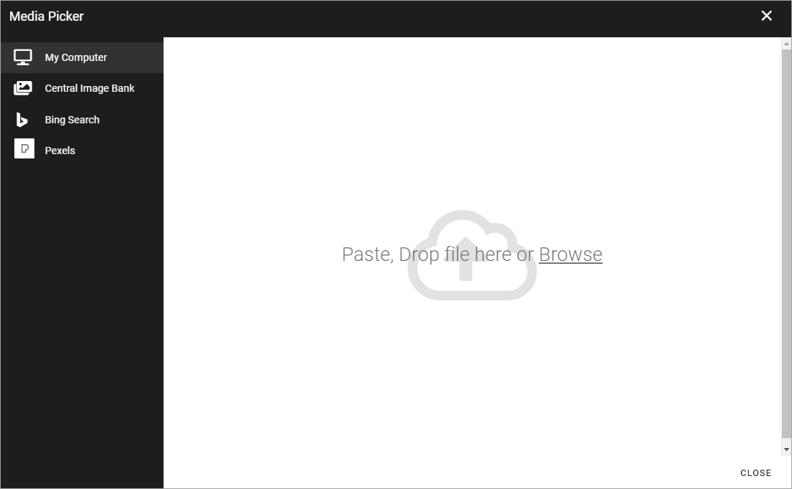

See this page for more information: :doc:`The Media Picker </general-assets/media-picker/index>`

Don't forget to save when you're done.

Mega Menu settings
************************
To open the Mega Menu settings, click the cog wheel:

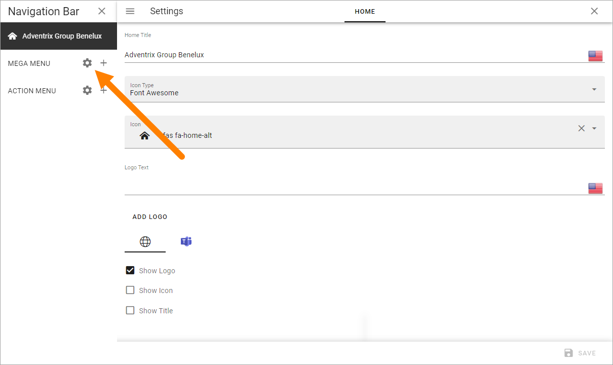

Separate settings are available for the default Mega Menu, and for the Mega Menu used in MS Teams.

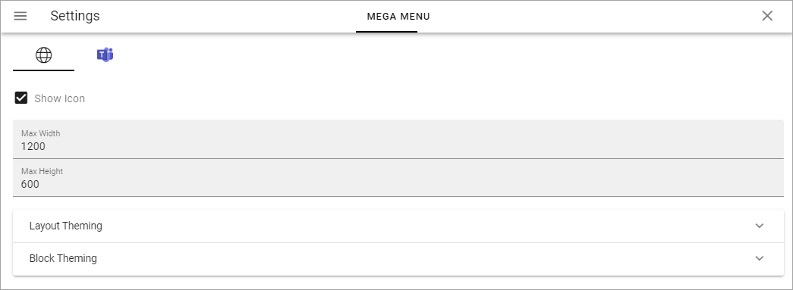

+ **Show Icon**: Select to show/hide navigation icons.
+ **Show Text**: Select to show/hide mavigation texts.
+ **Max Width**: You can set a maximum width in pixels for the navigation bar, if needed.
+ **Max Height**: You can set a maximum height in pixels for the navigation bar, if needed.
+ **Layout Theming**: If you would like to use custom settings for the layout, open this section and select "Custom Theme". 
+ **Block Theming**: If you would like to use custom settings for the layout, open this section and select "Custom Theme". 

Layout Theming are the same settings as are described here: :doc:`Layout Theming </general-assets/layout-explorer/page-layout/layout-theming/index>`

Block Theming are the same settings as are decsribed here: :doc:`Block Theming </general-assets/layout-explorer/page-layout/block-theming/index>`

See below for information on how to add Mega Menu objects.

Action Menu settings
**********************
To open the settings for the Action Menu, click the cog wheel:

.. image:: workplace-navigation-action-menu-settings-cogwheel-new.png

The following settings are available here, for the default Action Menu and for the Action Menu used in MS Teams (the Action Menu in MS Teams is not applicable in Omnia on-prem):

.. image:: workplace-navigation-settings-action-menu-new.png

+ **Show icon**: For the top action menu, showing an icon is default. If you add other action menus, you can choose to show icons or not.
+ **Show text**: For the top action menu, showing text is default. If you add other action menus, you can choose to show texts or not.
+ **Item Limit**: Set the number of items that should be listed before a "Show more" link is shown.

See below for information on how to add Action Menu objects.

Adding a Mega Menu object
***************************
To add a Mega Menu object, click the plus:

.. image:: mega-menu-add-new-plus.png

and choose to add a layout or create a link.

.. image:: mega-menu-add-new2.png

Create Layout
--------------
When you choose to create a Mega Menu layout, the following is shown:

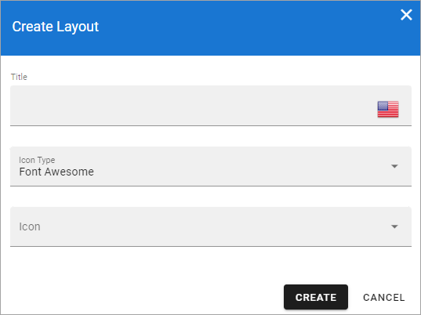

1. Add a title in any of the Tenant languages (click the flag to change language), and an icon if you like. 

What you add here is only shown in the list of mega menus, not shown for users.

2. Click "Create".
3. Create the Mega Menu layout by using sections and blocks available in Omnia.

For more information, see *Working with the layout* and *Saving a draft and publishing* below.

Create a link
---------------
You can create a Mega Menu link to anything you can link to, for example a page in Omnia or external functionality.

Set the following for the link:

.. image:: mega-menu-add-link-new.png

+ **Url**: Add the Url for the link here.
+ **Title**: Add a title in any of the Tenant languages here (click the flag to change language).
+ **Open link in new tab**: If the link should be opened in a new tab, select this option.
+ **Icon Type/Icon**: Add an icon for the link if you wish.

Mega Menu object settings
---------------------------
Some settings are available for each Mega Menu object, here:

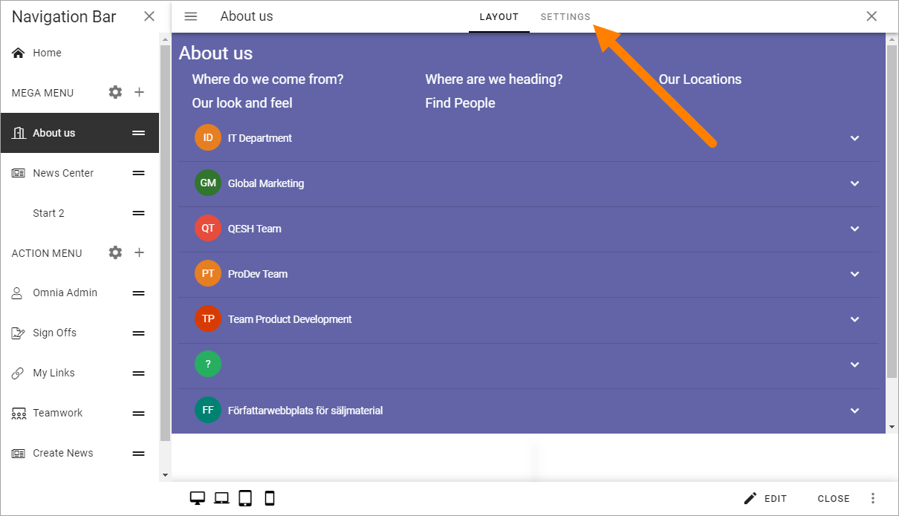

To edit them, click Edit:

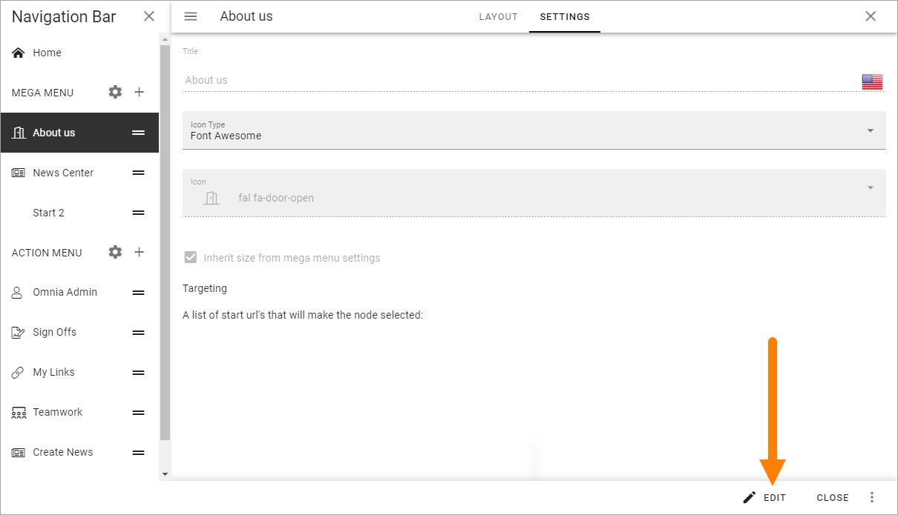

The follwing settings are then available:

.. image:: mega-menu-settings-edit.png

+ **Title**: You can edit the title for any of the languages. Click the flag to change language.
+ **Icon Type/Icon**: You can edit the settings for icon here.
+ **Inherit size from mega menu settings**: Per default, this object has the same size settings as the whole mega menu. If you want to set specific size settings for this object, deselect the option.
+ **Targeting**: Here you can set targeting for the mega menu object. See below for more information.
+ **A list of start Url's that will make the node selected**: This is a way of showing how different parts of the solution is connected. Any Url can make this node selected.

Here's an example:

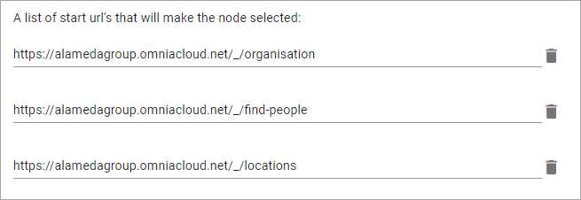

And here's how OUR ORGANIZATION is selected when any of these options is active:

.. image:: node-selected-selected.png

Target a Mega Menu object
-------------------------------
When the Mega Menu object is created you can add a targeting filter, meaning you can decide who this Mega Menu object will be available for.

1. Select the Mega Menu Object.
2. Open the settings (see above).
3. Click "Edit" if needed.
3. Add targeting filters.

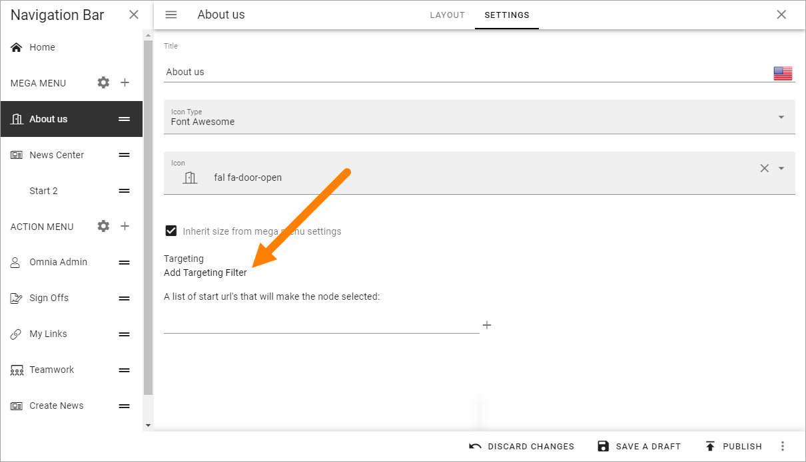

You do that the same way as for many other options in Omnia. See this page for more information: :doc:`Using targeting </general-assets/targeting-in-omnia/index>`

Adding an Action Menu object
******************************
The action menu can include almost any action available in Omnia. To add an Action Menu object, do the following:

1. Click the plus.

.. image:: action-menu-add-new.png

The following is shown:

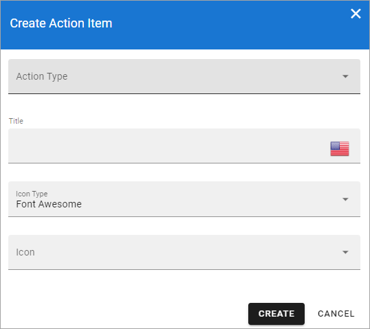

2. Add the settings.

+ **Action type**: Select action type from the list. Note that these actions are the same as can be added using an Action Button block.
+ **Title**: Add a title for the list here (not shown to users).
+ **Icon Type/Icon**: Add an icon if you wish, for this list (not shown for users).

Different fields are shown depending on Action Type selected. See this page for detailed information about those fields: :doc:`Action Button block </blocks/button-link/index>`

Action Menu object settings
-----------------------------
In the settings for an Action Menu object, you can edit the settings you used when adding the object:

.. image:: action-menu-settings.png

Target an Action Menu object
-------------------------------
When the Action Menu object is created you can add a targeting filter, meaning you can decide who this Action Menu object will be available for.

.. image:: action-menu-add-settings-targeting-new2.png

You do that the same way as for many other options in Omnia. See this page for more information: :doc:`Using targeting </general-assets/targeting-in-omnia/index>`

Edit the order
****************
If you have created several objects of one type, you can decide in what order these objects should be shown for users.

Use this icon and drag and drop the desired order:

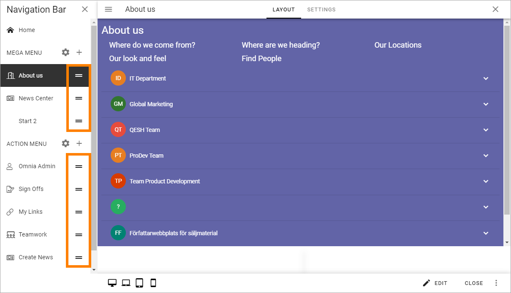

Working with the layout
*************************
You start your work with the layout by adding sections and blocks, the way this page describes: :doc:`Working with Layouts </general-assets/working-with-layouts/index>`

**A tip:** One way of creating a mega menu-like navigation is to use a Page Rollup, with scope "Navigation path" and "Navigation View".

Different layouts for different screen sizes
----------------------------------------------
In addition to the options desctobed above, you can add different layout for different screen sizes, if needed.

The default screen size is for computer screens. You can use the other screen sizes to check what the layout will look like in smaller sizes, and decide if specific layouts for other sizes are needed.

If you would like to add different layouts for one or more of the other scren sizes available, do the following:

1. Select Screen size.

.. image:: layout-screen-size-new.png

2. Open the list and select "Create new layout".

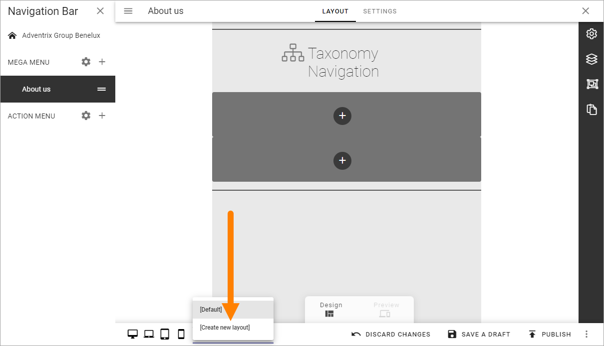

You work with the layout for the different screen sizes as described above.

