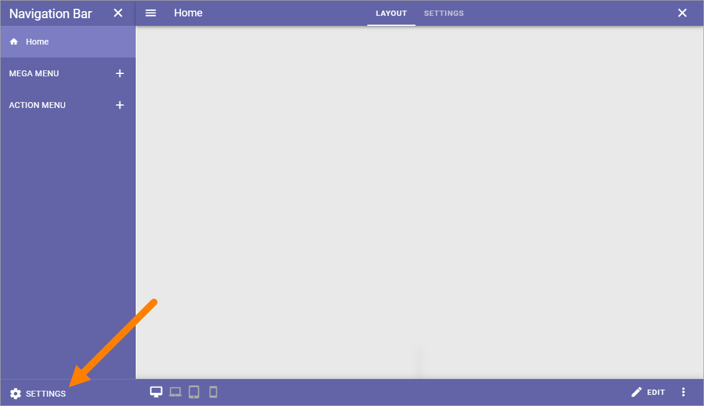
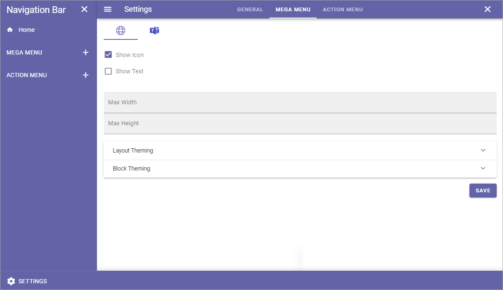
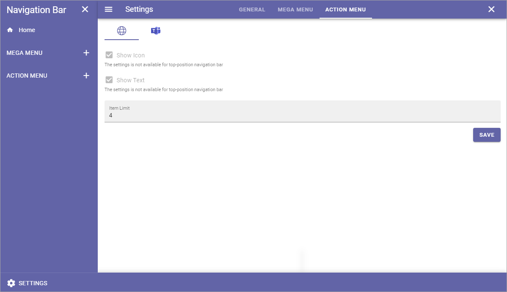
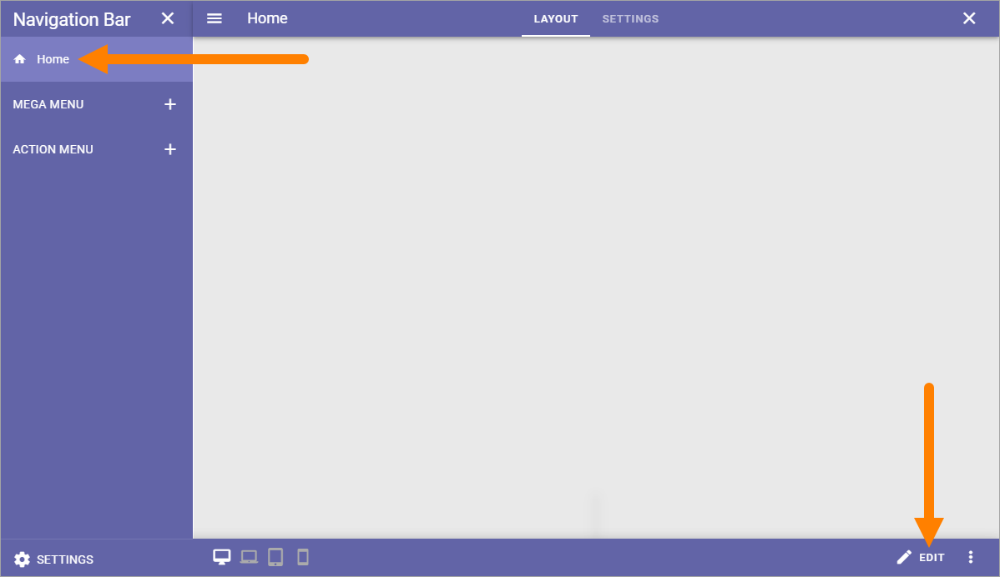
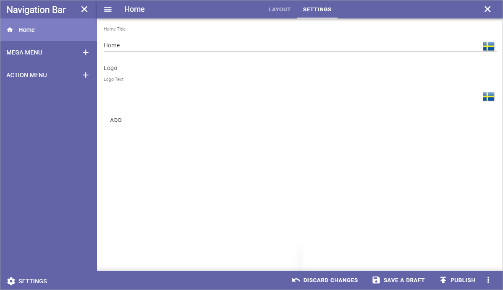

Navigation Bar
=================

This is an ongoing preliminary documentation for functionality to come in Omnia 6.5.

Here you can edit default navigation bar settings for Workplace.

.. image:: workplace-navigation-bar-new.png

Navigation Bar settings
************************
To open the settings, click SETTINGS in the lower left corner.

General
---------
Here you can set colors for the default navigationbar and for the navigation bar used in MS Teams.

.. image:: workplace-navigation-settings-general.png

Mega Menu
----------
These settings are available for the Mega Menu, for the default menu and the Mega Menu used in MS Teams.

+ **Show Icon**: Select to show/hide navigation icons.
+ **Show Text**: Select to show/hide mavigation texts.
+ **Max Width**: You can set a maximum width in pixels for the navigation bar, if needed.
+ **Max Height**: You can set a maximum height in pixels for the navigation bar, if needed.
+ **Layout Theming**: If you would like to use custom settings for the layout, open this section and select "Custom Theme". 
+ **Block Theming**: If you would like to use custom settings for the layout, open this section and select "Custom Theme". 

A detailed description of Theming settings will be added soon.

Action Menu
------------
The following settings are available here, for the default Action Menu and for the Action Men used in MS Teams:

+ **Show icon**: For the top action menu, showing an icon is default. If you add other action menus, you can choose to show icons or not.
+ **Show text**: For the top action menu, showing text is default. If you add other action menus, you can choose to show texts or not.
+ **Item Limit**: (A description will be added soon).

Home settings
***************
To edit Home settings, see to that "Home" is selected to the legt, and then click "Edit":

Then, click SETTINGS.

.. image:: workplace-navigation-home-settings-settings.png

The following is available:

+ **Title**: If you would like show a Home title, add it here, in any or all the Tenant languages. Click the flag to change language.
+ **Logo Text:: If you would like show a logo text by the Home title, add it here, in any or all the Tenant languages. Click the flag to change language.

Another alternative is to add a logo image. Do it this way:

1. Click ADD.

.. image:: workplace-navigation-home-settings-click-add.png

2. Use the Media Picker to find and select the image.

.. image:: workplace-navigation-home-settings-media-picker.png

See this page for more information: :doc:`The Media Picker </general-assets/media-picker/index>`
