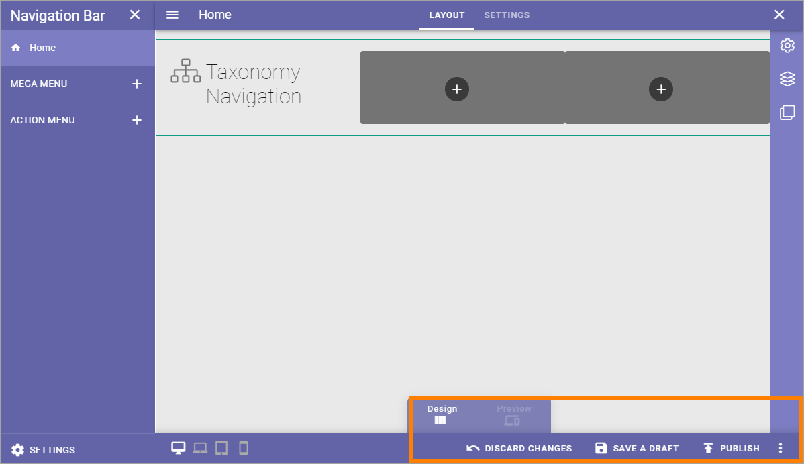
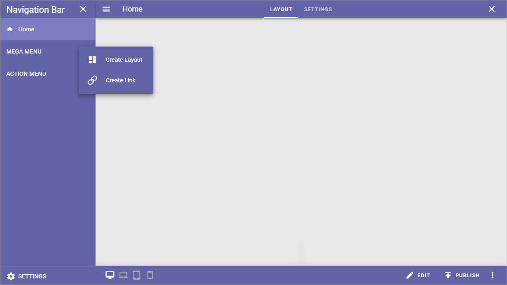
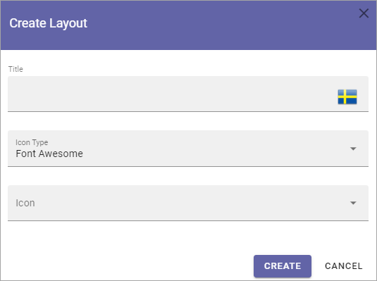
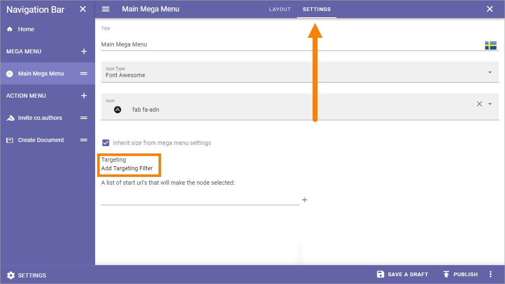
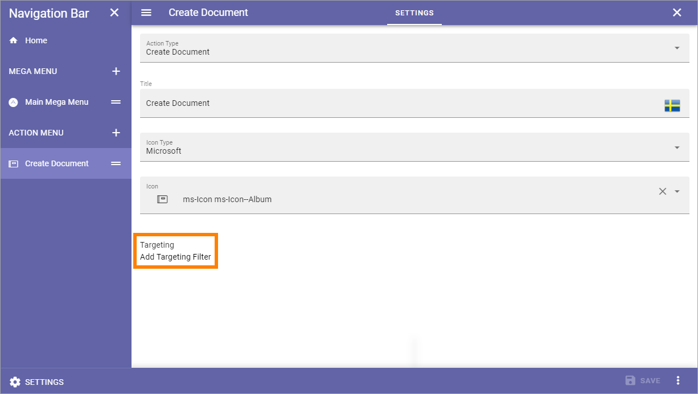

Navigation Bar
=================

This is an ongoing preliminary documentation for functionality to come in Omnia 6.5.

Here you can edit navigation bar settings for the business profile's workplace. You can add different settings for the default navigation bar and for the navigation bar used in MS Teams. 

You can use several Mega Menu objects and several Action Menu objects, if needed.

When working with the layout, you can use all the sections and blocks that normally are available for pages, so the possibilities are almost endless. You can even add different layouts for different screen sizes, if needed, to fit for example both computer and mobile phone.

.. image:: workplace-navigation-bar-new.png

Navigation Bar settings
************************
To open the settings, click SETTINGS in the lower left corner.

.. image:: workplace-navigation-bar-open-settings.png

General
---------
Here you can set colors for the default navigation bar and for the navigation bar used in MS Teams.

.. image:: workplace-navigation-settings-general.png

Mega Menu
----------
These settings are available for the default Mega Menu, and for the Mega Menu used in MS Teams.

.. image:: workplace-navigation-settings-mega-menu.png

+ **Show Icon**: Select to show/hide navigation icons.
+ **Show Text**: Select to show/hide mavigation texts.
+ **Max Width**: You can set a maximum width in pixels for the navigation bar, if needed.
+ **Max Height**: You can set a maximum height in pixels for the navigation bar, if needed.
+ **Layout Theming**: If you would like to use custom settings for the layout, open this section and select "Custom Theme". 
+ **Block Theming**: If you would like to use custom settings for the layout, open this section and select "Custom Theme". 

Regarding Custom Theme, detailed information about the options are found here in the Omnia 6.0 documentation: :doc:`Theme for the Business Profile </admin-settings/business-group-settings/settings/theme/index>`

See below for information on how to add Mega Menu objects.

Action Menu
------------
The following settings are available here, for the default Action Menu and for the Action Menu used in MS Teams:

.. image:: workplace-navigation-settings-action-menu.png

+ **Show icon**: For the top action menu, showing an icon is default. If you add other action menus, you can choose to show icons or not.
+ **Show text**: For the top action menu, showing text is default. If you add other action menus, you can choose to show texts or not.
+ **Item Limit**: (A description will be added soon).

See below for information on how to add Action Menu objects.

Home settings
***************
To edit Home settings, see to that "Home" is selected to the left, and then click "Edit":

.. image:: workplace-navigation-home-settings-edit.png

Then, click SETTINGS.

.. image:: workplace-navigation-home-settings-settings.png

The following is available:

.. image:: workplace-navigation-home-settings-shown.png

+ **Title**: If you would like to show a Home title, add it here, in any or all the tenant languages. Click the flag to change language.
+ **Logo Text**: If you would like to show a logo text by the Home title, add it here, in any or all the tenant languages. Click the flag to change language.

Another alternative is to add a logo image. Do it this way:

1. Click ADD.

.. image:: workplace-navigation-home-settings-click-add.png

2. Use the Media Picker to find and select the image.

.. image:: workplace-navigation-home-settings-media-picker.png

See this page for more information: :doc:`The Media Picker </general-assets/media-picker/index>`

Working with the layout
*************************
When working with the navigation bar layout, you can use all options for sections and blocks available in Omnia.

Start by clicking the x symbol to add a section.

.. image:: layout-1.png

Then select section layout, just like you would do when working with a Page Type.

.. image:: layout-2.png

Then continue building up the layout using sections and blocks.

For more information, see these pages:

+ :doc:`Working with sections and blocks </pages/page-types/working-with-sections-and-blocks/index>`
+ :doc:`Settings for sections </pages/page-types/section-settings/index>`
+ :doc:`Working with blocks </blocks/working-with-blocks/index>`

**A tip:** One way of creating a mega menu like navigation is to use a Page Rollup, the new scope "Navigation path" and the new "Navigation View".

Saving a draft and publishing
---------------------------------
Saving a draft, discarding changes and finally publishing the layout, works very similar to working with pages.

For more information, see these pages:

+ :doc:`Edit a page </pages/edit-page/index>`
+ :doc:`Publish page changes </pages/publish-page-changes/index>`

But note that it's very similar, not exactly the same. Some options for pages are not available here (like scheduled publishing).

One thing that is perhaps not that obvious is how to delete a layout, if needed. You will find that option in the menu:

.. image:: layout-delete.png

Different layouts for different screen sizes
*********************************************
The default screen size is for computer screens. If would like to add different layouts for one or more of the other scren sizes available, do the following:

1. Select Screen size.

.. image:: layout-screen-size.png

2. Open the list and select "Create new layout".

.. image:: layout-screen-size-new-layout.png

Adding a Mega Menu object
***************************
To add a Mega Menu object, click the plus and choose to add a layout or create a link.

Create Layout
--------------
When you choose to create a Mega Menu layout, the following is shown:

1. Add a title, and an icon if you like. 

What you add here is only shown in the list of mega menus, not shown for users.

2. Click "Create".
3. Create the Mega Menu layout by using sections and blocks available in Omnia. For more information, see *Working with the layout* and *Saving a draft and publishing* above.

Create a link
---------------
You can create a Mega Menu link to anything you can link to, for example a page in Omnia or external funcitonality.

Set the following for the link:

.. image:: mega-menu-add-link.png

Target a Mega Menu object
-------------------------------
When the Mega Menu object is created you can add a targeting filter, meaning you can decide who this Mega Menu object will be available for.

1. Select the Mega Menu Object.
2. Open the settings.
3. Add targeting filters.

You do that the same way as for many other options in Omnia, see for example the heading "Targeting" on this page: :doc:`General block settings </blocks/general-block-settings/index>`

Adding an Action Menu object
******************************
The action menu can include almost any action available in Omnia. To add an Action Menu object, do the following:

1. Click the plus.

.. image:: action-menu-add.png

The following is shown:

.. image:: action-menu-add-settings.png

2. Add the settings.

+ **Action type**: Select action type from the list. Note that these actions are the same as can be added using an Action Button block.
+ **Title**: Add a title for the list here (not shown to users).
+ **Icon Type/Icon**: Add an icon if you with, for this list (not shown for users).

Different fields are shown depending on Action Type selected. See this page for detailed information about those fields: :doc:`Action Button in omnia 6.5 </blocks/button-link/action-button-65/index>`

Target an Action Menu object
-------------------------------
When the Action Menu object is created you can add a targeting filter, meaning you can decide who this Action Menu object will be available for.

You do that the same way as for many other options in Omnia, see for example the heading "Targeting" on this page: :doc:`General block settings </blocks/general-block-settings/index>`

Edit the order
****************
If you have created several objects of one type, you can decide in what order these objects should be shown for users.

Use this icon and drag and drop the desired order:

.. image:: action-menu-add-settings-order.png
