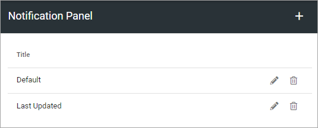
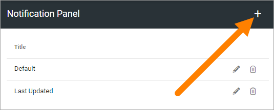
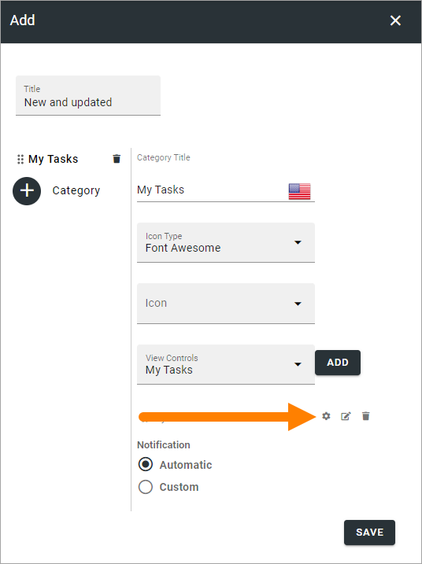

Notification panel
====================

The notification panel is a concept in Omnia. The purpose is to help end users find out what information has been updated within different areas of the intranet.

A notification panel can be placed on any page through the Notification panel block, or in the action menu, to show different notifications. You can create several notification panels for different purposes.

The first you will see is the list of existing notification panels, for example:

Create a new notification panel
*********************************
To create a new notification panel, do the following:

1. Click the plus.

2. Use the following settings:

.. image:: notification-panel-settings-new6.png

+ **Title**: You can add a block title here if you wish. 
+ **Category**: Click the plus here to add a new Category. 
+ **Category title**: Add a title for the new category. You can add titles for all active languages. (Click the flag to change language).
+ **Icon type**: Select an icon type.
+ **Icon**: Choose the Icon in the icon type you have selected.
+ **View controls**: Here you select what you will display in the category. See below, under *Category settings* for more information.
+ **Notification**: Select Automatic or Custom for the category. 

3. Click "ADD" to create the category.
4. Click the cog wheel to access the settings for the category.

5. Add the category settings.
6. Save the changes.

Category settings
--------------------
The settings for a category is the same as the settings for the corresponding Block, see:

Action button: :doc:`The Action button block </blocks/button-link/index>`

Activity feed: :doc:`The Activity feed block </blocks/activity-feed/index>`

Announcements: :doc:`The Announcements block </blocks/announcements/index>`

Calendar rollup: :doc:`The Calendar rollup block </blocks/calendar-rollup/index>`

Document rollup: :doc:`The Document rollup block </blocks/document-rollup/index>`

HTML script: :doc:`The HTML scripts block </blocks/html-script/index>`

My tasks: :doc:`The Tasks rollup block </blocks/task-rollup/index>`

Page rollup: :doc:`The Pages rollup block </blocks/page-rollup/index>`

People rollup: :doc:`The People rollup block </blocks/people-rollup/index>`

RSS Reader: :doc:`The RSS Reader block </blocks/rss-reader/index>`

Sign-off requests: :doc:`The Sign-off request rollup block </blocks/sign-off-requests-rollup-613/index>`

Team news rollup: :doc:`The Team news rollup block </blocks/team-news-rollup/index>`

Viva Engage (former Yammer feed): :doc:`The Viva Engage block </blocks/yammer-feed/index>`
