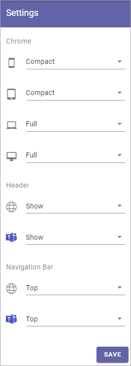

Settings
==========

This is an ongoing, preliminary documentation for functionality to come in Omnia 6.5.

The following settings are available here:

+ **Chrome**: Here you can choose Compact or Full Chrome for the different screen sizes.
+ **Header**: Decide to show the header or not for the standard pages and/or for Teams.
+ **Navigation Bar**: Decide where to show the navigation bar for the standard pages and for Teams.

