Announcements
===========================================

Here a Tenant Administrator (or any other user added under Permissions for Announcements, see below) can create Announcements that can be displayed over the whole tenant, normally at the top. Tenant Announcements can also be shown through the Announcements block. For more information about the block, see: :doc:`The Announcements block </blocks/announcements/index>`

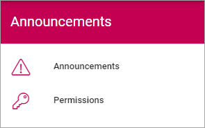

Note that an option to create Announcements for a specific Business Group also is available. The options are identical, the only difference is where Announcements are shown.

Announcements
***************
All existing Announcements, either active or not, are shown in the list. From there you can edit or delete an Announcement.

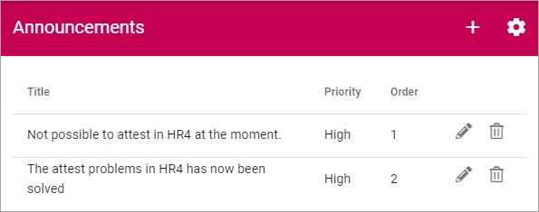

For explanation of Priority and Order, see below.

To edit an Announcement, click the pen:

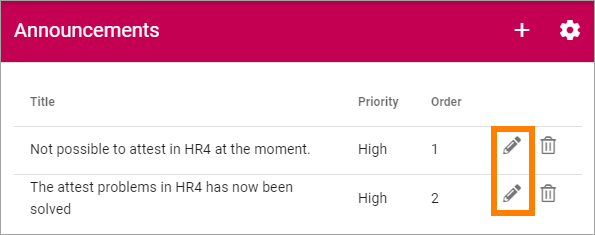

Everything added when a new Announcement is created can be edited, see above.

To delete an Announcement that is no longer needed, clik the dust bin.

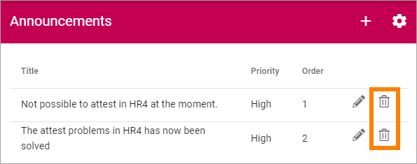

Create an Announcement
------------------------
To create a new Announcement, do the following:

1. Click the plus.

.. image:: tenant-announcements-clickplus.png

Use the following settings:

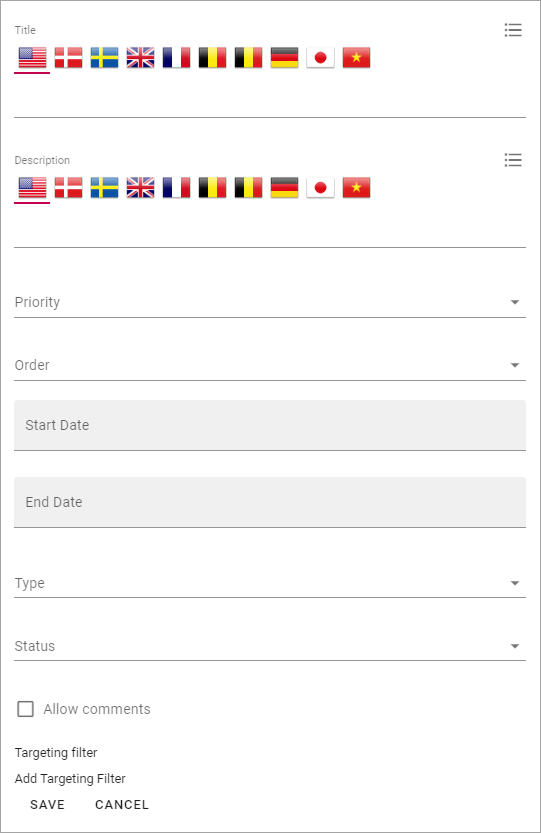

+ **Title**: Add a title for the message. If you use more than one language in the tenant you can add a title in each language. Note that you must always add a title in the default language, other languages are optional.
+ **Description**: Add the message here. If you use more than one language in the tenant you can add the description in each language. Note that you must always add the description in the default language, other languages are optional.
+ **Priority**: Set the Priority. Important Announcements with High priority will be displayed below the cross site mega menu on all pages (see example below). Announcements (with Normal or High priority) can be displayed to users in the Notification Panel or through the Announcements block.
+ **Order**: Set the order for this Important Announcement when there are several displayed.
+ **Start Date** and **End Date**: Set the start and end date of the Important Announcement. You can set exact times within the dates if needed. Start and end dates are optional, but we recommend that you always at least set an end date.
+ **Type**: Type is an indication of what type the Announcement is, noted with text and an icon. Available Types are created and edited in the settings (see below).
+ **Status**: Status is a color and text indication of the status (severity) of Announcement. Available Status options are created and edited in the settings (see below)
+ **Allow comments**: Decide to allow comments or not. The default is to not allow comments. If allowed, users can add comments, and even comment other comments (and so can you of course) the same way as for example for news.
+ **Targeting filter**: An Announcement can be targeted, which means just displayed to a defined group of users. See below for information on how to do that.

Here's an example of an Announcement with high priority:

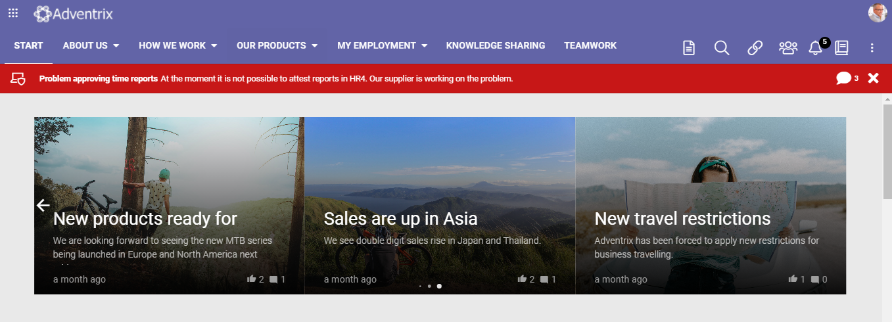

Here's an example of Announcements displayed in the Announcements block:

.. image:: announcements-block2.png

For more information, see: The Announcements block: :doc:`The Announcements block </blocks/announcements/index>`

All languages to be used here must be setup in the Tenant Settings, see: :doc:`Tenant Settings </admin-settings/tenant-settings/settings/index>`

Targeting Announcements
-------------------------
An Important Announcement can be targeted to any receivers that has been defined in Targeting Properties, see the section on this page: :doc:`Properties </admin-settings/tenant-settings/properties/index>`

1. Click "Add Targeting Filter".

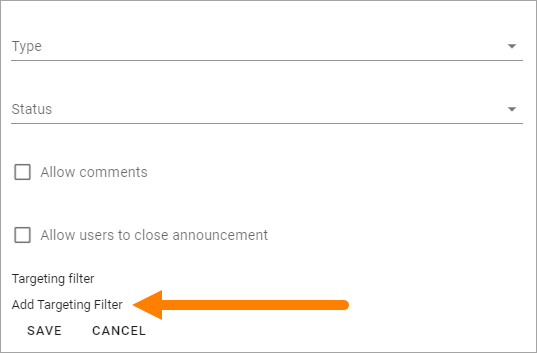

2. Open the list and select property.

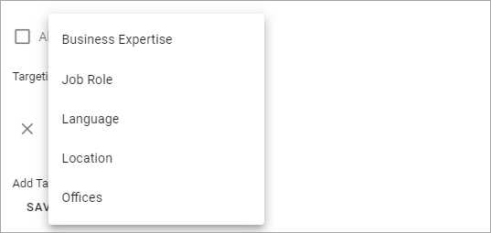

3. Select one or more children properties, if applicable.

.. image:: targeting-add-property-sub2.png

Or:

3. Select to include all children properties.

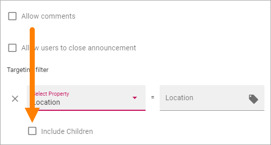

To delete a targeting filter, just click the x.

Settings for Announcements
***************************
Click the cog wheel to enter the settings:

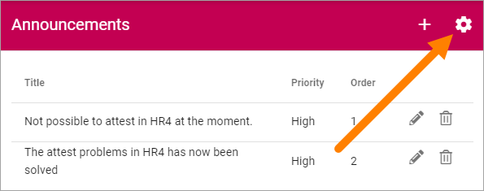

You can set the following:

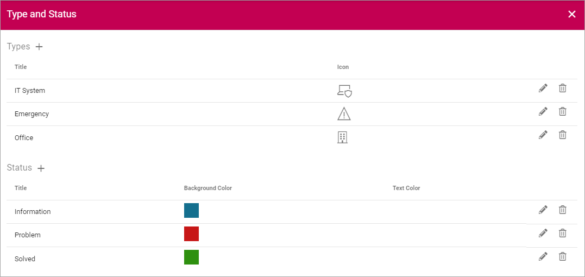

Types
------
Here you can add and edit Types and Status that can be used in an Announcements to indicate what type of content the Announcement has.

The existing Types are listed, with selected icons shown. Edit and delete the Types using the pen or dust bin:

.. image:: types-pen-dustbin-new.png

To create a new Type, click the plus:

.. image:: types-create-new2.png

Set the following:

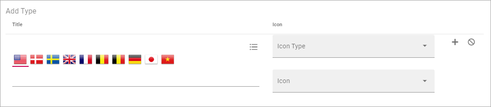

1. Add a Title.
2. Select Icon Type.
3. Select Icon. 
4. Click the plus to save the Type.

**Tip!** You can select "Custom" under "Icon Type" to use any image as an icon, but you have to know (or have copied) the Url to the image.

Status
--------
Here you can add and edit Status options that can be used in an Announcements to indicate the status for the Announcement, for example the level or problem or Spotted/Solving/Solved.

The existing Types are Status options, with selected color shown. Edit and delete the Status options using the pen or dust bin:

.. image:: status-pen-dustbin-new.png

To create a new Status option, click the plus:

.. image:: status-create-new2.png

Set the following:

.. image:: add-status-settings-new.png

1. Add a Title.
2. Select Background Color.
3. Select Text Color. 
4. Click the plus to save the Status option.

Permissions for Announcements
********************************
Announcements has a seperate Permissions setting, meaning any user can be set as an Announcement administrator, including external users that has been invited in the Asher AD, meaing they can log in with their own Office 365 account. 

Add all users that should be Announcements administrators here:

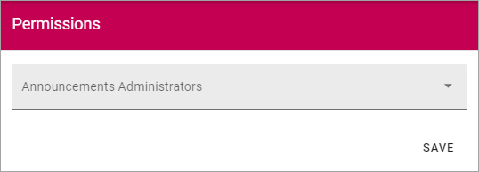

Note that Tenant Administrators always can work with Announcements even though they are not listed here.

