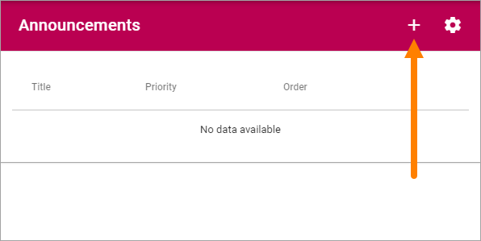
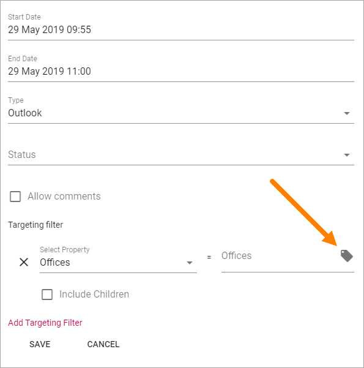
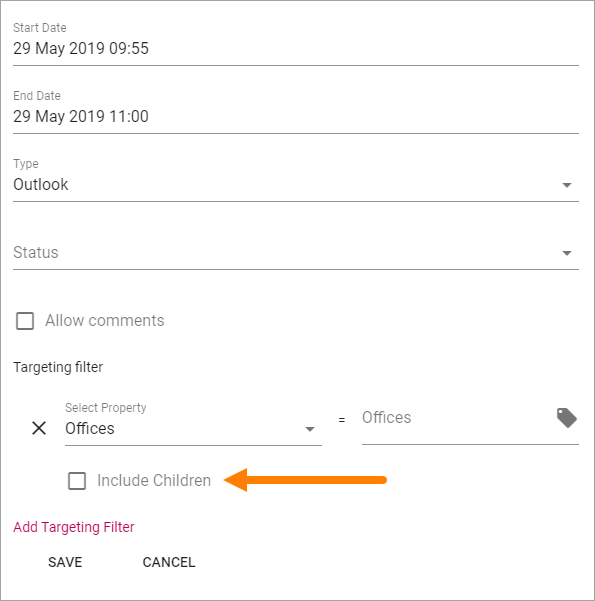
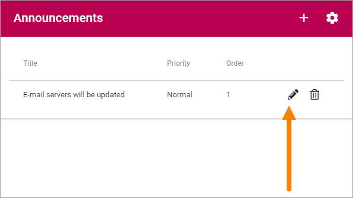

Announcements
===========================================

**Note!** This documentation is ongoing. More details will be added soon.

Here a Tenant Administrator can create Announcements that will be displayed over the whole tenant, normally at the top. Tenant Announcements can also be shown through the Annoncements block. For more information about the block, see: :doc:`The Announcements block </block/announcements/index>`

Note that an option to create Announcements for a specific Business Group also is available, see: (Link to be added)

Here's an example of two Tenant Announcements shown at the top:

.. image:: tenant-announcement-example.png

Create an Announcement
*************************
To create a new Announcement, do the following:

1. Click the plus.

Use the following settings:

.. image:: tenant-announcements-new-settings.png

+ **Title**: Add a title for the message.
+ **Description**: Add the message here.
+ **Priority**: Set the Priority. Important Announcements with High priority will be displayed below the cross site mega menu on all pages, and in the Notification panel. Important Announcements with Normal priority will be displayed in the notification panel only.
+ **Order**: Set the order for this Imortant Announcement when there are several displayed.
+ **Start Date** and **End Date**: Set the start and end date of the Important Announcement. You can set exact times within the dates if needed. Start and end dates are optional, but we recommend that you always at least set an end date.
+ **Type**: Select Type from the list, to indicate what type of announcement it is.
+ **Status**: Select a Status, which is a Color that can indicate the status of Announcement.
+ **Comments**: Decide to allow comments or not. The default is to not allow comments. If allowed, users can add comments, and even comment other comments (and so can you of course) the same way as for example for news.
+ **Targeting filter**: An Announcement can be targeted, which means just diplayed to a defined group of users. See below for information on how to do that.

Targeting Announcements
************************
An Important Announcement can be targeted to any receivers that has been defined in Targeting Properties, see: (link to be added)

Do the following:

1. Click "Add Targeting Filter".

.. image:: add-targeting-filter.png

2. Open the list and select property.

.. image:: targeting-add-property.png

3. Select one or more children properties, if applicable.

Or:

3. Select to include all children properties.

To delete a targeting filter, just click the x.

Edit or delete an Announcement
*******************************
All existing Announcements, either active or not, are shown in the list. From there you can edit or delete an Announcement.

To edit an Announcement, click the pen:

Everything added when a new Announcement is created can be edited, see above.

To delete an Announcement that is no longer needed, clik the dust bin.

.. image:: announcement-dust-bin.png

Settings for Announcements
***************************
Click the cog wheel to enter the settings:

.. image:: cog-wheel-settings.png

You can set the following:

.. image:: announcement-settings.png

Use "Types" to add and edit Types to be used for Announcements. Select a suitable icon for quick reference.

Use "Status" to create ned Edit Status Color than can be used for Announcements.

