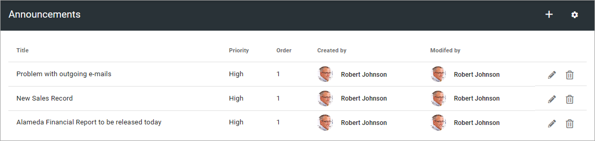
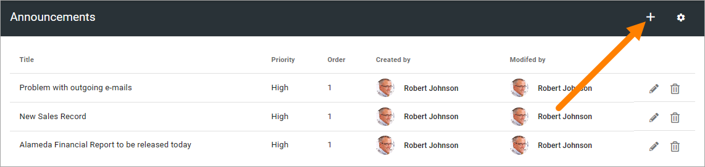
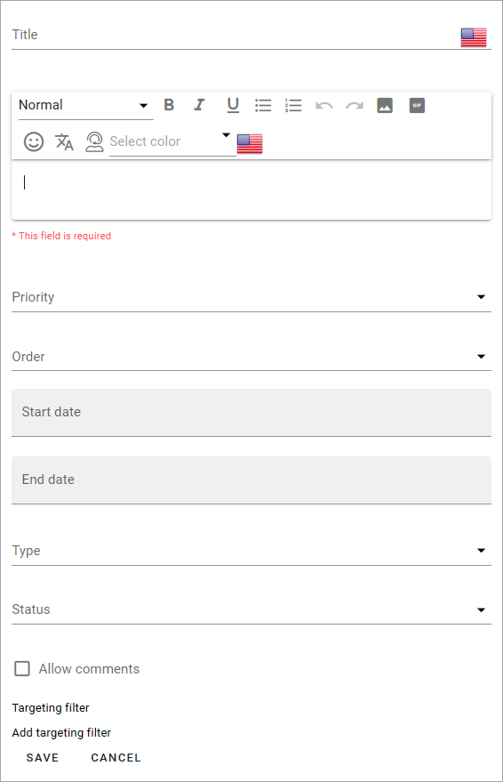
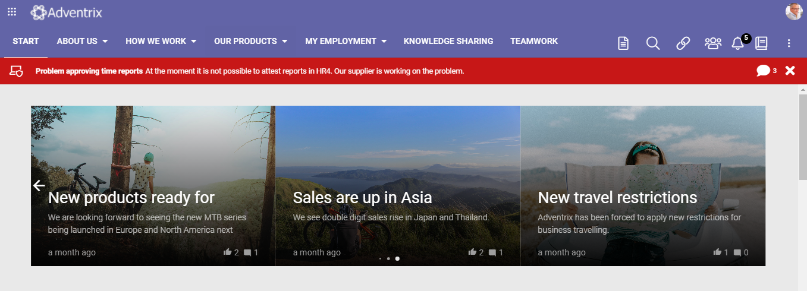
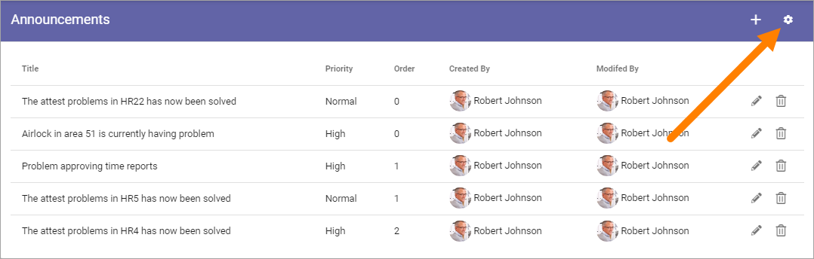
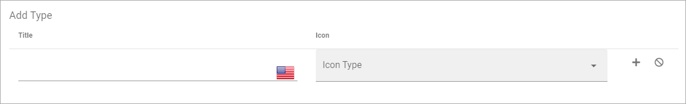
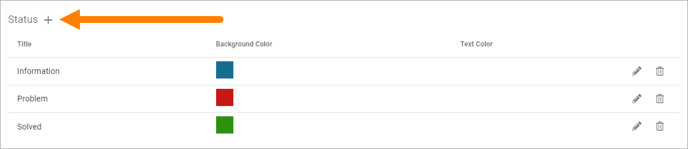
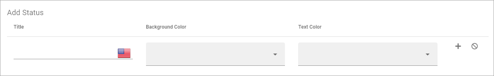

Announcements
===========================================

Here a user with the approrpiate permissions can create announcements that can be displayed over the whole tenant, normally at the top. Tenant administrators can always create announcements. Also, any user can be granted this permission. This is set under "Permissions" for the tenant, see: :doc:`Permissions for the tenant </admin-settings/tenant-settings/permissions/index>`

Tenant announcements can also be shown through the Announcements block. For more information about the block, see: :doc:`The Announcements block </blocks/announcements/index>`

Note that an option to create announcements for a specific business Group also is available. The options are identical, the only difference is where announcements are shown.

All existing announcements, active or not, are shown in the list. From there you can edit or delete an announcement.

For explanation of Priority and Order, see below.

To edit an announcement, click the pen. Everything added when a new announcement is created can be edited, see below.

To delete an announcement that is no longer needed, click the dust bin.

Create an announcement
------------------------
To create a new announcement, do the following:

1. Click the plus.

Use the following settings:

+ **Title**: Add a title for the message. If you use more than one language in the tenant you can add a title in each language. Note that you must always add a title in the default language, other languages are optional. Click the flag to change language.
+ **(Text field)**: Add the message here. If you use more than one language in the tenant you can add the description in each language. Note that you must always add the description in the default language, other languages are optional. Click the flag to change language. The limited RTF editor is used for the description. For more information, see: :doc:`Editing text with the RTF editor </general-assets/rtf-editor/index>`
+ **Priority**: Set the priority. Announcements with High priority will be displayed below the cross site mega menu on all pages (see example below). Announcements (with Normal or High priority) can be displayed to users in the notification panel or through the Announcements block.
+ **Order**: Set the order for this announcement when there are several displayed.
+ **Start date** and **End date**: Set the start and end date of the announcement. You can set exact times within the dates if needed. Start and end dates are optional, but we recommend that you always at least set an end date.
+ **Type**: Type is an indication of what type the announcement is, noted with text and an icon. Available types are created and edited in the settings (see below).
+ **Status**: Status is a color and text indication of the status (severity) of the announcement. Available status options are created and edited in the settings (see below).
+ **Allow comments**: Decide to allow comments or not. The default is to not allow comments. If allowed, users can add comments, and even comment other comments (and so can you of course) the same way as for example for news. **Note!** Comments are sent to you, meaning the colleague who created the announcement.
+ **Targeting filter**: An announcement can be targeted, which means just displayed to a defined group of users. See below for information on how to do that.

**Important Note!** If there are no announcements block placed on a suitable page and announcements is not added as a category to the notification panel, announcements with Normal priority are simply not shown!

Here's an example of an announcement with high priority:

Here's an example of announcements displayed in the Announcements block:

.. image:: announcements-block-new.png

For more information, see: The Announcements block: :doc:`The Announcements block </blocks/announcements/index>`

All languages to be used here must be setup in the tenant, see: :doc:`Regional Settings </admin-settings/tenant-settings/settings/regional-settings/index>`

Targeting announcements
-------------------------
An announcement can be targeted to any receivers that has been defined in targeting properties, see the section on this page: :doc:`Targeting properties </admin-settings/tenant-settings/properties/targeting-properties/index>`

You set up targeting for an announcement the same way as for many other parts of Omnia. See this page for more information: :doc:`Using targeting </general-assets/targeting-in-omnia/index>`

Settings for announcements
***************************
Click the cog wheel to enter the settings:

You can set the following:

.. image:: announcement-settings-new2.png

Types
------
Here you can add and edit types that can be used in announcements to indicate what the announcement is about.

The existing types are listed, with selected icons shown. Edit and delete the types using the pen or dust bin.

To create a new type, click the plus:

.. image:: types-create-new3.png

Set the following:

1. Add a title in any or all tenant languages (click the flag to change language).
2. Select Icon type.
3. Select Icon. 
4. Click the plus to save the Type.

**Tip!** You can select "Custom" under "Icon type" to use any image as an icon, but you have to know (or have copied) the URL to the image.

Status
--------
Here you can add and edit atatus options that can be used in announcements to indicate the status of the announcement, for example the level or problem or Spotted/Solving/Solved.

The existing types are atatus options, with selected color shown. Edit and delete the status options using the pen or dust bin.

To create a newsStatus option, click the plus:

Set the following:

1. Add a title in any tenant language (click the flag to change language).
2. Select Background color.
3. Select Text color. 
4. Click the plus to save the status option.

