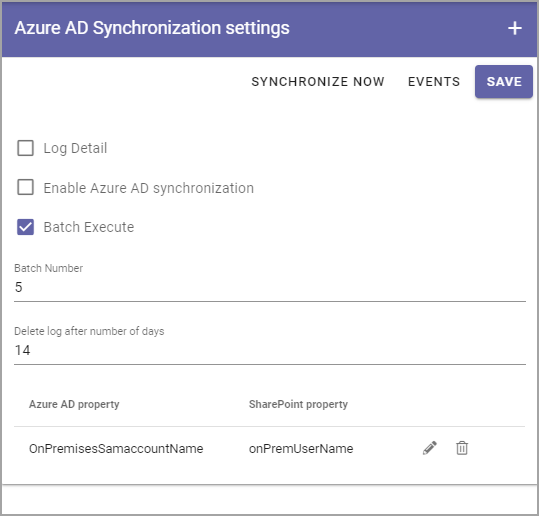
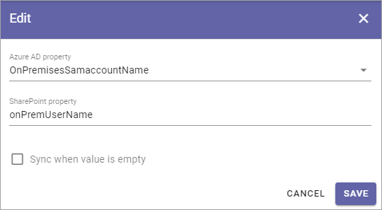

Azure AD Synchronization settings
===================================

Use these advanced settings to make sure person properties are synchronized from Azure AD to Sharepoint.   

(This documentation is just started, more will be added/updated soon.)

This is what's available:

+ **SYNCHRONIZE NOW**: Click this button to execute the syncrhonizations set up (listed at the bottom).
+ **EVENTS**: (A description will be added soon.)
+ **Log Detail**: Use this if you have problems with the synchronization. In the details you will hopefully find out what's wrong.
+ **Enable Azure AD Synchronization**: Select this option to enable the synchronization.
+ **Batch Execute**: This is an advanced option if you have a very long list of users. Contact you provider/consultant for help when using this.
+ **Batch Number**: (A description will be added soon).
+ **Delete log after number of days**: Set the number of days the log file will be available. Default: 14 days.

Attthe bottom the synchronizations that has been set up are shown. By clicking the pen you can edit the same settings as when the synchronization was set up (see below).

To delete a synchronization from the list, click the dust bin.

Set up a new synchronization
*****************************
To set up a new synchronization, do the following:

1. Click the plus.

.. image:: synchro-click-plus.png

2. Use the followinf settings:

.. image:: azure-ad-settings.png

+ **Azure AD property**: Open the list and select the AD property to synchronize.
+ **Sharepoint property**: Type the name of the Sharepoint property to synchronize to.
+ **Sync when value is empty**: Normally empty fields are not synchronized from the AD. If you want to do that, select this option.

Here's an example:

3. Save when your here.
4. Save your changes in the settings window.
