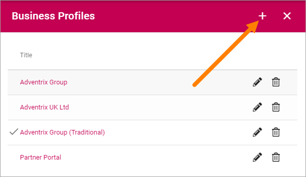

Business Profiles
===========================================

Within a Tenant several Business Profiles can be used, for different settings for different areas of the Tenant. 

When adding and editing settings for a specific Business Profile, select the Profile in the list. The available settings for the Business Profile is then listed below.

.. image:: business-profile-settings.png

For descriptions of the Business Profile settings, see: :doc:`Business Profile settings </admin-settings/business-group-settings/index>`

Create a Business Profile
**************************
To create a Business Profile, click the plus:

Just add a Title and click "Add".

.. image:: business-profile-add.png

Edit or delete a Business Profile
***********************************
To delete the Business Profile, click the dust bin (remember that all settings for the Business Profile are lost!). To edit a Business Profile Title, click the pen.

.. image:: business-profile-delete-edit.png

