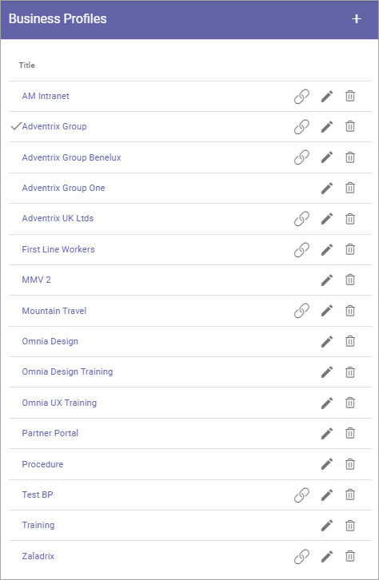
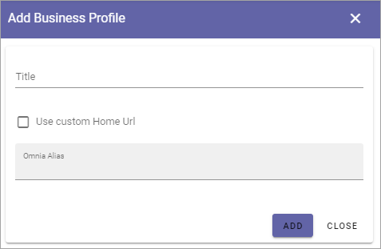

Business Profiles
===========================================

Within a Tenant several Business Profiles can be used, for different settings, for different areas of the Tenant. Even if you will have the same settings everywhere in the Tenant, you still need at least one Business Profile, to set, for example, Themes (Colors) and Content Header Settings.

Settings for Teamwork, the Notification Panel, Search, Event Management, Worspace and App Templates are also found among the Business Profile settings, to just mention som of the settings for a Business Profile.

When adding and editing settings for a specific Business Profile, you must first select the Profile in this list. The available settings for the Business Profile are then available.

Use the icons this way: the left-most icon to edit App Route, if applicable; the pen to edit the title and a few more settings; the dust bin to delete the Business Profile.

For descriptions of the Business Profile settings, see: :doc:`Business Profile settings </admin-settings/business-group-settings/index>`

Edit App Route
***************
If needed (and if it's applicable for the Business Profile) you can click the left-most icon to edit the App Route.

.. image:: business-profile-app-route.png

**Note!** Only one app route can exist. It's set here for the business profile, or for the workspace. If set in one of these places, it's then not available in the other one.  

Create a new Business Profile
*******************************
To create a new Business Profile, click the plus:

.. image:: business-profile-click-new3.png

Use the following settings:

+ **Title**: Add a Title (name) for the Business Profile here.
+ **Use Custom Home Url**: Select this option to set Custom Home Urls, see below. 
+ **Omna Alias**: Add the Url for the Business Profile here.

Custom Home Url
-----------------
When you select "Use Custom Home Url", the following is available:

.. image:: business-profile-add-custom.png

Set the default home Url (the globe). You can also set a Url for the link when it’s clicked in Teams (not applicable in Omnia on-prem).

