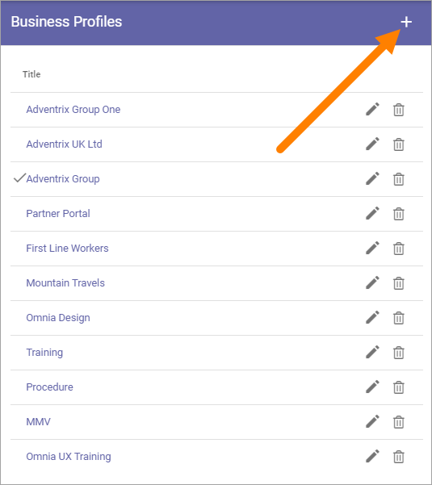
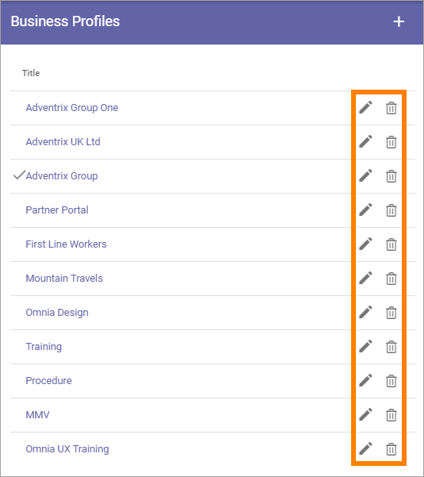

Business Profiles
===========================================

Within a Tenant several Business Profiles can be used, for different settings for different areas of the Tenant. Even if you will have the same settings everywhere in the Tenant, you still need one Business Profile, to set, for example, Themes (Colors), Central Image Locations and Content Header Settings.

Settings for Teamwork, the Notification Panel, Search and Provisioning Templates are also found among the Business Profile settings.

When adding and editing settings for a specific Business Profile, you must first select the Profile in this list. The available settings for the Business Profile is then listed below.

.. image:: business-profile-settings-new2.png

For descriptions of the Business Profile settings, see: :doc:`Business Profile settings </admin-settings/business-group-settings/index>`

Create a Business Profile
**************************
To create a Business Profile, click the plus:

Use the following settings:

.. image:: business-profile-add-new2.png

+ **Title**: Add a Title (name) for the Business Profile here.
+ **Home Url**: Set the default home Url (the globe). You can also set a Url for the link when it’s clicked in Teams.

Edit or delete a Business Profile
***********************************
To delete the Business Profile, click the dust bin (remember that all settings for the Business Profile are lost!). To edit a Business Profile Title, click the pen.

