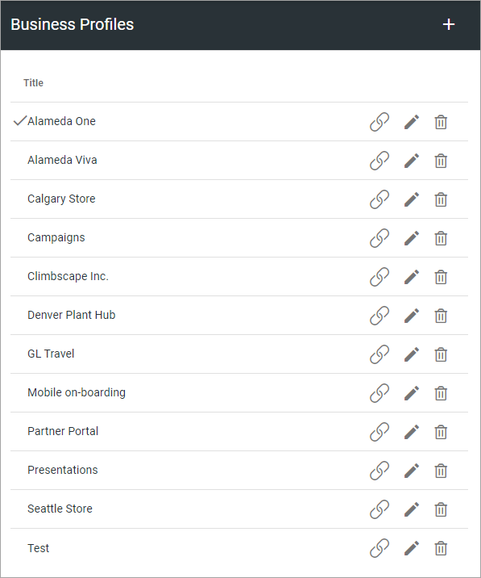
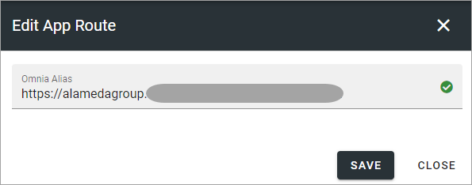
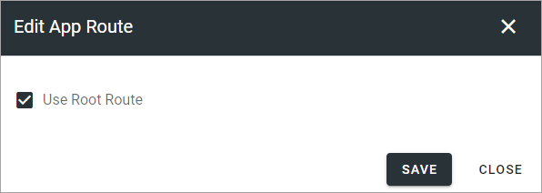
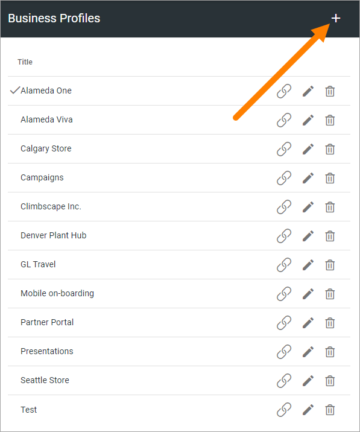
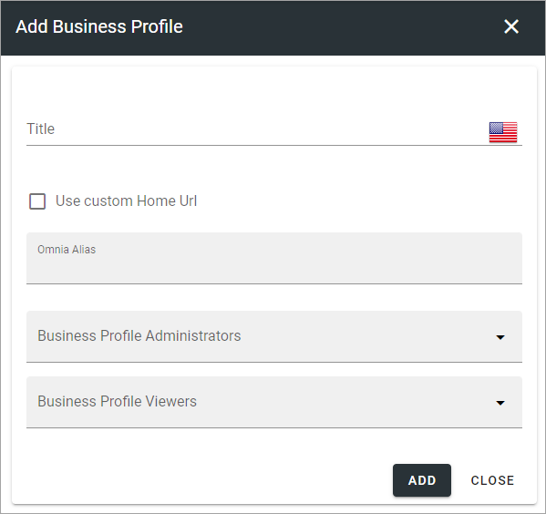
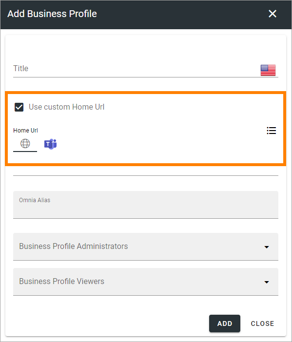
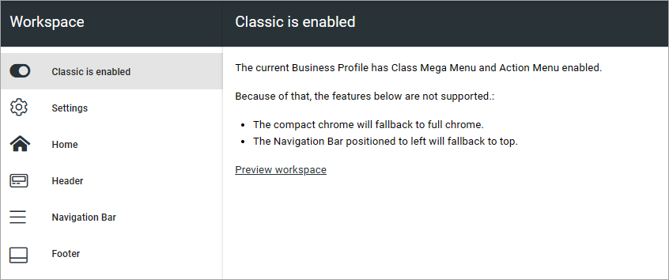
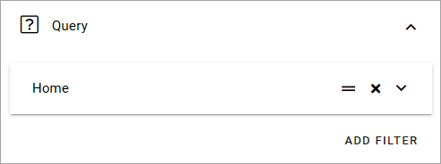

Business Profiles
===========================================

Within a Tenant several Business Profiles can be used, for different settings, for different areas of the Tenant. Even if you will have the same settings everywhere in the Tenant, you still need at least one Business Profile, to set, for example, Themes (Colors) and Content Header Settings.

Settings for Teamwork, the Notification Panel, Search, Event Management, Worspace and App Templates are also found among the Business Profile settings, to just mention som of the settings for a Business Profile.

When adding and editing settings for a specific Business Profile, you must first select the Profile in this list. The available settings for the Business Profile are then available.

Use the icons this way: the left-most icon to edit App Route, if applicable; the pen to edit the title and a few more settings; the dust bin to delete the Business Profile.

For descriptions of the Business Profile settings, see: :doc:`Business Profile settings </admin-settings/business-group-settings/index>`

Edit App Route
***************
If needed (and if it's applicable for the Business Profile) you can click the left-most icon to edit the App Route.

**Note!** Only one app route can exist. It's set here for the business profile, or for the workspace. If set in one of these places, it's then not available in the other one. 

If the Root Route is set for the business profile, it's shown this way:

The Root Route can only be assigned once in the tenant, for a business profile's workspace or for an app. To "move" the root route to another business profile or app, first deselect the option here and then reassign the root route.

Create a new Business Profile
*******************************
To create a new Business Profile, click the plus:

Use the following settings:

+ **Title**: Add a Title (name) for the Business Profile here.
+ **Use Custom Home URL**: Select this option to set Custom Home Urls, see below. 
+ **Omna Alias**: Add the URL for the Business Profile here.
+ **Business Profile Administrators**: Add one or more administrators for the business profile here.
+ **Business Profile Viewers**: Add one or more colleagues and/or groups that should be able to use the business profile.

Permissions for different parts of the business profile can then be set here: :doc:`Permissions for a business profile </admin-settings/business-group-settings/permissions/index>`

You must be tenant administrator or administrator for the business profile, to edit the settings there.

Custom Home URL
-----------------
When you select "Use Custom Home URL", the following is available:

Set the default home URL (the globe). You can also set a URL for the link when it’s clicked in Teams (not applicable in Omnia on-prem).

Edit a business profile
**************************
There is one option available only when editing a business profile:

.. image:: business-profile-edit.png

+ **Classic Mega Menu & Action Menu**: If you for some reason would like to use (more likely continue using) the older classic mega menu and action menu, select this option. In that case, you should do that directly after creating the business profile.

When this option is selected, the following information is found in the Workspace menu:

There are also settings available for the workspace header:

.. image: business-profile-classic.png

Classic Mega Menu settings
*******************************
These settings are available when “Classic Action Menu & Mega Menu” is selected for the Business profile. 

.. image:: workplace-header-classic-mega-menu-v7.png

Query
----------
Here you set the following:

Use these settings to create a Classic Mega Menu. Click ADD FILTER to start Page Picker to select part of (or the whole) the navigation tree for a Page Collection.

You can use the icon to the left to the left to edit the order and the x to delete.

Don't forget to save when you're done.

For more information about the Page Picker, see: :doc:`The Page Picker </general-assets/page-picker/index>`

Display
------------
For Display, the following settings are available:

.. image:: workplace-header-classic-mega-menu-display-v7.png

These settings are the same as in the Mega Menu block, see: :doc:`The Mega Menu block </blocks/mega-menu/index>`

Classic Action Menu settings
********************************
These settings are available when “Classic Action Menu & Mega Menu” is selected for the Business profile. 

.. image:: workplace-header-classic-action-menu-v7.png

+ **Components**: This column lists the Components that can be displayed in the Action Menu. "My Teams" and "Notification Panel" has additional settings, see below.
+ **Display**: You can decide which Components to display, and how: "Pinned" - is default, an Icon will be displayed; "Hidden" - if you don't want the Component to be available; "Menu" - if you want to display the Component in the menu (the three standing dots) instead as an Icon.
+ **Order**:  You can decide the order for the Components you're displaying, from left to right.

