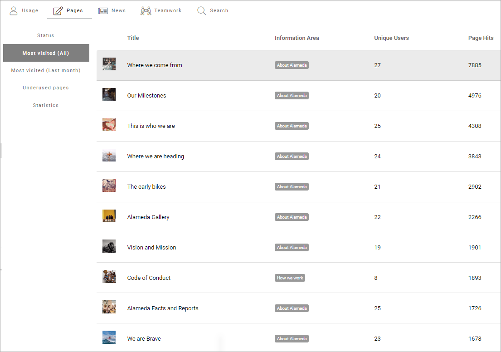
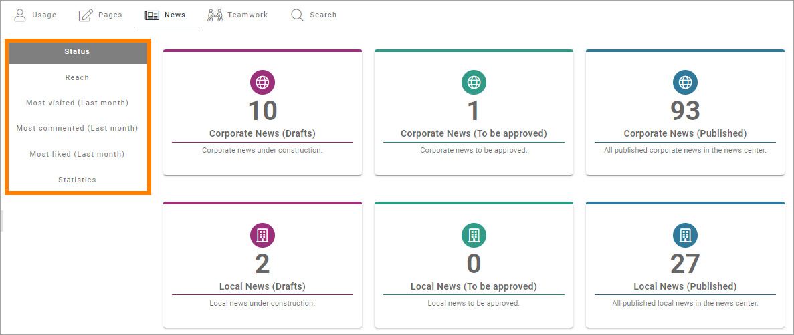
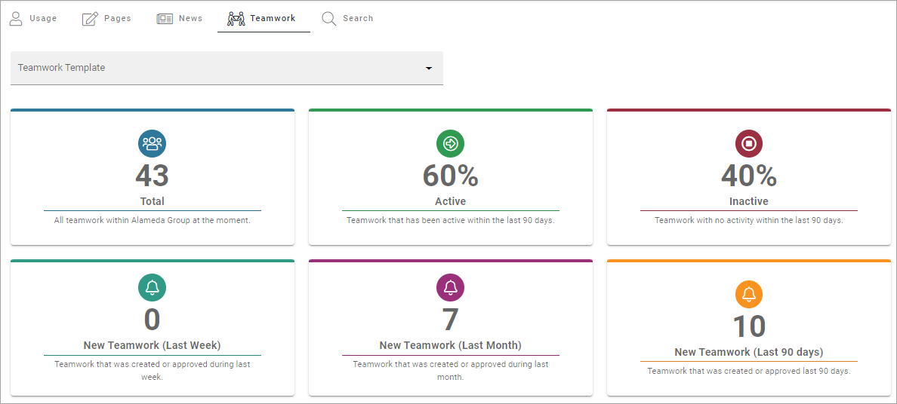
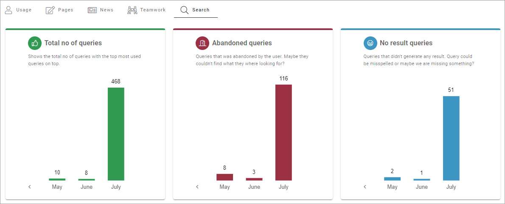
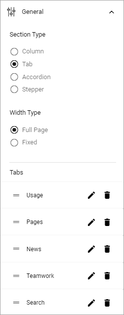
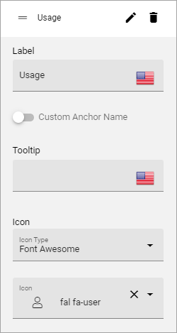
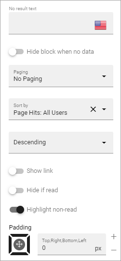
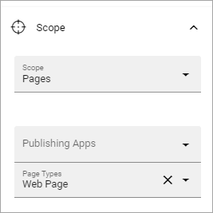
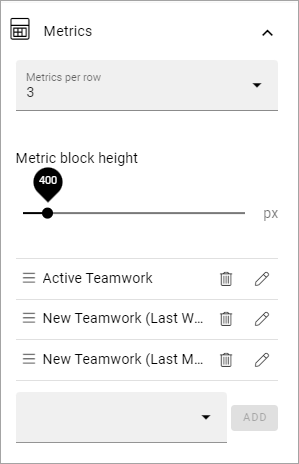

Dashboard implementation example
==============================================

**This page is being updated. Will be finished soon.**

Here's an example of a Dashoboard set up:

.. image:: admin-dashboard-usage-newframe.png

Under Usage, information about active readers and active contributors are shown. What should be considered an active reader or an active contributor is defined in the Metrics settings, see: :doc:`Metric Settings </admin-settings/tenant-settings/settings/metrics/index>`

Under Page Status, something like the following can be shown:

.. image:: admin-dashboard-page-status-new2.png

What you see in the example is the total status for the tenant. You can choose to see status for just one of the publishing apps.

A number of lists has been set up, besides Status; Most Visited (All), Most Visited (Last month), Underused Pages and Statistics.

.. image:: admin-dashboard-page-status-lists.png

Here's an example of a list of Most Visited (All):

For Underused Pges, something like the following can be shown:

.. image:: admin-dashboard-underused-pages.png

What should be considered underused content is defined in the Metrics settings, see link above.

Note the list to the right, of pages that has npt been vsitied for a very long time.

Fo News, something like the following can be shown:

.. image:: admin-dashboard-news.png

Besided Status for news pages, a number of lists has been set up; Reach, Most Visited (Last month), Most Commented (Last month), Most Liked (Last month) and Statsitics:

Regarding Reach: How well we reach our target audience based on what we expect. The metric can be configured to a specific scope of pages (for example News pages) and have a target number of users. 

For Teamwork, you can see the number of active teamworks and if any has been created this week or this month:

In the image above, status for all Teamwork Templates are shown. You can also choose to see the status for just one of the templates, meaning all teamworks created from a certain template.

Finally, in this example, status for searches made by users can be shown:

How it's done
-----------------
The layout in this implementation example is a tab section with six tabs:

The settings for the tabs are similar. Here's the first tab as an example:

For Style, "Show Active Slider" is selected so it's clear which the active tab is:

.. image:: dashboard-example-tab-settings-style-new.png

Usage settings
------------------
On this tab a Metrics block is placed, with the following settings:

Scope is set to "User Activity":

.. image:: dashboard-example-Usage-scope.png

The following Metrics are set for the Usage tab:

.. image:: dashboard-example-Usage-metrics.png

Pages settings
----------------
For Pages, a section as added within the section, and the folling tabs are set up:

.. image:: pages-tabs.png

The settings for the tabs are similar toi those used for Usage, see above.

On the Status tab, a Metrics block are placed with the following setting for Scope:

.. image:: dashboard-example-tab-page-scope.png

And the following settings for Metrics:

.. image:: dashboard-example-tab-page-metrics.png

Most Visited (All) is a Page Rollup block, with the following settings for query:

.. image:: dashboard-example-tab-page-visitied-all-query.png

The Display is List View with the these settings:

.. image:: dashboard-example-tab-page-visitied-all-lisview.png

and these:

Most Visited (Last month) has similar settings, but ofcourse showing the last month only.

Underused Pages has a section within a section with two tabs:

.. image:: underused-pages-tabs.png

In the tab to the left, theres a Metrics block, with the following settings for Scope:

And the following Metrics:

.. image:: underused-pages-tabs-underused-metrics.png

(**From here, still being edited.**)

**Teamwork**: For this tab, the Scope is set to "Teamwork", with three Metrics:

A filter is also added so you can choose the type of teamwork, based on template:

.. image:: dashboard-example-tab-teamwork-filter.png

And with the following Metrics:

.. image:: dashboard-example-tab-communities-metrics-new.png

