Dashboard implementation example
==============================================

The dashboard can be set up in so many ways, depending on what you actually are interested in following up.

Here's an example of a dashboard set up, from a test environment:

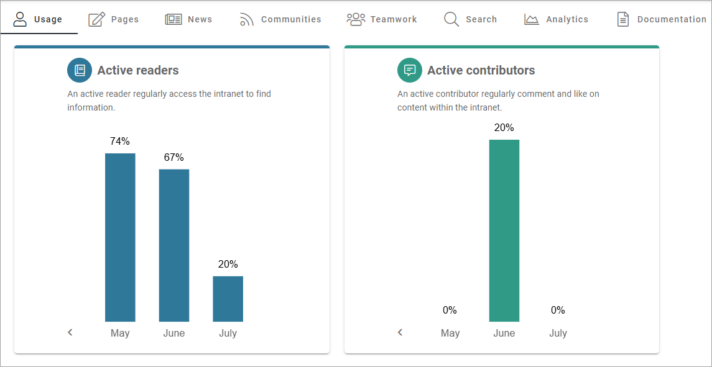

Under Usage, information about active readers and active contributors are shown. What should be considered an active reader or an active contributor is defined in the Metrics settings, see: :doc:`Metric Settings </admin-settings/tenant-settings/settings/metrics/index>`

Under Pages, the following is availble:

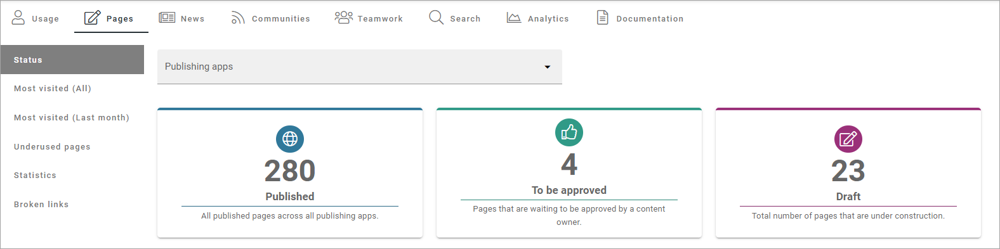

A number of tabs are available. What you see in the above example, is the total status for the tenant, on the Status tab. You can choose to see status for just one of the publishing apps. 
Besides that, a number of lists has been set up; Most Visited (All), Most Visited (Last month), Underused Pages, Statistics and Broken links.

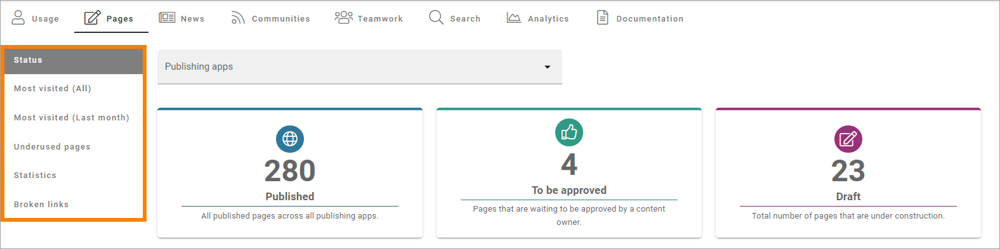

For underused pages, something like the following can be shown:

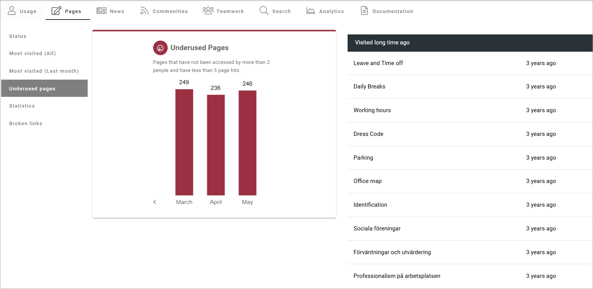

Note the list to the right, of pages that has not been visited for a very long time. For more information on the lists, see below.

What should be considered underused content is defined in the Metrics settings, see link above.

More detailed information can be found by clicking a bar. Here's underused pages in July, as an example:

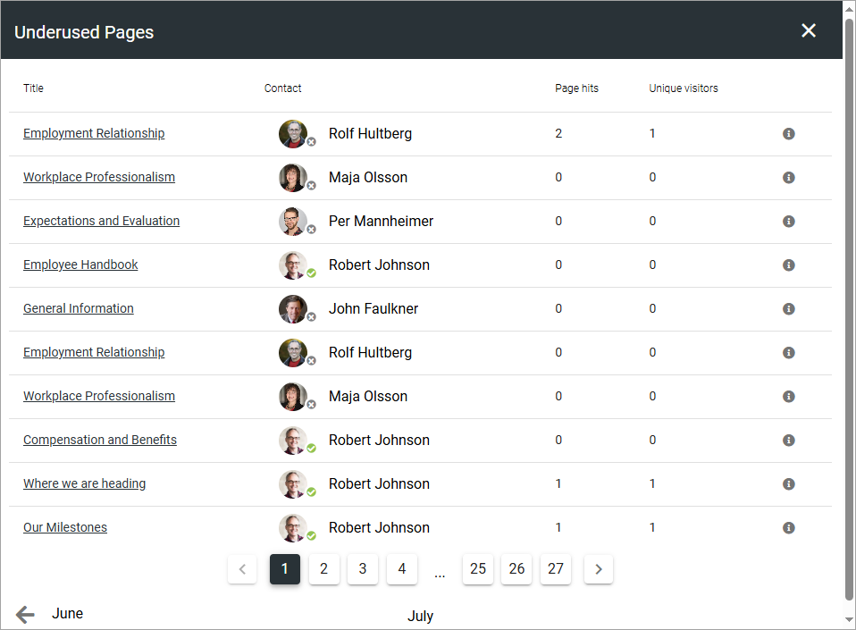

For News, this has been set up:

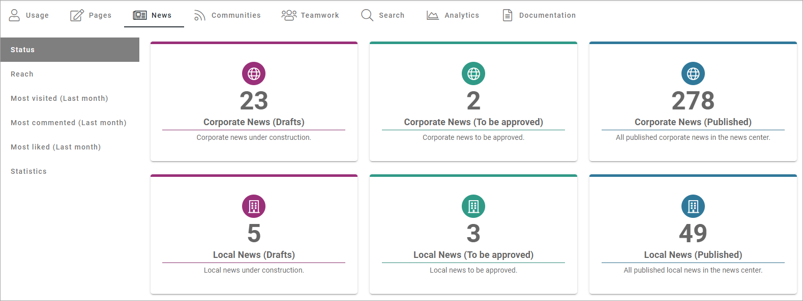

Any of the blocks can be clicked for more detailed information. Here's an example of local news drafts:

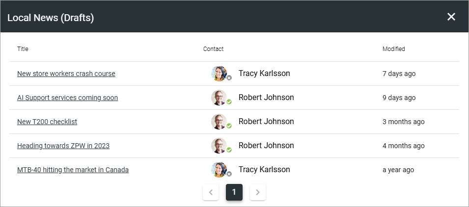

Both the link to the page and the link to the page contacts info page can be clicked for further checks or actions.

Besided status for news pages, a number of lists are available; Reach, Most Visited (Last month), Most Commented (Last month), Most Liked (Last month) and Statsitics:

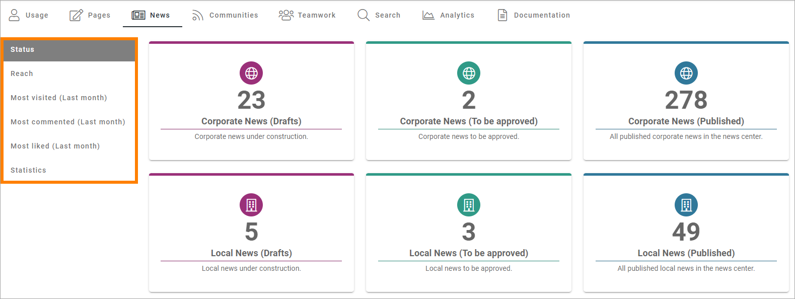

Regarding Reach: How well we reach our target audience based on what we expect. The metric can be configured to a specific scope of pages (for example news pages) and have a target number of users. Note that the bars can be clicked for more information about the reach, the same way as noted above.

For Communites and Teamwork, you can see the number of active communities/teamworks and if any has been created this week or this month (Teamworks as an example):

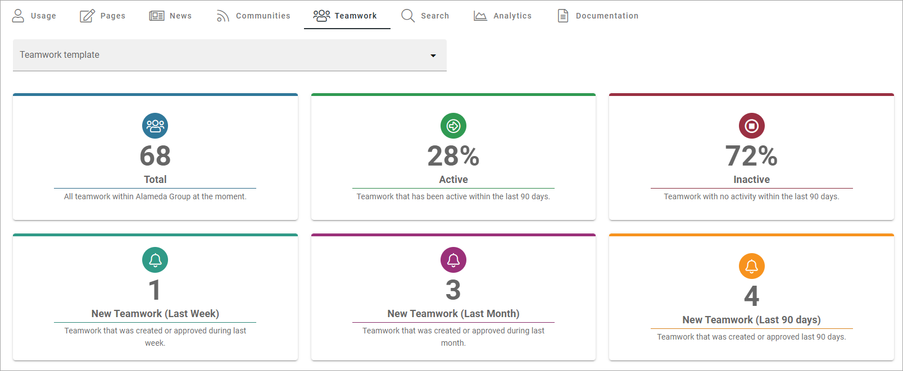

In the image above, status for all teamwork templates are shown. You can also choose to see the status for just one of the templates, meaning all teamworks created from a certain template. Also note that any of the blocks can be clicked for more information, as explained above.

Status for searches made by users can be shown:

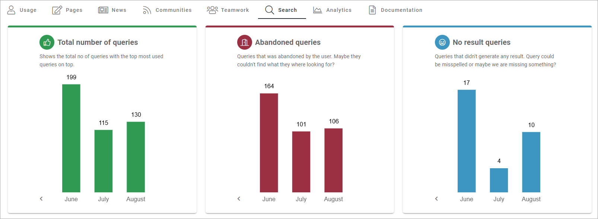

Bars can be clicked for more detailed information here as well. Here's an example of no result queries for May:

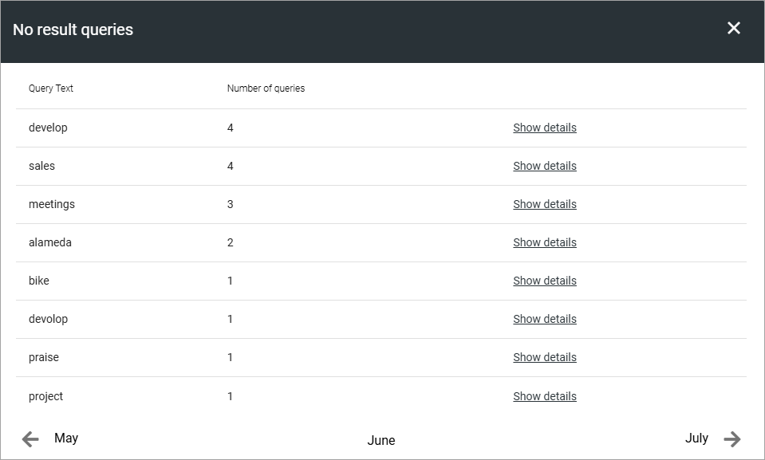

Regarding Analytics, a number of analytic blocks can be used to display analytics in different ways. Here's a quite extensive example:

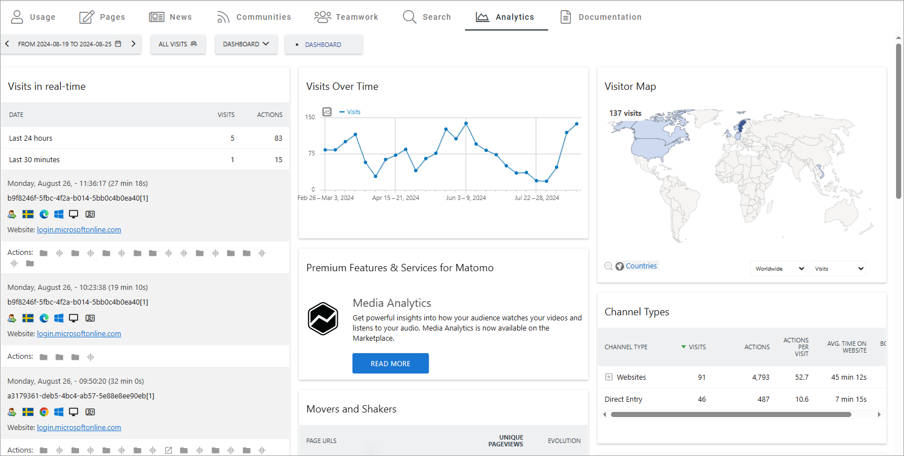

And the last part of this example is a tab wioth a search block, that can used to search for documents, for example:

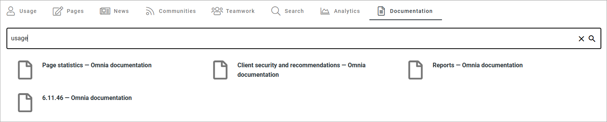

As stated above, there's so many ways to set up a dashboard using the blocks in Omnia. Another example, among many, is to set up a governance hub. Here's an example of such an implementation, where different dashboards can be selected:

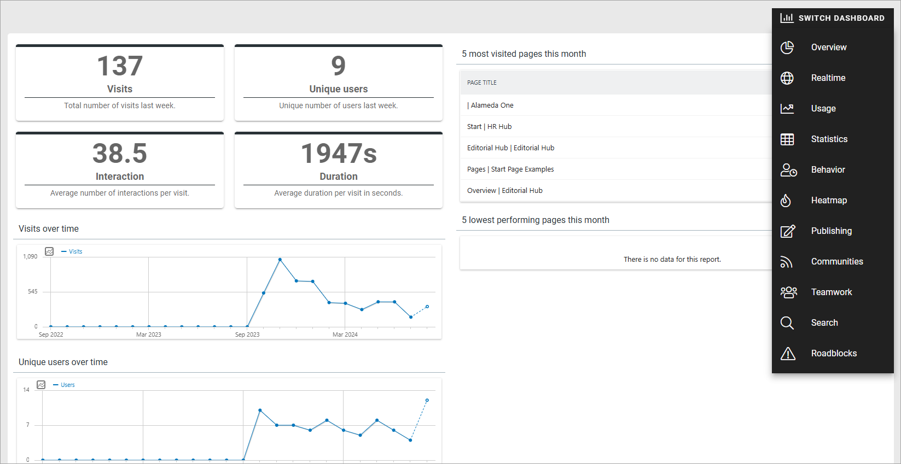

How it's done
-----------------
Well, how is this done, then? There's simply too many details in the settings for what is shown above, to describe them all, but some basics:

+ The basic layout for a dashboard page can be created with tab sections.
+ A Metrics block is always useful in this type of implementations.
+ A Page rollup block can be used for any rollup of pages, with detailed settings for what you want to list.  

Actually, any number of blocks can be used, but these are most likely the most common, so for more information, see:

+ :doc:`The Metrics block </blocks/metrics-block-612/index>`
+ :doc:`The Page rollup block </blocks/page-rollup/index>`
+ :doc:`Blocks for analytics </blocks/blocks-for-analytics/index>`

