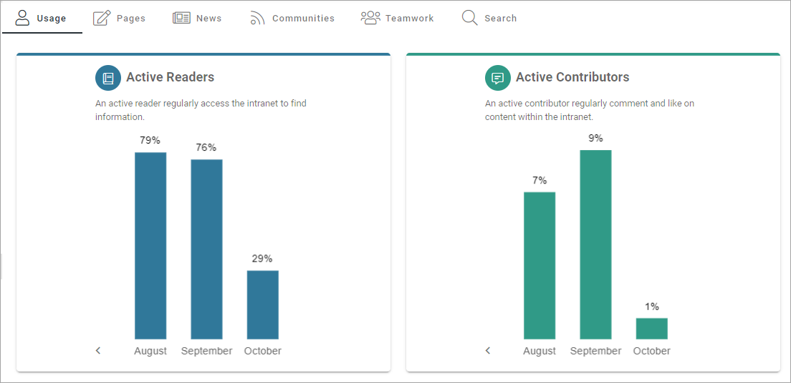
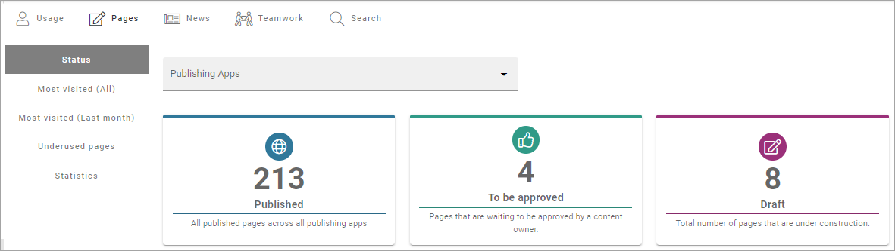

Dashboard
===========

**This page is being edited. Will be finished soon**.

Here you can see dashboard information on several aspects of your tenant. Heres an example on what can be shown for Usage:

What is to be considered active readers and active contributors are set in the Metrics settings. See this page for more information: :doc:`Metrics settings </admin-settings/tenant-settings/settings/metrics/index>`

Under Page Status, the following can be availble:

A number of tabs are available. What you see in the example is the total status for the tenant. You can choose to see status for just one of the publishing apps. 
Besides that number of lists has been set up; Most Visited (All), Most Visited (Last month), Underused Pages and Statistics.

.. image:: admin-dashboard-page-status-lists.png

For Underused Pges, something like the following can be shown:

.. image:: admin-dashboard-underused-pages.png

What should be considered underused content is defined in the Metrics settings, see link above.

Note the list to the right, of pages that has npt been vsitied for a very long time. For more information on the lists, see below.

For News, this has been set up:

.. image:: admin-dashboard-news.png

Besided Status for news pages, a number of lists is available; Reach, Most Visited (Last month), Most Commented (Last month), Most Liked (Last month) and Statsitics:

.. image:: admin-dashboard-news-lists.png

Regarding Reach: How well we reach our target audience based on what we expect. The metric can be configured to a specific scope of pages (for example News pages) and have a target number of users. For nmore information on the lists, see below.

For Teamwork, you can see the number of active teamworks and if any has been created this week or this month:

.. image:: admin-dashboard-teamwork-new.png

In the image above, status for all Teamwork Templates are shown. You can also choose to see the status for just one of the templates, meaning all teamworks created from a certain template.

Finally, in this example, status for searches made by users can be shown:

.. image:: admin-dashboard-search.png
