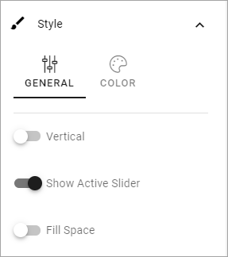
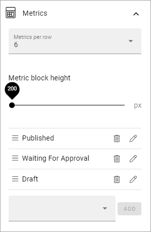
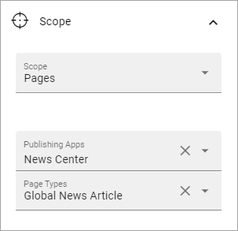
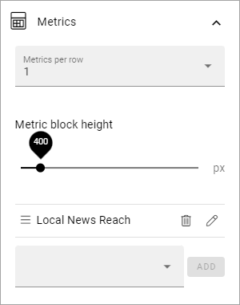
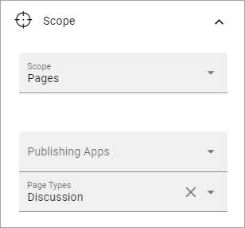

Dashboard
===========

Here you can build the Dashboard to your needs. You set up the Dashboard much like you would do a page type. Most sections and blocks can be used.

.. image:: dashboard-new.png

As you would a page type, the first step is to add the layout, using sections. See this page for more information: :doc:`Working with section and blocks </pages/page-types/working-with-sections-and-blocks/index>`

You then add the blocks you need. All available blocks are listed on this page: :doc:`Blocks </blocks/index>`

The Metrics block (new in Omnia 6.5) can be especially useful: :doc:`The Metrics block </blocks/metrics/index>`

You can also edit some of the metrics settings, in Omnia Admin, see: :doc:`Metric settings </admin-settings/tenant-settings/settings/metrics/index>`

Implementation example
************************

Here's an example of a Dashoboard set up:

.. image:: admin-dashboard-usage.png

Under Usage, information about active readers and active contributors are shown. What should be considered an active reader or an active contributor is defined in the Metrics settings, see link above.

Under Page Status, something like the following is shown:

.. image:: admin-dashboard-page-status.png

What you see in the example is the total status for the tenant. You can choose to see status for just one of the publishing apps and/or just one of the page types.

For Underused Content, something like the following can be shown:

.. image:: admin-dashboard-underused-content.png

What should be considered underused content is defined in the Metrics settings, see link above.

Regarding Reach - a description will be added soon.

.. image:: admin-dashboard-reach.png

For Teamwork, you can see the number of active teamworks and if any has been created this week or this month:

.. image:: admin-dashboard-teamwork.png

Finally, for Communities, the following information is shown:

.. image:: admin-dashboard-communities.png

How it's done
-----------------
The layout in this implementation example is a tab section with six tabs:

.. image:: dashboard-example-tab-section.png

The settings for the tabs are similar. Here's the first tab as an example:

.. image:: dashboard-example-tab-settings.png

For Style, "Show Active Slider" is selected so it's clear which the active tab is:

On each tab a Metrics block is placed, with the following settings:

**Usage**: For this tab the Scope is set to "User Activity",  with the following Metrics:

.. image:: dashboard-example-tab-usage.png

**Page Status**: Here the setting for Scope is "Pages" with the following Metrics:

**Underused Content**: The Scope for this is also set to page, but this time the following Metrics:

.. image:: dashboard-example-tab-page-underused.png

**Reach**: On the Reach tab, two Metrics blocks are added.

For the "Global News Reach", the Scope is set this way:

And the Metrics, this way:

.. image:: dashboard-example-tab-page-reach-news-metrics.png

For the "Local News Reach", the Scope is set this way:

.. image:: dashboard-example-tab-page-reach-news-local.png

As you can see, the difference between these two blocks, is the Page Type used.

And the Metrics, this way:

**Teamwork**: For this tab, the Scope is set to "Teamwork", with three Metrics:

.. image:: dashboard-example-tab-teamwork.png

A filter is also added so you can choose the type of teamwork, based on template:

.. image:: dashboard-example-tab-teamwork-filter.png

**Communities**: For the "Communites tab" Scope is set to Pages, and the Page Type "Discussion":

And with the following Metrics:

.. image:: dashboard-example-tab-communities-metrics.png

For more information about the Metrics block, see the link at the top of this page.
