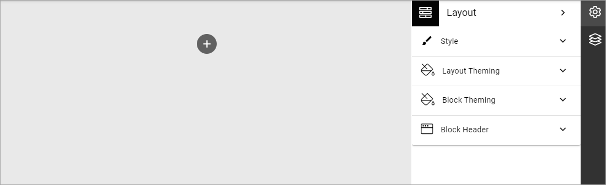
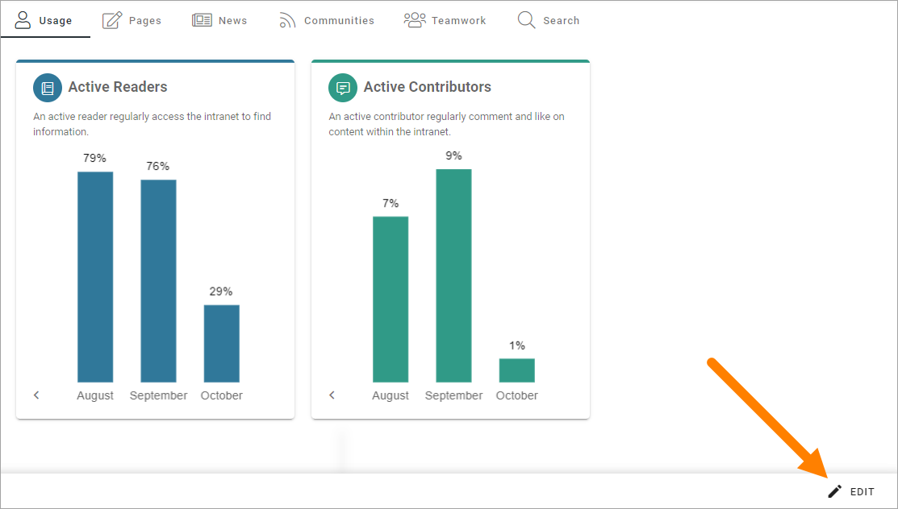

Dashboard
===========

Here you can build the Admin Dashboard to your needs, to display dashboard information on many different aspects of the tenant. You set up the Dashboard the same way as you would any layout in Omnia. Most sections and blocks can be used.

See this page for gmore information: :doc:`Working with layouts </general-assets/working-with-layouts/index>`

The Metrics block can be especially useful: :doc:`The Metrics block </blocks/metrics-block-612/index>`

You can also edit some of the metrics settings, in Omnia admin, see: :doc:`Metric settings </admin-settings/tenant-settings/settings/metrics/index>`

For an implementation example, see this page: :doc:`Dashboard implementation example </admin-settings/tenant-settings/dashboard/dashboard-implementation/index>`

Tip - find broken links and more
-----------------------------------
You can use the Metrics block to find all broken links, and all attempts for users to visit a URL they didn’t have access to.

The option is called "URL status". Use th link above for more information about the Metrics block.

Edit the Dashboard
********************
To edit an existing Dahboard, click EDIT here:

Dashboard information through the Metrics block
*******************************************************
If you would like to display Dashboard/Metrics information of some kind for all or some users, you can use the Metrics block on any Omnia page. For more information on the Metrics block, see the link above.

