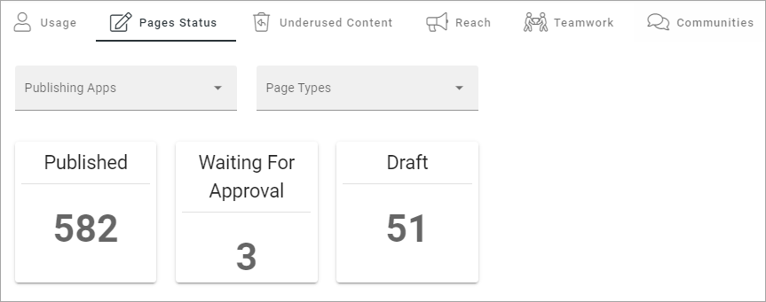
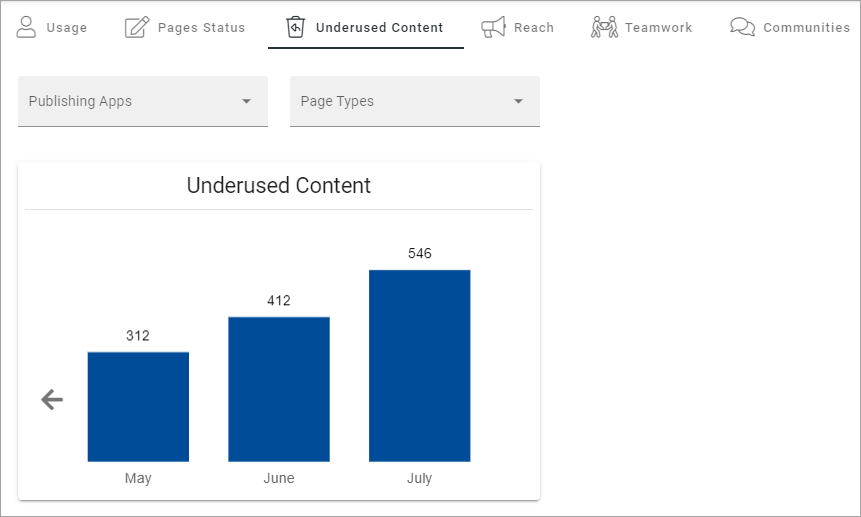
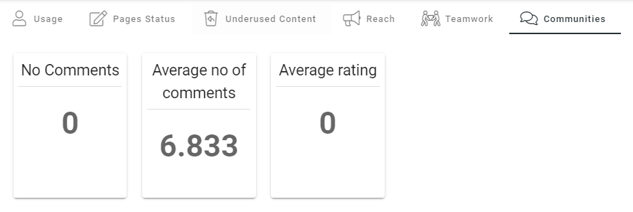

Dashboard
===========

This is an ongoing, preliminary documentation.

In omnia 6.5, the complete dashboard has been moved to Omnia Admin (that is what is described here). A block will still be available, now called Metrics, to display status for either Teamwork or Pages or User Activity. This block can also be used in the Dashboard.

The Dashboard will be completely dynamic. You set up the Dashboard much like you would do a page. Most blocks can be used.

.. image:: dashboard-new.png

As you would a page (or maybe rather a Page Type), the first step is to add the layout. See this page for more information: :doc:`Working with section and blocks </pages/page-types/working-with-sections-and-blocks/index>`

All available blocks are listed on this page: :doc:`Blocks </blocks/index>`

The new Metrics block can be especially useful: :doc:`The Metrics block </blocks/metrics-block/index>`

You can also edit some of the metrics settings, see: :doc:`Metric settings </admin-settings/tenant-settings/settings/metrics/index>`

See below for an implementation example.

Implementation example
************************

Here's an example of a Dashoboard set up:

.. image:: admin-dashboard-usage.png

Under Usage, information about active readers and active contributors are shown. What should be considered an active reader or an active contributor is defined in the Metrics settings, see link above.

Under Page Status, something like the following is shown:

What you see in the example is the total status for the tenant. You can choose to see status for just one of the publishing apps and/or just one of the page types.

For Underused Content, something like the following can be shown:

What should be considered underused content is defined in the Metrics settings, see link above.

Regarding Reach - a description will be added soon.

.. image:: admin-dashboard-reach.png

For Teamwork, you can see the number of active teamworks and if any has been created this week or this month:

.. image:: admin-dashboard-teamwork.png

Finally, for Communities, the following information is shown:

(A more detailed description of the Communities metrics will be added soon).

