Document templates
====================

Here you handle the document templates in your tenant. The templates can be available for controlled documents only or as general document templates in Omnia as well.

The list of available templates can look like this:

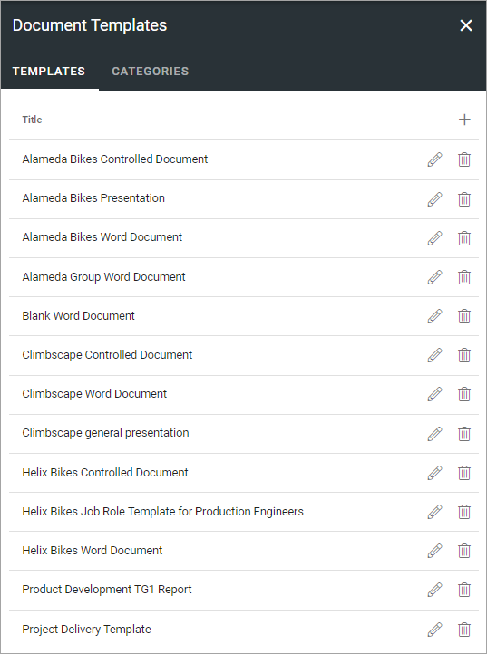

Click the pen to edit a template. Click the dust bin to delete a template.

When editing a template, the same options are available as when creating a new template, see below.

Categories
*****************
If there are many templates you can use Categories to group them. Categories are applicable for normal templates only. (Controlled documents are grouped by document type, not done here).

The first step is to create the cateogories you will use (you can of course add more categories later) and then add categories when creating new or editing templates. Using categories is never mandatory, and even if you use them, some templates can still have no category. On the other hand, a template can belong to more than one category.

If categories are used, users will see them this way in the document wizard.

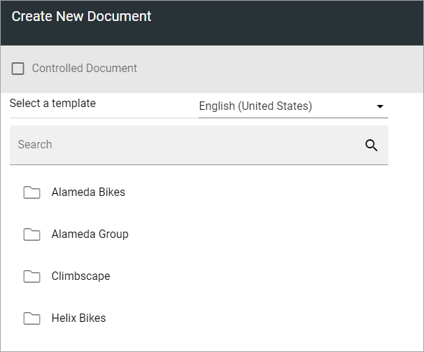

A list of document categories can look like this:

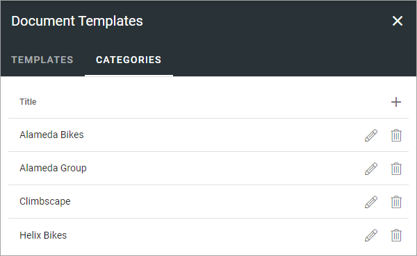

Click the pen to edit a category. Click the dust bin to delete a category.

To add a category, do the following:

1. click the plus.
2. Type a Title for the new category and save.

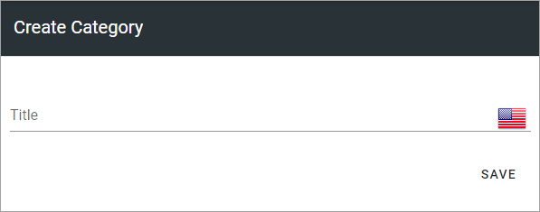

You can add titles for any of the languages use in the tenant (click the flag to change language). A title for the default language is mandatory.

Adding a new template
**********************
Do the following:

1. Click the plus.

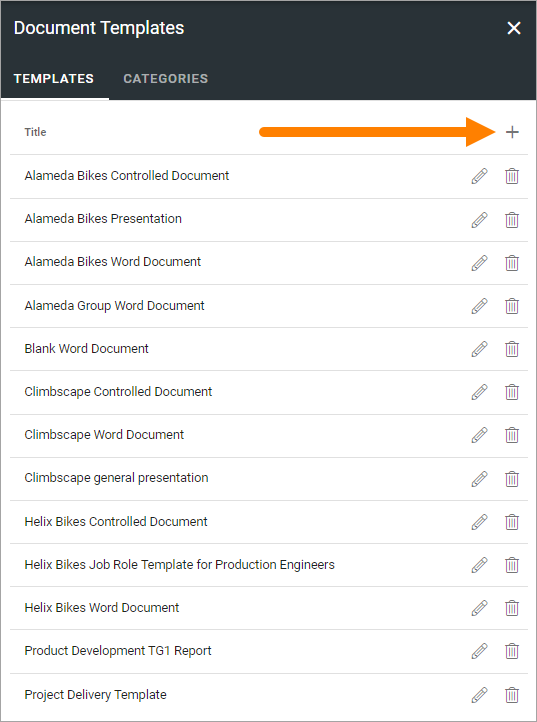

Set the following:

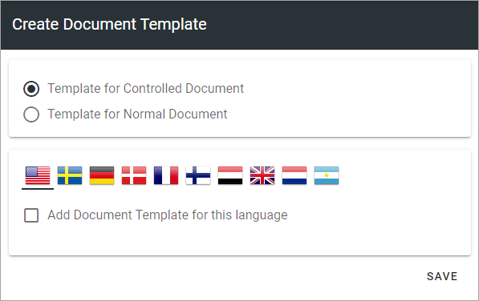

2. Select to add a template for controlled documents or for standard documents.

See below for the rest of the steps.

Template for standard documents
-------------------------------
I you selected to add a template for standard documents, continue this way:

1. Select one or more categories if you wish.

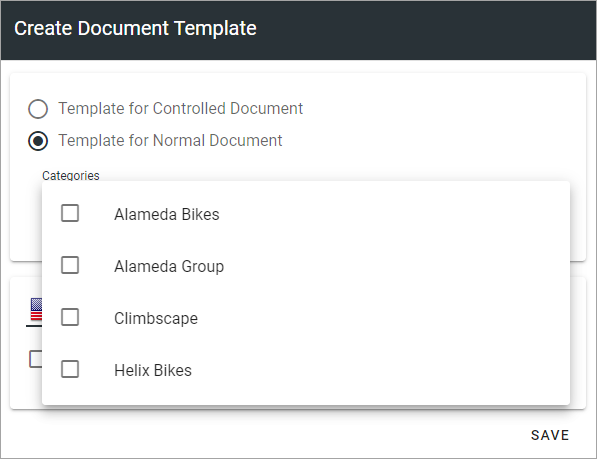

2. Select language and click "Add Document Template for this language".

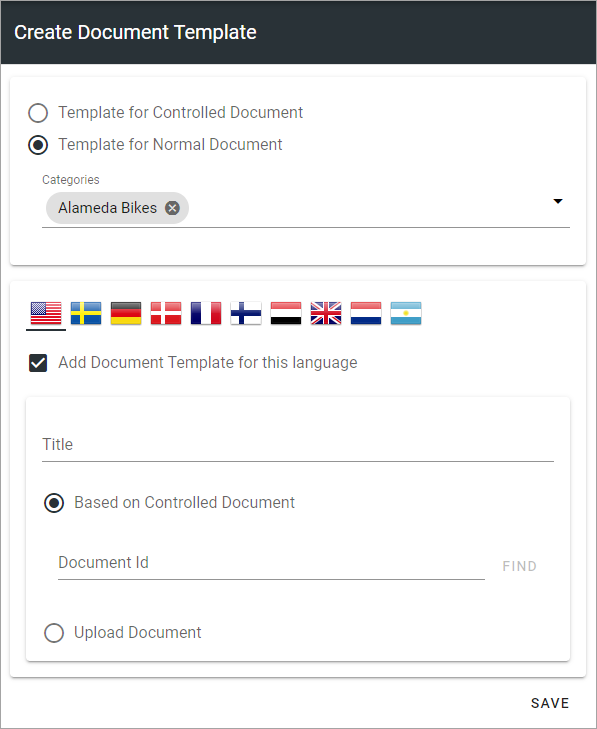

3. Type a title for the template.

You can now either link to an existing, published controlled document (which was most likely published for the purpose of being a template), or prepare and upload a new document, to use as a template.

Link to a published Document
----------------------------------
To link to a published controlled document you have to know the Document Id (which you normally can see where the document is listed).

1. Enter the document-id and click "Find".

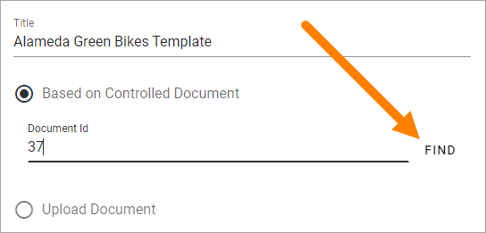

2. When you have found the document, click "Save".

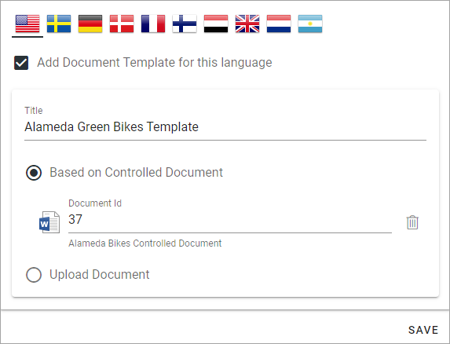

**Note:** When a new edition of the linked document is published, the template is automatically updated. When an editor creates a new document based on document type with a linked document as template, the latest edition is always used. Existing, published documents are not changed.

Upload document
------------------
To upload a document to use as a template:

1. Select "Upload Document".
2. Upload the file by using drag and drop or click "Browse" to browse for the file and select it.

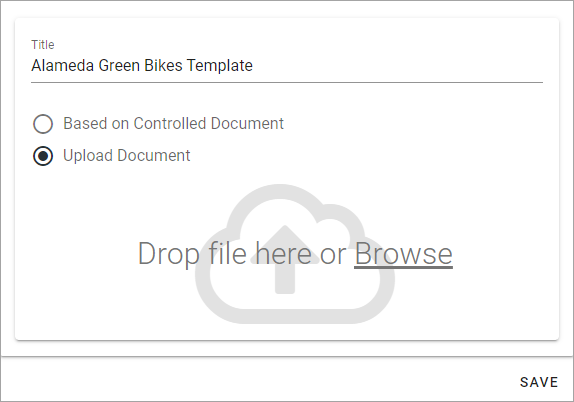

3. Click "Save".

Template for Controlled Documents
**********************************
When you are creating a template for controlled documents you don't use categories. Controlled documents are grouped by document types, which you don't work with here. See this page for more information: :doc:`Document Types </admin-settings/tenant-settings/document-management/document-types/index>`

The rest of the steps are the same as above.

Using a template in the Document Wizard
*****************************************
How to use a template in the Document Wizard is described on this page: :doc:`Using the Document Wizard </working-with-documents/using-the-document-wizard/index>`.
