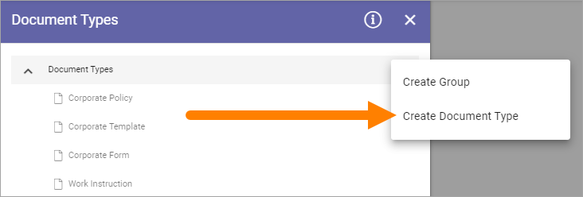
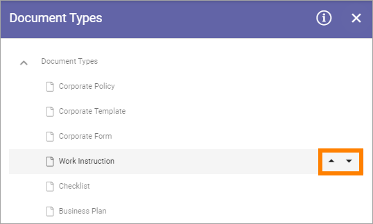
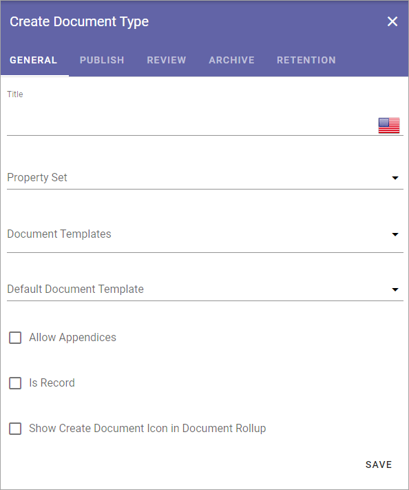
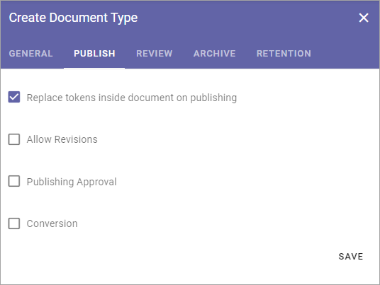
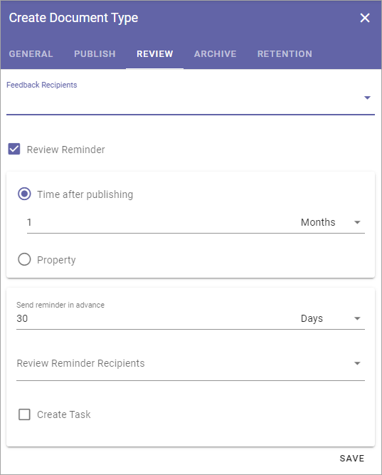
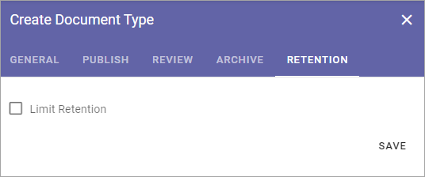
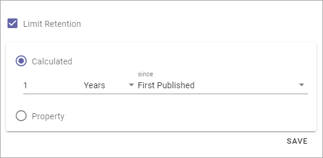

Document Types
================

When creating a new controlled document an author selects a Document Type. Document Types can be grouped. In that case the author first selects group and then Document Type within that group.

The settings displays all existing Document Types, and Groups, for example:

.. image:: document-types-start-new2.png

The i icon can show information on syncronization of new or edited Document Types.

.. image:: document-types-i-icon.png

Here's an example:

.. image:: document-types-info-new2.png

You can decide the order in which the document types are shown within a grooup. Click a document type and use the arrows to move up or down.

.. image:: document-types-move.png

Creating a new Group
**********************
To create a new a group, do the following:

1. Click any existing group.
2. Click the plus and select "Create Group".

.. image:: doctype-select-group-new2.png
 
3. Add a Title in one or more languages (click the flag to change language). Default language in the tenant is mandatory.

.. image:: doctype-group-title-new2.png

4. Save.

Creating a Document Type
*****************************
To create a new Document Type, do the following:

1. Click the group to create a Document Type in.
2. Click the plus and select "Create Document Type".

 
2. Set all necessary settings and save.

The same settings are available when creating a Document Type and when editing one. See below for detailed information.

Sort Document Types
***********************
You can sort if you want to present the list in a specific order to the editors.

1. Select the group or Document Type to move and use the arrows.

Edit or delete a Document Type or group
******************************************
To edit or a Group or Document Type, do the following:

1. Select the type or group.
2. Edit available settings (see below for detailed information about Document Type settings).
3. Save.

To delete a Group or Document type, do the following:

1. Select the type or group.
2. Available settings are now shown.
3. Click the dust bin.

.. image:: doctype-delete-new3.png

Settings for Document Types
****************************
The settings are organized into five tabs, see the sections below.

General
--------
The General tab contains the following settings (image from Omnia 6.12):

+ **Title**: Add a Title for the Document Type in one or more of the tenant languages (click the flag to change language). Note that default language is mandatory.
+ **Property Set**: Property Sets is a way of groping a number of properties into a set, which makes it easier to use a set of properties in several Document Types. Select a property set for the Document Type. When you have done so you can click the cogwheel to see which properties belong to the set. You will also see information about Placeholder Shortname and default value for the properties in the set.
+ **Document Templates**: Select one or more of the templates. Available templates depends pn Property set selected. You must always do this even if there’s just one template available.
+ **Default Document Template**: Use this option to select one of the templates for this Document Type as the default template. When selecting the Document Type, the author then has this template preselected.
+ **Allow appendices**: Check this option to allow for appendices. Authors can then tie other documents as appendices to the main documents. This option must be checked to make it possible for this document type.
+ **Is record**: This option is available in Omnia 6.12 and later. Some controlled documents may not need to be updated, just to be used as is. To set that for this document type, select this option. See below for more information.
+ **Show Create Document Icon in Document Rollup**: In the Document Rollup the “Create Document Icon” column can be added. A document can be created using the icon only if it belongs to a Document Type that has this option selected. if not, the icon is not shown.

Don't forget to save when you're done.

Here's an example when a Create New Document icon is shown in a Document Rollup list.

.. image:: document-rollup-create-new-icon.png

Options for Is Record
----------------------
The following options are available when you select "Is Rewcord":

.. image:: document-type-is-record.png

+ **Disable Create Draft**: When you select this option, documents of this document type can only exist in one edition. Creating a draft from a published edition is not possible.
+ **Disable Move**: When this is selected, the Move option in a controlled documents library, can't be used for document of this type.
+ **Disable Unpublish**: If this option is selected, a document of this type can't be unpublished. Once published, it's always available.

You can select any combination of options here. Be careful, this can not be changed for existing, published documents created from a document type with these settings, just for new documents after the document type has been edited.

Publish
---------
On the Publish tab you can set the following:

+ **Replace tokens inside document on poublishing**: When a document is published, the placeholders (tokens) will be replaced with metadata, but for a document that will be used as a template, you will probably not want that to happen. If you are creating a Document Type to be used for templates, deselect this option.
+ **Allow Revisions**: Selecting this option you can allow authors to publish a revision of a document that does not require approval, for example for correcting typing errors. If this option is active, it's up to the author to decide if approval is needed or not. Approval is still needed for publication of a new edition of a document.
+ **Publishing approval**: Select if approval is to be used for this Document Type. If this option is NOT active, a document will be published immediately when an author clicks "Publish". If Publishing Approval is selected, you must also choose how approval will take place:

    - Anyone: The author can select any user of the portal as approver, when the document is published.
    - Limited list of users: Authors can select approvers from a defined list only. You create the list here.
    - Term-driven: Authors can select approvers from a defined list only. Which approvers will be available depends on the Properties selected for the documents. You select the term(s) here. When you have selected one or more terms you can use the cogwheel to set approvers for individual terms in the set.
    - Based on person property: You select one of the person properties defined, for example Document owner.
    - Group: This setting will use the permission group for approvers in the Team Site. Needs "Approvers Group" to be selected in Settings for Document Management. 
+ **Conversion**: Select if conversion to PDF will be available, and then choose how.

Don't forget to save your changes.

**Important note!** How Publish will work is set when Document Management is activated for a site. If the settings here are changed, it does not change the setting in existing sites. If you want that to happen, you must update the Document Management feature in each site. See the heading "Features" on this page for more information: :doc:`App settings </admin-settings/app-settings/index>`

Review
---------
On this tab you handle settings for Feedback and Review of documents. When a document of this Document Type has passed it's Review Date, a link to the document is placed in the list "Expired review".

.. image:: document-types-review-new.png

+ **Feedback Recipients**: Select feedback recipient(s) in the list. 
+ **Review reminder**: Select this option to activate review reminders.

When review reminders are activated you can set the following:

+ **Time after Publishing**: Set number of months, weeks or days for Review Interval. 
+ **Property**: Another way is to select a Property for handling of Review. An example could be if you want authors to be able to set a specific date for review, which could be needed for a Supplier Agreement, for example. A date property must then have been set up for this to work.
+ **Send reminder in advance**: Set the number of days that a reminder should be sent, before the Review Date.
+ **Review Reminder Recipients**: Select review reminder recipient(s) in the list.
+ **Create Task**: If a review task should be created, select this option. Then use the list to select who to assign the task to.
+ **Task expire in**: This is shown when you select "Create Task". Set the number of days, months or years before the task will expire. 

Archive
----------
Use this tab to decide if this Document Type should be archived or not. If the Document Type should be archived, you can set archive to be used, by adding the Url. You don't have to add a Url to use the default archive.

.. image:: document-types-archive-new.png

Retention
------------
If Retention is activated, this tab is shown for all Document Types:

Use this tab to set up a Retention Policy.

+ **Limit Retention**: Select this option if a Retention Policy should be set for this Document Type.

Then you can set the following:

+ **Calculated**: You can select to calculate the number of years or months on when the document was first published or when it was last published.
+ **Property**: Another way is to select a property for retention, for example Retention Date.

When the set Retention time has passed, the Retention Manager will receive an e-mail. The e-mail includes a link to a page where the document can be terminated (completely removed from the system). 

