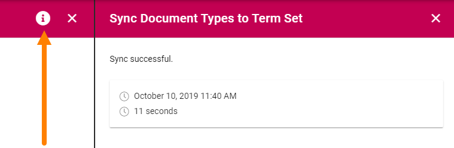
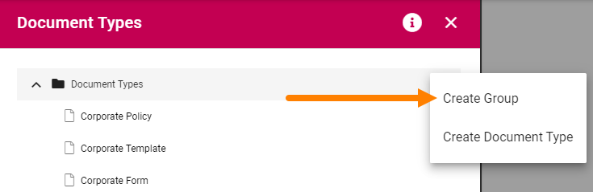
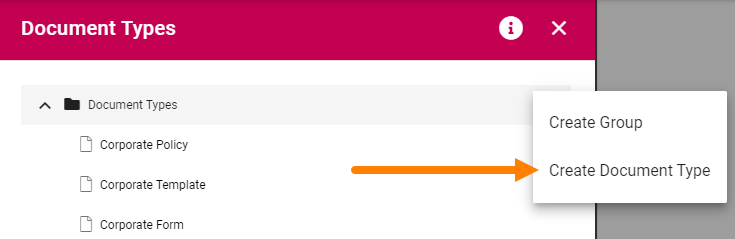
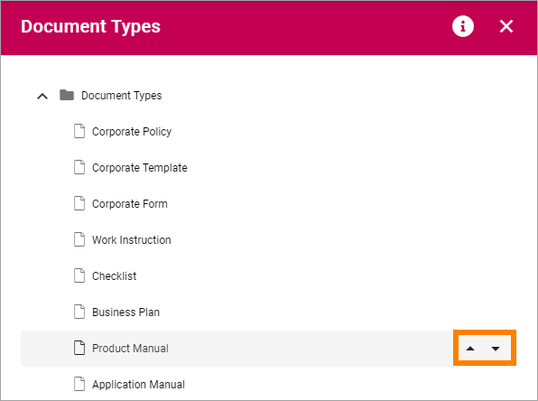

Document Types
================

(This documentation is just started, more will be added soon).

When creating a new controlled document an author selects a Document Type. Document Types can be grouped. In that case the author first selects group and then Document Type within that group.

The settings displays all existing Document Types, and Groups, if they are grouped, for example:

.. image:: document-types-start.png

The i icon can show information on syncronization of new or edited Document Types. Here's an example:

Creating a new Group
**********************
To create a new a group, do the following:

1. Point at any existing group.
2. Click the plus and select "Create Group".

 
3. Add a Title in one or more languages (default language in the tenant is mandatory).

.. image:: doctype-group-title.png

4. Save.

Creating a Document Type
*****************************
To create a new Document Type, do the following:

1. Point at the group to create a Document Type in.
2. Click the plus and select "Create Document Type".

 
2. Use the following settings:

.. image:: document-type-general.png

The same settings are available when creating a Document Type and when editing one. See below for detailed information.

Sort Document Types
***********************
You can sort if you want to present the list in a specific order to the editors.

1. Select the group or Document Type to move and use the arrows.

Edit or delete a Document Type or group
******************************************
To edit or a Group or Document Type, do the following:

1. Select the type or group.
2. Edit available settings (see below for detailed information about Document Type settings).
3. Save.

To delete a Group or Document type, do the following:

1. Select the type or group.
2. Available settings are now shown.
3. Click the dust bin.

.. image:: doctype-delete.png

Settings for Document Types
****************************
The settings are organized into five tabs, see the sections below.

(More info will be added very soon).

