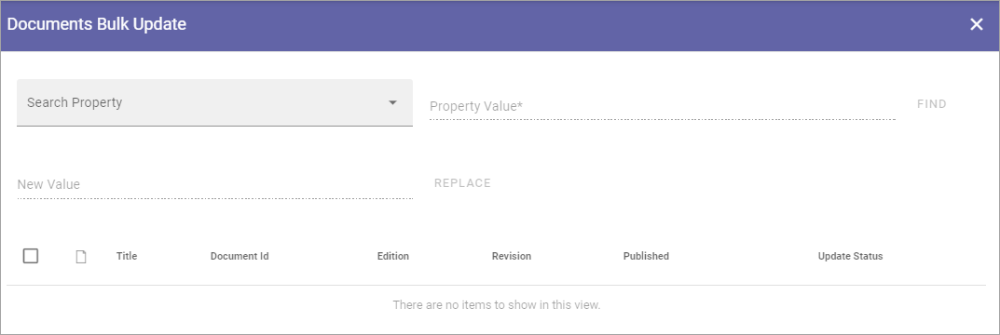

Documents Bulk Update
=======================

This option is available in Omnia v6 only.

Use this option to bulk update any of the defined document management properties. Note that not all properties can be updated this way. One example is Approver. 

1. Select "Search Property".
2. In "Property Value", add the value to be replaced.
3. Click "FIND".

A list of published documents that has the selected property defined is displayed.

4. In "New Value", add the value that should replace the one you selected.
5. Select all documents that should replace the value.
4. Click "REPLACE".

.. image:: documents-bulk-update-2.png

Bulk update and templates
***************************
Note that Bulk update never updates the template. The republish via Bulk update always uses the current template.

