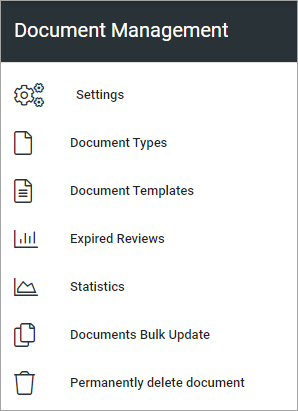

Document management
=====================

Here you handle all the settings for Document management.

Prerequisite: The tenant feature "Controlled documents" must be active for these options to be available.

Select section for a description:

.. toctree::
   :titlesonly:

   settings/index
   document-types/index
   document-templates/index
   document-template-with-placeholders/index
   expired-reviews/index
   statistics/index
   documents-bulk-update/index
   document-termination/index
   about-merging-terms/index
   
**Note**: In Omnia 7.0 and later, the option "Document termination" is renamed "Permanently delete document". The functionality is the same.
