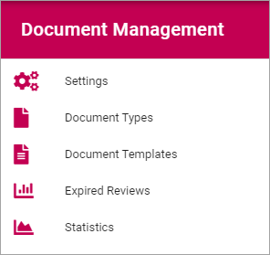

Document Management
=====================

Here you handle all the settings for Document Management.

(The documentation is just started, more will be added soon.)

**Note!** The Feature "Controlled Documents" must be activated for these settings to show up.

Settings
*********
These settings are available here:

.. image:: document-management-settings.png

General
--------
+ **Term set for Document Types**: A link to the default term set is shown. You can select enother term set bu clicking the icon to the right. 
+ **Authors of Controlled Documents**: Here you can set the type of permissions to be used in Controlled Documents libraries in the tenant. 
- "Document Authors Group": This is the default setting. A specific permission group will be used for authors.
- "Site Owners": All site owners will have permissions to work with Controlled Documents. No specific permission group for authors is needed.
- "Site Owners and Members": All site owners and all Members will have permissions to work with Controlled Documents. No specific permission group for authors is needed.

