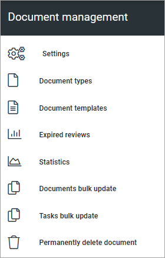

Document management
=====================

Here you handle all the settings for Document management.

Prerequisite: The tenant feature "Controlled documents" must be active for these options to be available. (Image from Omnia 7.6).

Select section for a description:

.. toctree::
   :titlesonly:

   settings/index
   document-types/index
   document-templates/index
   document-template-with-placeholders/index
   expired-reviews/index
   statistics/index
   documents-bulk-update/index
   tasks-bulk-update/index
   document-termination/index
   about-merging-terms/index

