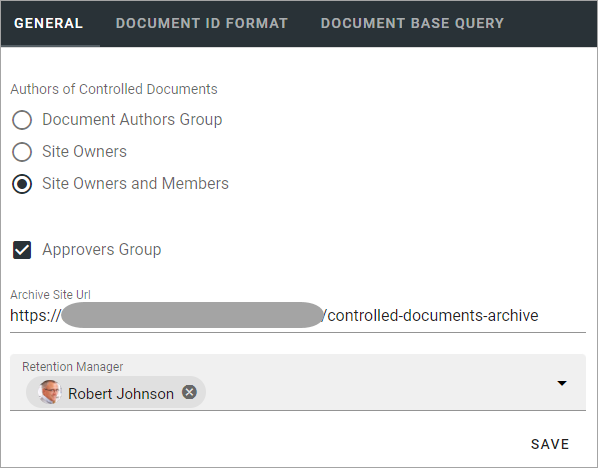
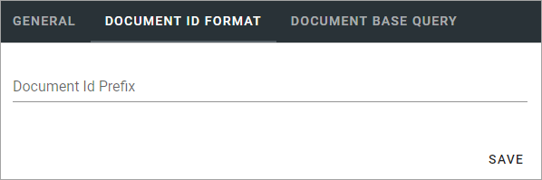
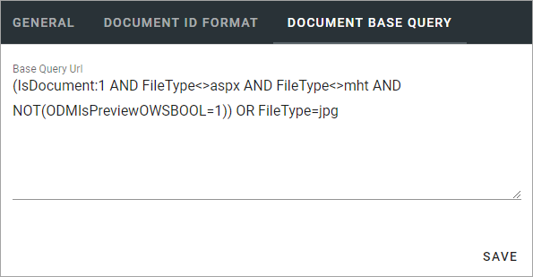

Document management settings
==============================

The following is available here, organized in three tabs:

General
*********
You can set this on the "General" tab:

+ **Authors of controlled documents**: Here you can set the type of permissions to be used in controlled documents libraries in the tenant. 

    - "Document authors group": This is the default setting. A specific permission group will be used for authors.
    - "Site owners": All site owners will have permissions to work with controlled documents. No specific permission group for authors is needed.
    - "Site owners and members": All site owners and all Members will have permissions to work with controlled documents. No specific permission group for authors is needed.
+ **Approvers group**: If this option is selected (default) a specific permission group will be created for approvers in every teamsite with a controlled documents library. Note that this should normally be selected. Not using permission groups is for specialized implementation only. Also note that you can still set what type of approval to use for each document type.
+ **Archive site URL**: Part of the controlled documents functionality is an archive site, where a copy of all published document’s editions are placed in an archive. The link to the site is shown here and can be edited if needed.
+ **Retention manager**: For retention of documents to work, a retention manager must be added in this field.

Document Id format
*********************
Here you set the prefix for the Document id for this tenant.

When a new controlled document is published the first time, a document id is set for the document, based on the prefix from the settings. This document id is then the same in all future editions of the document and is an important part of tracking published editions of the document. 

**Note!** The Document Format can be changed even after creation of Controlled Documents has started, but it's not really recommended. Still, if it's done, existing documents will keep their prefix and only new documents will get the new one.

Document base query
*********************
Here you can add one or more base queries that always should be executed in the background when a search is run in a rollup. The purpose is to help set what this organization regards as a "document". For example, is a PDF file regarded as a document?

Here's an example of a base query:

You use Keyword Query Language (KQL) here. To learn more about KQL, see this Microsoft page: https://docs.microsoft.com/en-us/sharepoint/dev/general-development/keyword-query-language-kql-syntax-reference

