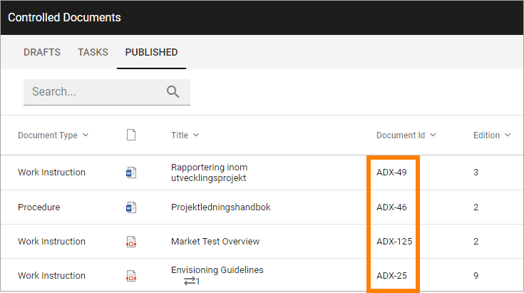

Document Management Settings
==============================

These settings are available here:

.. image:: document-management-settings-new.png

General
*********
You can set this on the "General" tab:

+ **Authors of Controlled Documents**: Here you can set the type of permissions to be used in Controlled Documents libraries in the tenant. 
    - "Document Authors Group": This is the default setting. A specific permission group will be used for authors.
    - "Site Owners": All site owners will have permissions to work with Controlled Documents. No specific permission group for authors is needed.
    - "Site Owners and Members": All site owners and all Members will have permissions to work with Controlled Documents. No specific permission group for authors is needed.
+ **Approvers Group**: If this option is selected (default) a specific permission group will be created for approvers in every Team Site with a Controlled Documents library. Note that this should normally be selected. Not using permission groups is for specialized implementation only. Also note that you can still set what type of approval to use for each Document Type.
+ **Archive Site Url**: Part of the Controlled Documents functionality is an Archive site, where a copy of all published document’s editions are placed in an archive. The link to the site is shown here and can be edited if needed.

Document Format
****************
Here you set the prefix for the Document id for this tenant.

.. image:: document-management-settings-format.png

When a new controlled document is published the first time, a document id is set for the document, based on the prefix from the settings. This document id is then the same in all future editions of the document and is an important part of tracking published editions of the document. Here's an example:

**Note!** The Document Format can be changed even after creation of Controlled Documents has started, but it's not really recommended. Still, if it's done, existing documents will keep their prefix and only new documents will get the new one.

