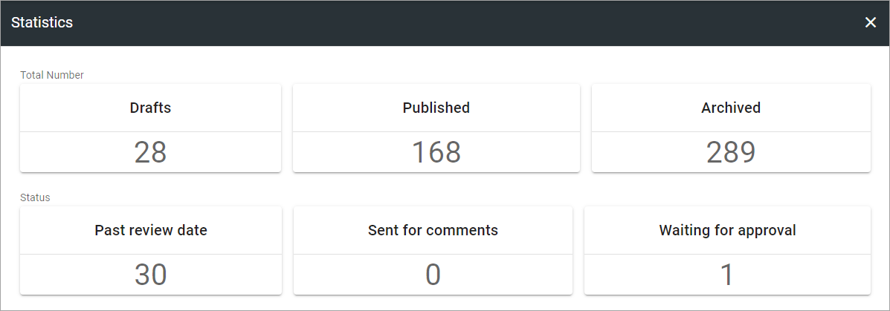
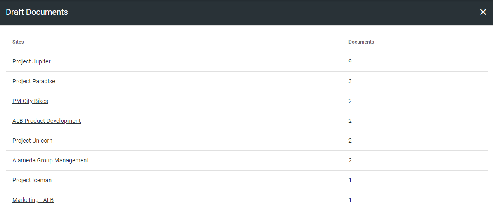

Statistics
====================

Here you can se various statistics for Controlled Documents, for example:

When you click a section you will get:

+ **Drafts**: A list of sites with drafts. The list displays the number of drafts per site. 
+ **Published**: A list of sites with published documents. The list displays the number of published documents per site. 
+ **Archived**: A list of Controlled Documents archives in this tenant. You can click a link to go to the archive and find out more, if you have the permission to access the archive. Each archive is a separate site and has it's own permissions.
+ **Passed review date**: This is the same list as "Expired Reviews".
+ **Sent for comments**: A list of sites with active Sent for Comments workflows. The list displays the number of active workflows per site.
+ **Waiting for approval**: A list of sites with active Approval workflows. The list displays the number of active workflows per site. 

You can click any of the statistics to see a list of documents.

Here's an example of a "Drafts" list:

If you need to check a document, click the link to go to the controlled documents library in that site. You of course need to have the right permissions to be able to open the library.
