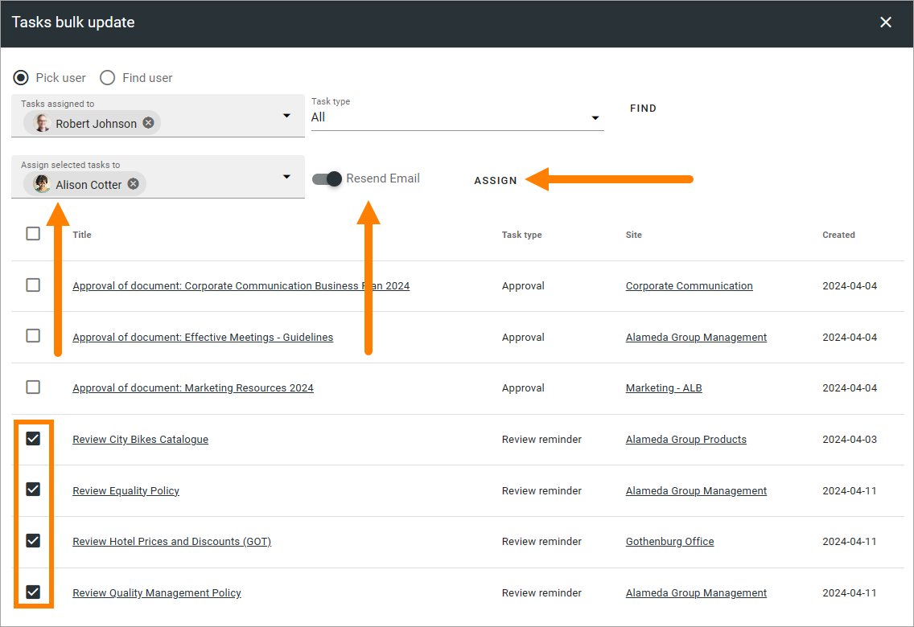

Tasks bulk update
========================

This is a new option in Omnia 7.6. 

.. image:: tasks-bulk-update.png

You can use this option to reassign tasks to another colleague. Here's how:

1. Decide to use the people picker (Pick user) or to search for the user (Find user).
2. Find the colleague to reassing from.
3. Select task type or just keep All.
4. Click FIND.

.. image:: tasks-bulk-update-find.png

The tasks are now shown in the list, for example:

.. image:: tasks-bulk-update-list.png

5. Select the tasks that should be reassigned.
6. Select the colleague to reassign the tasks to.
7. Decide to send an Email (or not).
8. Click ASSIGN.

