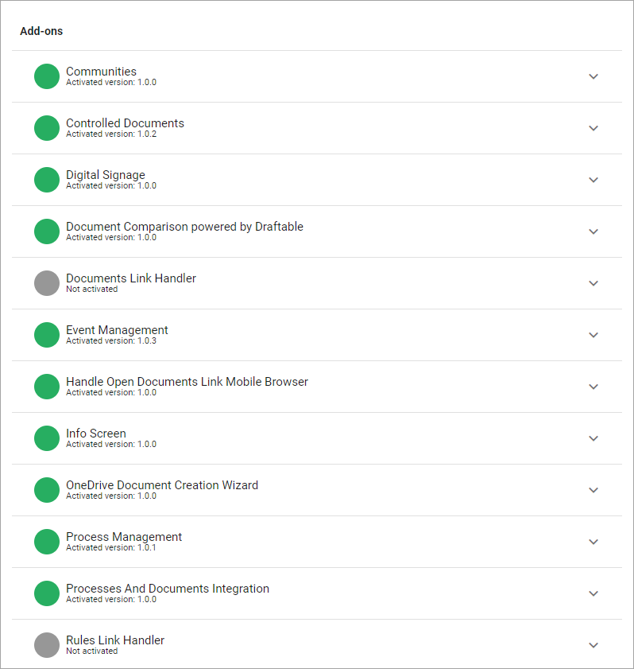
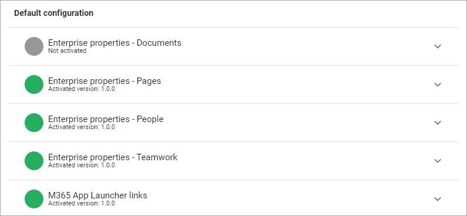
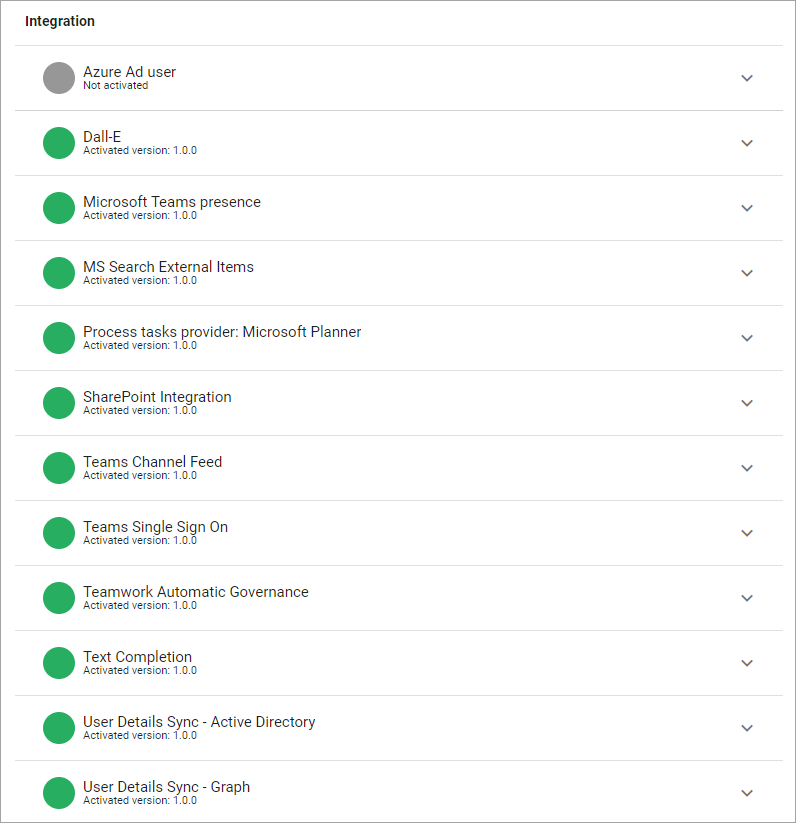
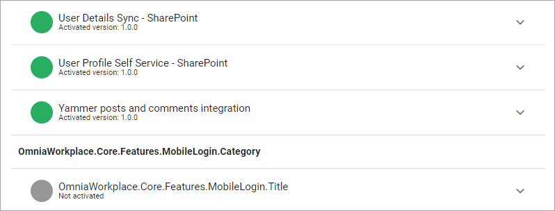
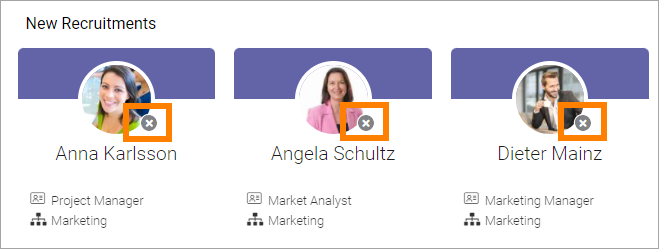
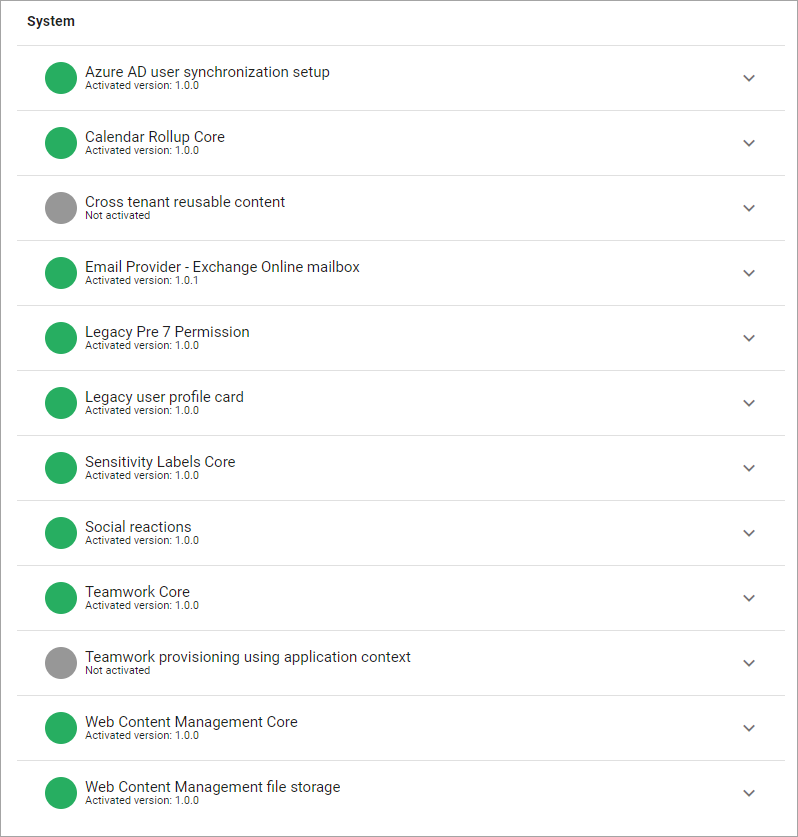

Features (Tenant) in Omnia 7.0
=============================================

This describes features available in Omnia 7.0.

**Work on the documentation is ongoing.**

Add-ons
*********
Here you can activate, remove or upgrade the Omnia Add-ons. 

+ **Communities**: Activates the extensive functionality for Omnia Communities in the tenant.
+ **Controlled Documents**: Activates the extensive funcionality for working with cxontrolled documents in the tenant.
+ **Digital Signage**: Activates the options for digital signage in the the tenant.
+ **Document Comparison powered by Draftable**: This feature needs a paid subscription with Draftable. When this feature is activated, comparison of documents is extended and improved. Works for documents without having to open them. Works for PDF:s as well. Note that you have to add the Draftable Account information as well, for this to work. That is done under Permissions-Secrets.
+ **Event Management**: Activates the extensive functionality for Omnia Event Management in the tenant. 
+ **Handle Open Documents Link Mobile Browser**: (A description will be added soon).
+ **Info Screen**: Activates functionality for sending selected Omnia pages to general or public screens.
+ **OneDrive Document Creation Wizard**: (A description will be added soon).
+ **Process Management**: Activates the extensive Omnia Process Management functionality in the tenant.
+ **Processes and Documents integration**: When this feature is activated, authors of controlled documents can suggest documents to be related to a process. Process authors can then decide to add a suggested document to the process, or not. Also note that this feature changes the way a process author works with the Documents list for a process. 
+ **Rules Link Handler**: Activates the link rules handler functionality. Settings are then available through "Link Handler" under "Settings" for the tenant.

For more information, see the links below:

+ :doc:`Working with Documents </working-with-documents/index>` 
+ :doc:`Info Screen </admin-settings/business-group-settings/settings/info-screen/index>`
+ :doc:`Working with Events </working-with-events/index>`
+ :doc:`Working with Processes </working-with-processes/index>`
+ :doc:`Using Communities </using-communities/index>`
+ :doc:`Digital Signage </admin-settings/tenant-settings/settings/digital-signage-613/index>`

Default configuration
******************************
The purpose of these features is to provide a number of Enterprise Properties for an easy starting point, and ready to go app launcher links. You can then edit the properties lists and the app launcher links to your organization's needs. Add the common properties you would like to have in your tenant.

Note that default properties can not be deleted, but all can be edited. 

For more information on working with properties, see these pages: :doc:`Properties </admin-settings/tenant-settings/properties/index>`

Regarding M365 App Launcher links: Activate this Feature for a number of default links for the App launcher - many of the links that will normally appear in the Microsoft 365 menu. You can then use "Shared links" to edit the links and decide which ones to use. **Note!** Most links here will not be applicable in Omnia on-prem.

Integration
*************
Here's an example of what can be available here:

and these:

+ **Azure Ad User**: (A description will be added soon).
+ **DallE**: (A description will be added soon).
+ **Microsoft Teams presence**: If activated, Teams presence is indicated by all people icons in Omnia (see below).
+ **MS Search External Items**: 
+ **Process tasks provider: Microsoft Planner**: Activate this feature to use Microsoft Planner to assign and work with process tasks. Can be used when processes are accessed through Microsoft Teams. If this feature is not activated, tasks for processes is just a simple list. 
+ **Sharepoint Integration**: (A description will be added soon).
+ **Teams Channel Feed**: (A description will be added soon).
+ **Teams Single Sign On**: (A description will be added soon).
+ **Teamwork Automatic Governance**: (A description will be added soon).
+ **Text Completion**: (A description will be added soon).
+ **User Details Sync - Active Directory**: (A description will be added soon).
+ **User Details Sync - Graph**: (A description will be added soon).
+ **User Details Sync - Sharepoint**: (A description will be added soon).
+ **User Profile Self Service - Sharepoint**: (A description will be added soon).
+ **Yammer posts and comments integration**: There's a lot of integration between Yammer and Omnia that is possible without having to activate this feature, but in order to use the new, improved Yammer integration where a post will be created in the selected Yammer community whenever a new page, matching the selected criteria, is created - this feature must be activated.

When Microsoft Teams presence is active, this type of icon indicates Teams presence:

In this example the icon indicates that the colleagues are offline at the moment.

For more information on how to set up Yammer in Omnia, see:

:doc:`Setup Yammer in Omnia </setup/setup-yammer-in-omnia/index>` 

System
**********
That following features may be found here:

+ **Azure AD user synchronization setup**: 
+ **Calendar Rollup Core**: 
+ **Cross tenant reusable content**: 
+ **Email provider - Exchange Online mailbox**: This feature must be activated if customs system email functionality is needed in the tenant. The optiopn was called "Enable Custom System Email" in earlier Omnia version. It's just a relabel, same funcitonality as before.
+ **Legacy pre 7 Permission**: 
+ **Legacy user profile card**: 
+ **Sensitivity Labels Core**: 
+ **Social reactions**: Activate this feature to use the same social reactions functionality in Omnia as in Teams. Note that when activating this feature, the Likes functionality is no longer available in any block, regardless of the "Allow social reactions" is selected or not. Existing likes will be showns as thumbs up when this feature is activated.
+ **Teamwork Core**: 
+ **Teamwork provisioning using application context**: If you want users to only be able to create Microsoft 365 Groups through Omnia templates, activate this feature. Note that additional settings needs to be made, to make sure Microsoft 365 Group can not be created any other way. More information can be found on this Microsoft page: https://docs.microsoft.com/en-us/microsoft-365/solutions/manage-creation-of-groups?view=o365-worldwide
+ **Web Content Management Core**: 
+ **Web Content Managament file storage**: When activated, the option "Copy documents locally" becomes available in the settings for the Realated Links block. Documents that are locally accessible are versioned together with the page and can be accessed by users without a SharePoint license.

