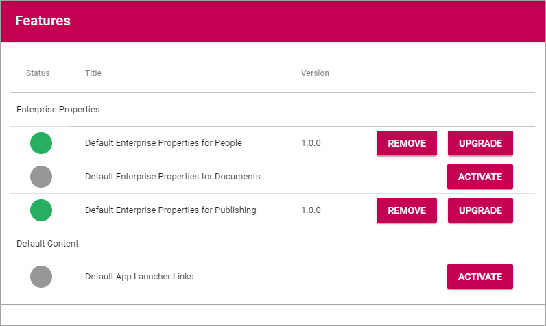

Features - Tenant
=====================

All available Features for the Tenant is listed here and can be activated, deactivated and updated when needed. Here's an example:

Enterprise Properties
*********************
The purpose of these features is to provide a number of Enterprise Properties for an easy starting point. You can then edit the properties list for your organization's needs. Add the common properties you would like to have in your tenant.

Note that some default properties can not be deleted, but all can be edited. See this page for more information: :doc:`Properties </admin-settings/tenant-settings/properties/index>`

Default Content
****************
Here you can add some default content for an easy starting point. Activate the content you want in your tenant. You can then edit these content areas for your organization's needs.

