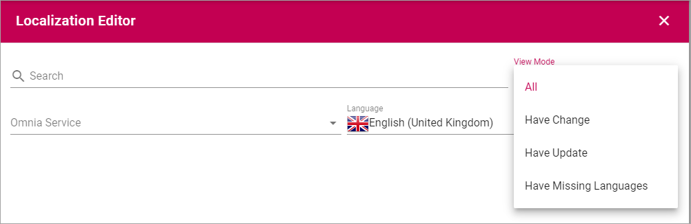
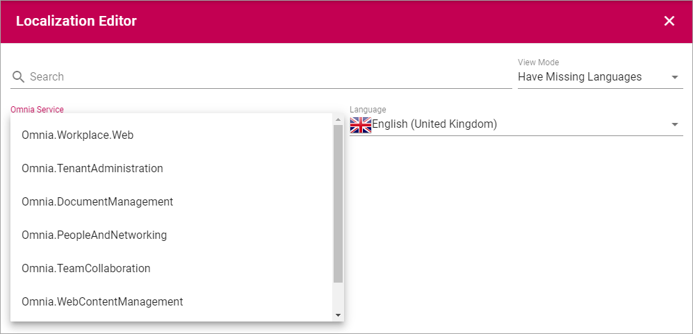
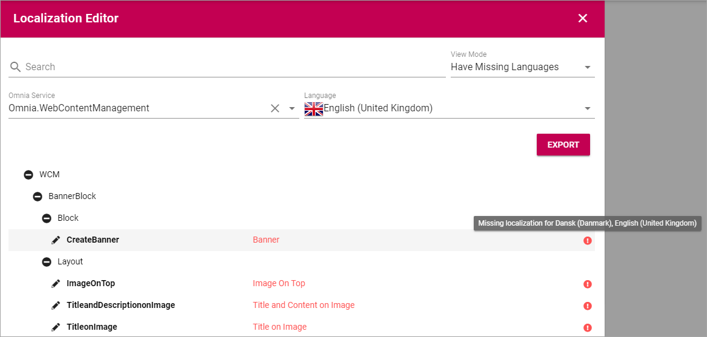
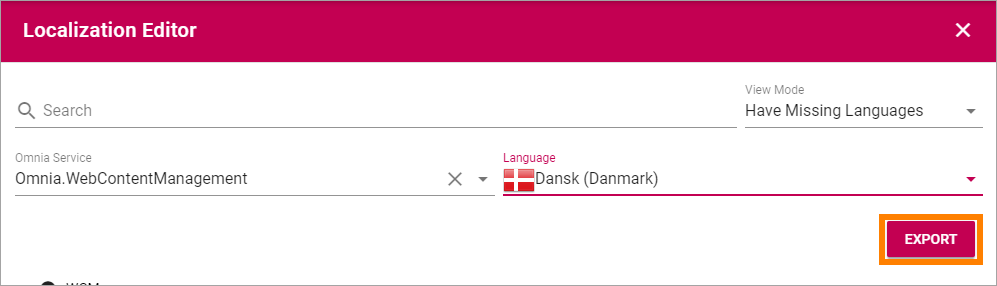

Localization
===========================================

(This description is just started, more will be added soon.)

Use this option to export a file for translation of the application user interface.

+ **View Mode**: Use this list to select the output:

+ **Omnia Service**: Select part of Omnia for the output:

When View Mode and Service has been selected, a list a shown. In this example everything in Web Content Management that don't have a translation yet is listed.

You can point at the I-icon for information about which languages, of the available languages, are missing.

+ **Language**: Select language for the output here, from the available tenant languages:

.. image:: localization-language.png

Available languages are set up under Tenant-Settings-Regional settings, see: :doc:`Regional settings </admin-settings/tenant-settings/settings/index>`

+ **Export**: When you have finished the settings, click this button to export to a file. 

The texts that needs to be translated are now exported to a json file. The file is placed in the Downloads folder on your computer.

.. image:: json-file.png

