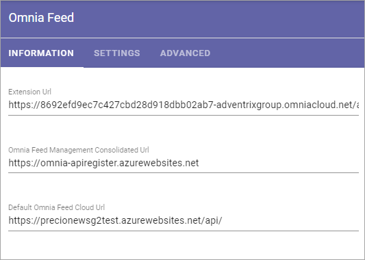

Omnia Feed - Tenant settings
==============================

These settings are mainly used by AM and the Omnia Feed Team to set up the tenant:

**Note!** Omnia Feed is not available for Omnia on-prem due to push notifications.

Some important notes:

+ To be able to access a page - news or any other Omnia page - users will need read permission for that page, meaning permissions in Omnia apply. This is normally set on Page Collection level. Omnia Feed has no separate permissions settings. Therefore, users can only see feed notifications for and read the pages they are allowed to read as set in Omnia.
+ If the customer is using Intune/conditional access that requires device authentication, the AM editor must be informed so the necessary settings for this will be done. Also note that when this is the case, Omnia Feed for Android will require access to the Contacts list on the device.

