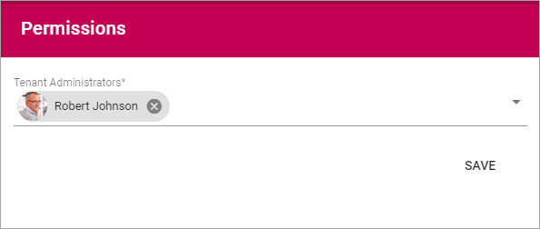

Permissions (Tenant)
===========================================

Use this setting to add and remove Tenant Administrators. Only Tenant Administrators can use this setting and eller other settings under "Tenant" in Omnia Admin. 

To delete an administrator here, just click the x. To add an administrator, add the name the same way as in other name fields.