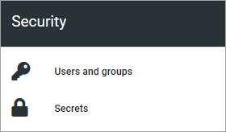
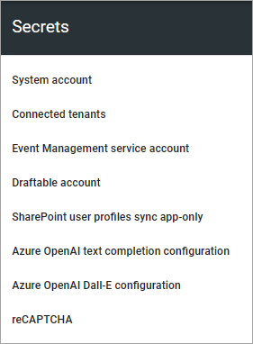
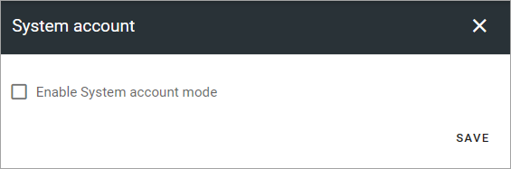
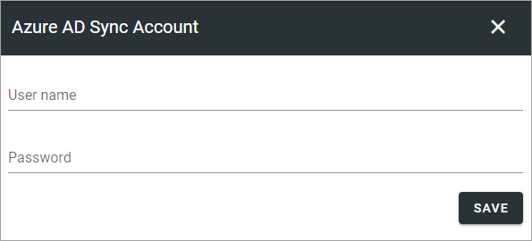
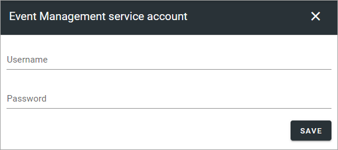
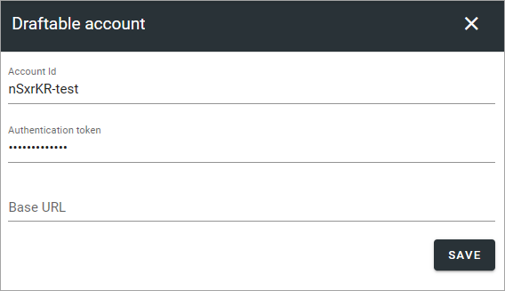
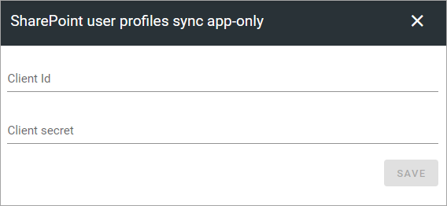
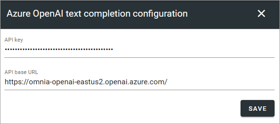
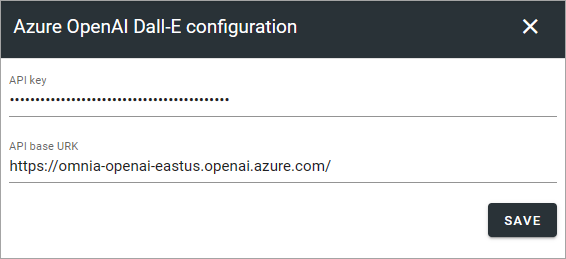
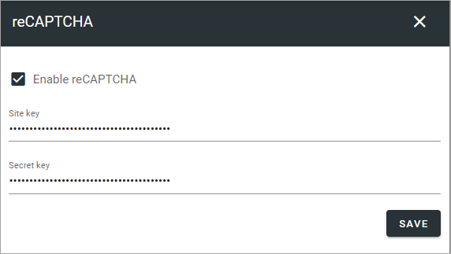

Permissions for the tenant
============================

The following settings are found here:

Users and groups
******************* 
Use this setting to add and remove tenant administrators and separate administrators for shared links and snnouncements, if needed. Only tenant administrators can use this setting. A tenant administrator can also edit all the settings for all business profiles within the tenant. 

Single users, security groups and Microsoft 365 groups can be added here (In Omnia on-prem, Microsoft 365 groups can't be used). 

External users that has been invited in the Azure AD can be added here as well. Users invited this way can log in with their own Microsoft 365 account.

**Note!** A user or a group must be permissions enabled do show up in the list.

.. image:: tenant-permissions-v75.png

To delete an administrator in any of the lists, just click the x. To add an administrator, add the name the same way as in other name fields.

**Note!** There must always be at least one tenant administrator. If there is only one, that administrator can not be removed until an additional administrator has been added.

Secrets
********
A number of settings are available under Secrets. Exactly what is available here depends on the implementation. Here's an example (from Omnia 7.5): 

System Account
------------------
System account is a standard extension for specialized implementations only, normally used by developers.

Azure AD Sync account
-----------------------
If you're using Azure AD synchronization, add the account that executes the scheduling here. Should be a SharePoint admin account.

**Note!** This way of using Azure AD synchronization is no longer supported by Microsoft (It's removed from Omnia 7.5 and later). You should execute syncronization as described here: :doc:`Azure AD Synchronization Settings </admin-settings/tenant-settings/system/azure-ad-sync/index>`

Event Management service account
----------------------------------

If you will be using Event Management with a connection to calendars in Outlook, you must add the service account that will be used to read and write from the calendars in the tenant. (Don't forget that this account needs permissions to that calendar.)

Draftable account
---------------------
If you're using Draftable's solution for comparing changes in controlled documents, you may have to edit the information here.

A default base URL is added but can be edited if needed. 

SharePoint user profiles sync app-only
-----------------------------------------
In the process of enabling SharePoint app-only, Client Id and Client secret must to be added here.

For more information, see the instruction available when you click the link "Config instruction" in the "Azure AD Sync" settings in Omnia Admin (available under "System").

For more information on Azure AD sync, see: :doc:`Azure AD Synchronization settings </admin-settings/tenant-settings/system/azure-ad-sync/index>`

Azure OpenAI text completion configuration
--------------------------------------------
To be able to use OpenAI text functionality within Omnia, the tenant feature Omnia.OpenAI.ChatOpenAIPanel.TextCompletion must be activated. When that is done, an API key and an API base URL must be entered here.

Azure OpenAI Dall-E configuration
------------------------------------
To be able to use the Dall-E functionality within Omnia, the tenant feature Omnia.OpenAI.Ux.DallEProvider.FeatureTitek must be activated. When that is done, an API key and an API base URL must be entered here.

reCAPTCHA
-----------
If you would like to use reCAPTCHA, you must enable it here and add a site key and a secret key.

