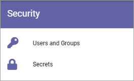
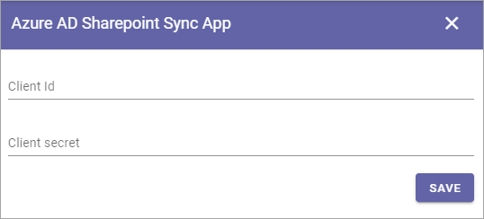

Permissions for the Tenant
============================

The following settings are found here:

Users and Groups
*******************
Use this setting to add and remove Tenant Administrators and separate administrators for Shared Links and Announcements, if needed. Only Tenant Administrators can use this setting. A Tenant Administrator can also edit all the settings for all Business Profiles within the Tenant. 

Single users, Security groups and Microsoft 365 groups can be added here (In Omnia on-prem, Microsoft 365 groups can't be used). 

External users that has been invited in the Azure AD can be added here as well. Users invited this way can log in with their own Microsoft 365 account.

.. image:: tenant-permissions-new3.png

To delete an administrator in any of the lists, just click the x. To add an administrator, add the name the same way as in other name fields.

**Note!** There must always be at least one Tenant Administrator. If there is only one, that administrator can not be removed until an additional one has been added.

Secrets
********
The following settings can be available here:

.. image:: tenant-secrets-new.png

System Account
------------------
System account is a standard extension for specialized implementations only, normally used by developers.

.. image:: tenant-secrets-system-url-new.png

Azure AD Sync Account
-----------------------
If you're using Azure AD Synchronization, add the account that executes the scheduling here. Should be a Sharepoint Admin account.

.. image:: tenant-secrets-sync-url-new.png

**Note!** This way of using Azure AD Synchronization is no longer supported by Microsoft. You should execute syncronization as described here: :doc:`Azure AD Synchronization Settings </admin-settings/tenant-settings/system/azure-ad-sync/index>`

Event Management Service Account
----------------------------------

If you will be using Event Management with a connection to calendars in Outlook, you must add the service account that will be used to read and write from the calendars in the tenant. (Don't forget that this account needs permissions to that calendar.)

.. image:: tenant-secrets-event-url-new.png

Azure AD Sharepoint Sync App
-------------------------------
In the process of enabling Sharepoint App Only, Client Id and Client Secret needs to be added here.

For more information, see the instruction available when you click the link "Config instruction" in the "Azure AD Sync" settings in Omnia Admin (available under "System").

For more information on Azure AD Sync, see: :doc:`Azure AD Synchronization settings </admin-settings/tenant-settings/system/azure-ad-sync/index>`
