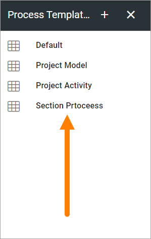
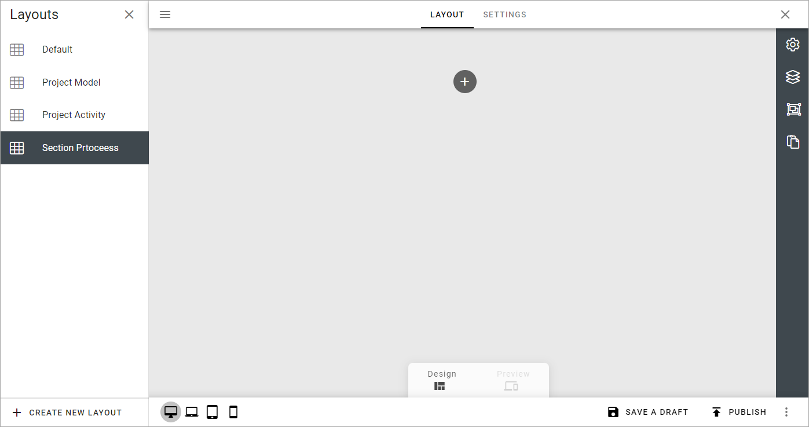

Process Templates in Omnia 7.0
=============================================

**This option is available in Omnia 7.0. Work on this documentation is ongoing**.

Use these options to create teamplates for processes. All process steps can have a different layout, if needed.

If any templates has been created, they are listed here, for example:

.. image:: process-templates-v7-1.png

To edit a template, click the name. To create a new template, click the plus.

Create a new Process Template
********************************
When you create a new template, the first step is to add a name:

.. image:: process-templates-v7-new1.png

Then click the name of the new process to start working with the layout:

The layout work area is shown:

This is done in a very similar way to working with the layout for Workspace, see the heading "Working with the layout" on this page: :doc:`Navigation bar </admin-settings/business-group-settings/workplace/navigation-bar/index>`

Here's an example of a finished layout:

.. image:: process-templates-v7-example.png

Settings
**********
Options on the SETTINGS tab are specific for processes. You can set default canvas settings and add shapes that should be available when creating a process or a process step from this layout. You can also change the title of the layout if needed.

Here's an example:

.. image:: process-templates-settings-v7.png

Use these options when creating a new template:

+ **Title**: You can change the title in this field, in any tenant language.
+ **Default canvas settings**: If needed, set the default canvas width and height in pixels. Author can change this setting if needed.
+ **ADD HEADING**: You can add headings to group the shapes, if needed, see below.
+ **ADD SHape**: Too add shape that should be avaiable for authors to use, click here. For more information, see below.

