Process Templates
=============================================

Use these options to create teamplates for processes. **Note!** All process steps can have a different layout, if needed.

If any templates has been created, they are listed here, for example:

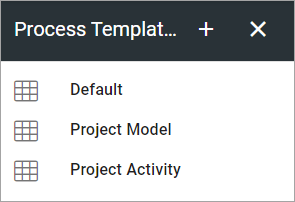

To edit a template, click the name. To create a new template, click the plus.

Create a new Process Template
********************************
When you create a new template, the first step is to add a name:

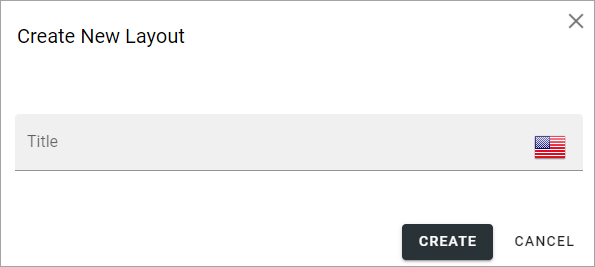

Then click the name of the new process to start working with the layout:

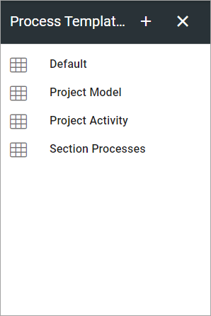

The layout work area is shown:

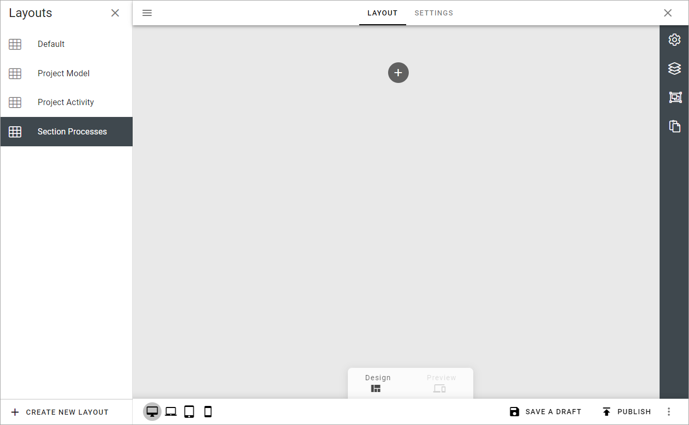

You create the layout by adding sections and blocks, the way this page describes: :doc:`Working with Layouts </general-assets/working-with-layouts/index>`

Here's an example of a finished layout:

.. image:: process-templates-v7-example.png

Also see the Settings section below on how to add shapes to the template.

Settings
**********
Options on the SETTINGS tab are specific for processes. You can set default canvas settings and add shapes that should be available when creating a process or a process step from this layout. You can also change the title of the layout if needed.

Here's an example:

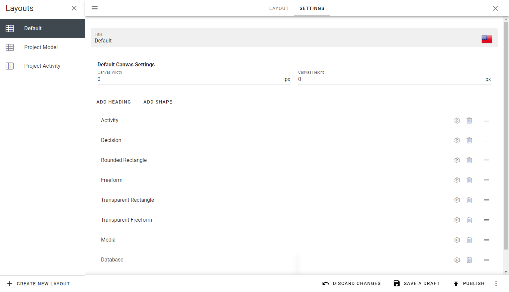

Use these options when creating a new template:

+ **Title**: You can change the title in this field, if needed.
+ **Default canvas settings**: If needed, set the default canvas width and height in pixels. Authors can change this setting if needed.
+ **ADD HEADING**: You can add headings to group the shapes, if needed, see below.
+ **ADD SHAPE**: Too add a shape that should be avaiable for authors to use, click here. For more information, see below.

Add Heading
---------------
1. To add a heading, click ADD HEADING.
2. Add a heading in any of the available languages. Default language is mandatory.

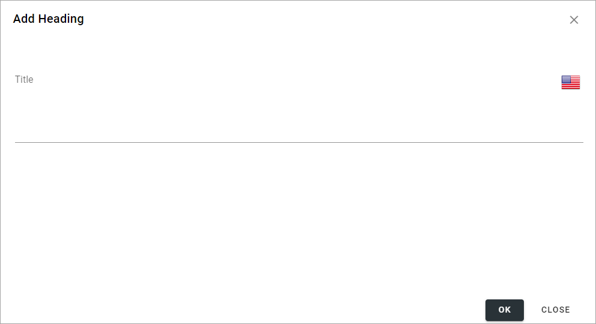

3. Click OK to save.

Add Shape
-----------
1. To add a shape, click ADD SHAPE.
2. Use the top list to select the shape to add.

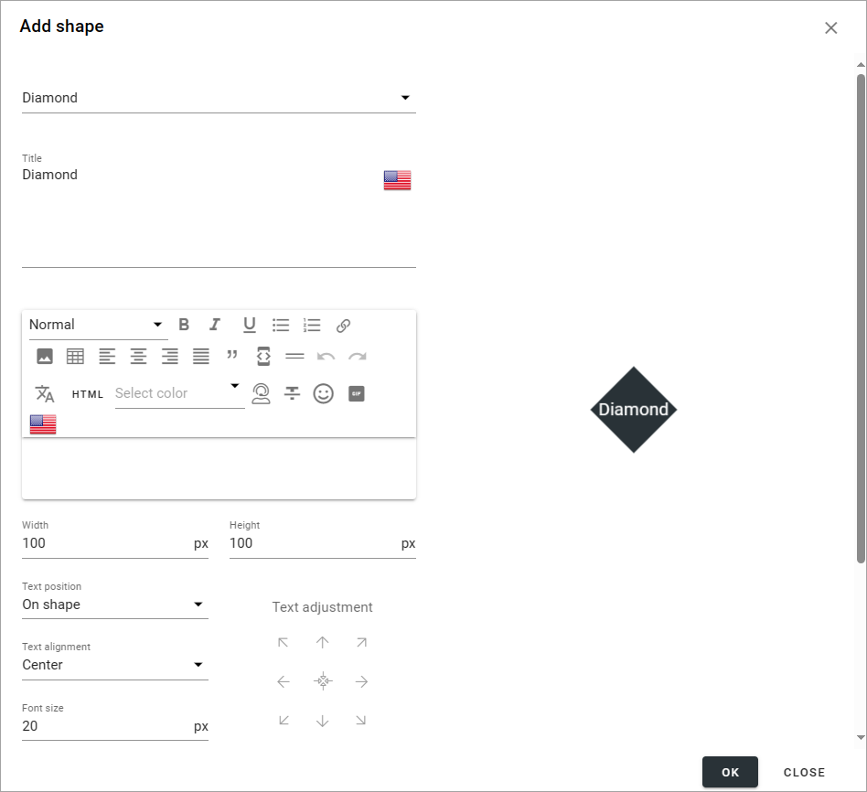

Then use the following settings (not all are shown in the image above):

+ **Title**: The suggested title for the shape is shown. You can edit the title here, if needed, for the purpose of this process template. Default language for the tenant os mandatory.
+ **(Description field)**: You can add a rich text description here to add details about the shape, for example intended use.
+ **Width/Height**: Default width and height is 100 pixels. You can can edit the width and height is needed.
+ **Text Position**: Decide where to place to text (if any) for the shape: "On Shape", "Above Shape" or "Below Shape".
+ **Text Alignment"**: Decide how to align the text (if any): "Left", "Center" or "Right".
+ **Font Size**: Set the font size for the text here. Default is 20 pixels.
+ **Text Adjustment**: Use the arrows to adjust the text. The symbol in the middle is for centering the text on the shape.
+ **Colors**: You can set colors for background, border and text - and when the shape is selected, not selected or when the mouse hovers over the shape.

2. Click OK to to add the shape or CANCEL if you don't want to.

Allowing authors to add shapes
-------------------------------
Note that you can allow authors to add new shapes even when using a process template.

To make it possible for an author to draw shapes, select "Freeform" in the list.

**Important Note!** If the author should be able to add clickable areas to a background image, the process template must contain Freeform.

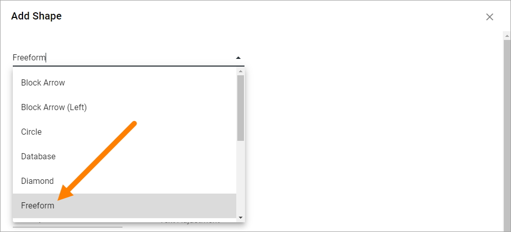

**Tip!** If you add a freeform shape intended for use for clickable areas on a background image, you should set the background colors to none, as such a freeform shape will have to be transparent.

To make it possible for an author to add images as shapes, select "Media" in the list.

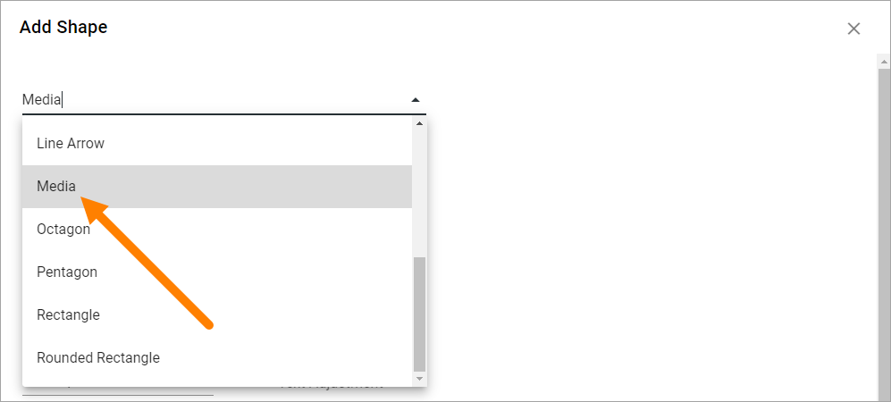

Reorder the shapes and headings
--------------------------------
If you would like the shapes and headings to be displayed in a certain order, use the icon to the far right to drag and drop.

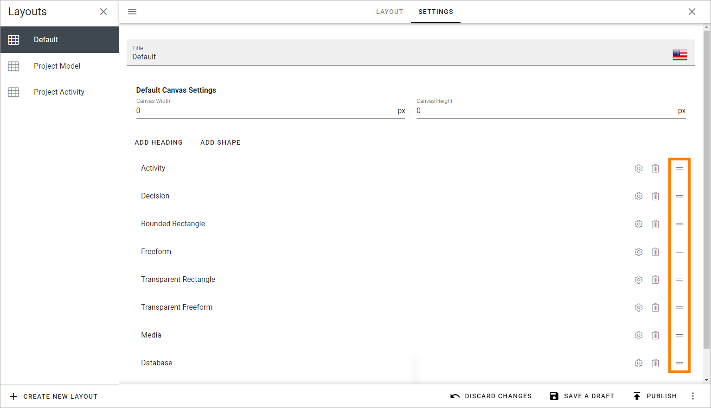

Edit or delete a shape
-------------------------
To edit the settings for a shape, click the cog wheel. To delete a shape from the process templates, click the dust bin.

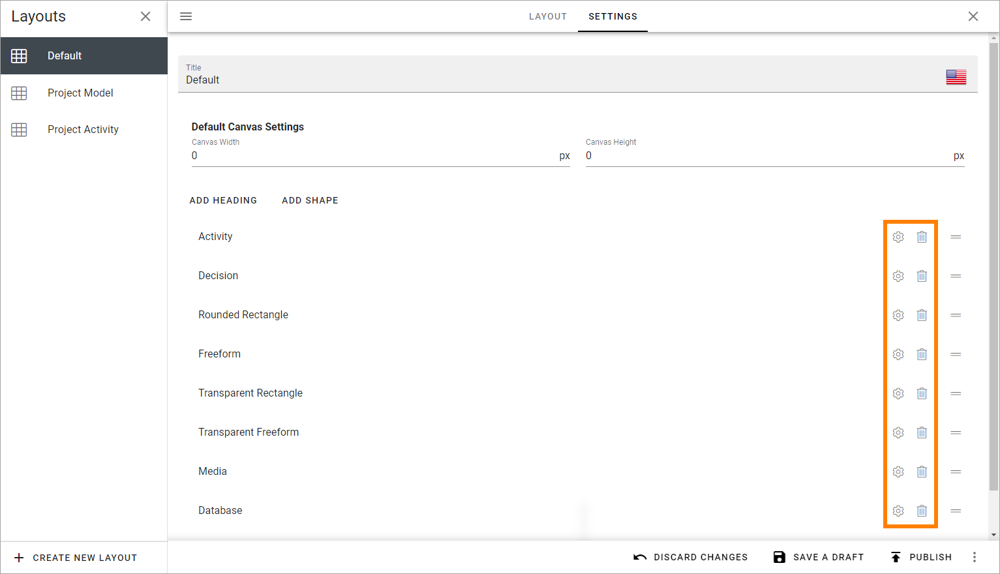

When editing a process template, all settings described above can be changed.

