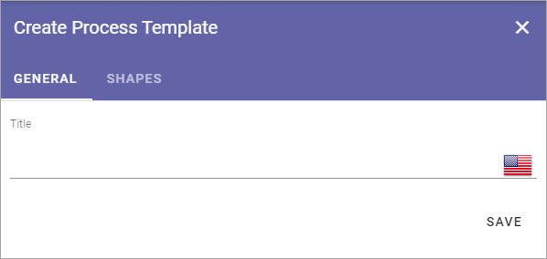
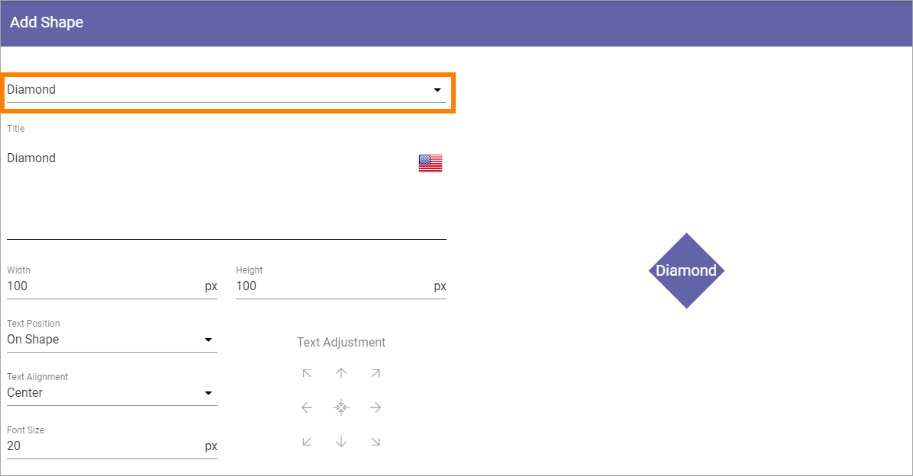

Process Templates
===================

This page describes Process Templates options in Omnia 6.13 and earlier. Options in Omnia 7.0 and later is quite different, described on this page: :doc:`Process Templates in Omnia v7 </admin-settings/tenant-settings/process-management/process-templates-omnia-7/index>`

A process template is a set of shapes. One or more process templates can be added to a process type.

Click the pen to edit a process template or the dust bin to delete it.

.. image:: process-templates-edit-delete-new.png

Before you continue here, make sure all shapes you need has been added, see :doc:`Shape Gallery </admin-settings/tenant-settings/process-management/shape-gallery/index>`.

Adding a new Process Template
******************************
1. To add a new Process Template click the plus.

.. image:: process-templates-clickplus-new.png

Use the following settings:

General
----------
Here you add a title for the process template, in any or all languages available in the tenant. Default language is mandatory. (Click the flag to change language).

Shapes
--------
Use this tab to add the shapes that should be available to the process author when editing a process.

.. image:: process-templates-shapes-new.png

To make things easier for the author, you can add headings to group the shapes.

Add Heading
---------------
1. To add a heading, click ADD HEADING.

.. image:: process-templates-heading-add-new.png

You can then add a heading in any of the available languages. Default language is mandatory. (Click the flag to change language).

.. image:: process-templates-heading-language-612.png

Add Shape
-----------
1. To add a shape, click ADD SHAPE.

.. image:: process-templates-shapes-add-new.png

Use the top list to select the shape to add.

Then use the following settings:

.. image:: process-templates-shapes-add-settings-612.png

+ **Title**: The suggested title for the shape is shown. You can edit the title here, if needed, for the purpose of this process template. You can add a title in any or all available languages. Default language for the tenant os mandatory. (Click the flag to change language).
+ **Width/Height**: Default width and height is 100 pixels. You can can edit the width and height is needed.
+ **Text Position**: Decide where to place to text (if any) for the shape: "On Shape", "Above Shape" or "Below Shape".
+ **Text Alignment"**: Decide how to align the text (if any): "Left", "Center" or "Right".
+ **Font Size**: Set the font size for the text here. Default is 20 pixels.
+ **Text Adjustment**: Use the arrows to adjust the text. The symbol in the middle is for centering the text on the shape.
+ **Colors**: You can set colors for background, border and text - and when the shape is selected, not selected or when the mouse hovers over the shape.

2. Click OK to to add the shape or CANCEL if you don't want to.

Allowing authors to add shapes
-------------------------------
Note that you can allow authors to add new shapes even when using a process template.

To make it possible for an author to draw shapes, select "Freeform" in the list.

**Important Note!** If the author should be able to add clickable areas to a background image, the process template must contain Freeform.

.. image:: process-templates-freeform-new.png

**Tip!** If you add a freeform shape intended for use for clickable areas on a background image, you should set the background colors to none, as such a freeform shape will have to be transparent.

To make it possible for an author to add images as shapes, select "Media" in the list.

.. image:: process-templates-media-new.png

Reorder the shapes and headings
--------------------------------
If you would like the shapes and headings to be displayed in a certain order, use the icon to the far right to drag and drop.

.. image:: process-templates-reorder-new.png

Edit or delete a shape
-------------------------
To edit the settings for a shape, click the pen. To delete a shape from the process templates, click the dust bin.

.. image:: process-templates-edit-delete-shape-new.png

When editing a process template, all settings described above can be changed.

