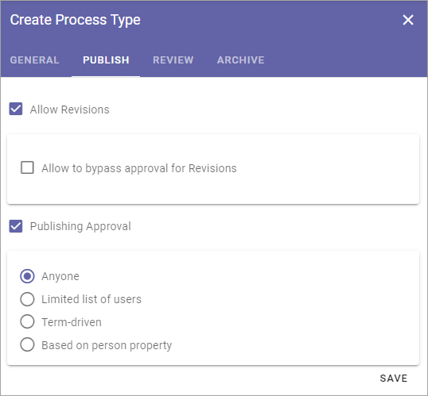
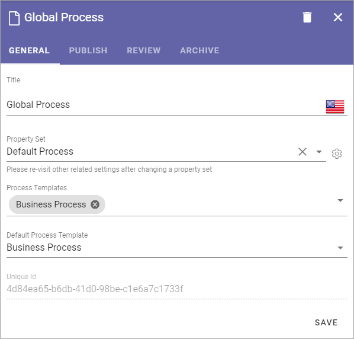
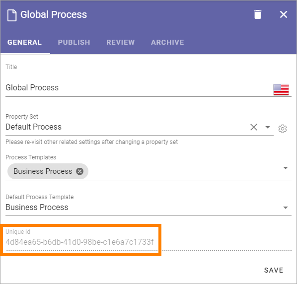

Process types
==================

When an author creates a process he or she selects a process type. A process type consists of a property set, one or more process templates and settings for how publishing, review and archive should be handled for the process.

Before you continue here, make sure all process templates you will need has been created, see: :doc:`Process templates </admin-settings/tenant-settings/process-management/process-templates/index>`

Also see to that the property set you need has been created, see: :doc:`Property sets </admin-settings/tenant-settings/properties/property-sets/index>` 

Creating a new process type
*****************************
1. Select the top "folder".
2. Click the plus.

.. image:: process-type-create-new.png

Use the following settings:

General
--------
These settings are available here.

.. image:: process-type-settings-general-new2.png

+ **Title**: Add a title for the process type, in one or more languages. Default language for the tenant is mandatory.
+ **Property Set**: Select property set from the list. For more information about property sets, see the ink above.
+ **Process Templates**: Select one or more process templates for the process author to choose from.
+ **Default Process Template**: If you selected more than one you can also set which of the process templates that should be pre selected.

Save when you're done here.

Publish
---------
Here you decide how publishing of the process should work.

.. image:: process-type-settings-publish-new.png

+ **Allow Revisions**: Selecting this option you can allow authors to publish a revision of a process, instead of a full edition, for example for correcting typing errors. 
+ **Allow to bypass approval for Revisions**: If this option is active (shown when the option above is selected), it's up to the author to decide if approval is needed or not, when publishing a revision. Approval is still needed for publishing a new (full) edition of a process.
+ **Publishing approval**: Select if approval is to be used for this Process Type. If this option is NOT active, a process will be published immediately when an author clicks "Publish". If Publishing Approval is selected, you must also choose how approval will take place:

+ **Anyone**: The author can select any user of the portal as approver, when the process is published.
+ **Limited list of users**: Authors can select approvers from a defined list only. You create the list here.
+ **Term-driven**: Authors can select approvers from a defined list only. Which approvers will be available depends on the Properties selected for the process. You select the term(s) here. When you have selected one or more terms you can use the cogwheel to set approvers for individual terms in the set.
+ **Based on person property**: You select one of the person properties defined, for example Process owner.

Save when you're done here.

Review
-------
Here you handle settings for review reminder.

.. image:: process-type-settings-review-new.png

+ **Feedback Recipients**: A process related page can be set up (using the Action Button block) to make it possible for users to send feedback about the process. Select which role will recieve the reminders. The feedback will also be availble on the Published tab in the site where the process is edited.
+ **Review Reminder**: Select this option if a review reminder should be sent for the process. If this option is selected, you must also set the following:
+ *Time after publishing*: You can set how often a review reminder should be sent, in one of two ways. Here you can set a time span - a number of days, months or years.
+ *Property*: You can set how often a review reminder should be sent, in one of two ways. Here you can set a property for that purpose, a property a process author will fill in - a specific date or a specific retention date.
+ *Send reminder in advance*: The reminder can be sent a number of days, months or years before the decided revision date. Set how far in advance it will be sent here.
+ *Review Reminder Recipients*: Select which role will recieve the reminders.
+ **Create Task**: A review reminder is always sent by email. If a task should be created as well, select this option, and the then set the following:
+ *(Top list)*: Shown when "Create Task" is selected. Use the top list to set which role the task will be created for.
+ *Task expire in*: Shown when "Create Task" is selected. Set a number of days, months or years for when the task will expire (the task will still be available, but marked as expired).

Save when you're done with the settings here.

Archive
----------
Here you set if archiving should be available for the process. If you select this option, you can enter the URL to an archive site to be used, or leave the field empty to use the default archive in the tenant.

.. image:: process-type-settings-archive-new.png

If archiving is selected, a copy of the process is placed in the archive when a published process is unpublished. 

Save when you're done with all settings.

Editing a process type
************************
To edit a process type, just click it in the main list. All settings described above can be edited.

On the General tab you can now see the Unique id for the process, for example:

Sorting process types
**********************
If you want the Process Types to be shown for authors in a speceific order, use the triangles to move a process up or down in the list:

.. image:: process-type-move.png

Delete a process type
**********************
A Process Type that is no longer used can be deleted.

1. Click the Process Type to open it for editing.
2. Click the dust bin.

.. image:: process-type-delete-new.png

Syncronising of process types
******************************
Process Types are syncronized to term sets. Information about the last syncronization is found by clicking the i-icon.

.. image:: process-type-i-icon-new.png

Here's an example:

.. image:: process-type-i-icon-example.png

