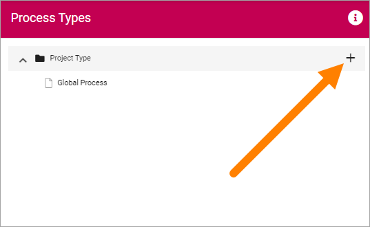
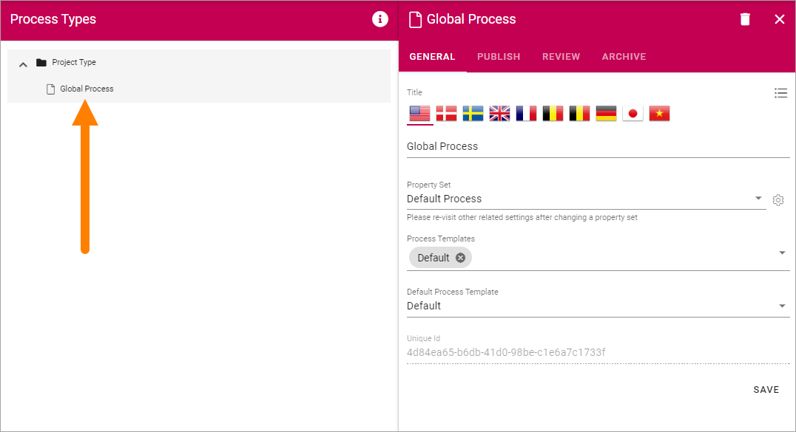

Process Types
==================

When an author creates a process he or she selects a Process Type. A Process type consists of a Property Set, one or more Process Templates and settings for how publishing, review and archive should be handled for the process.

Before you continue here, make sure all Process Templates you will need has been created, see: :doc:`Process Templates </admin-settings/tenant-settings/process-management/process-templates/index>`

Also see to that the Property set you need has been created, see the heading "Property Sets" on this page: :doc:`Tenant Settings - Properties </admin-settings/tenant-settings/properties/index>`

Creating a new Process Type
*****************************
1. Select the top "folder".
2. Click the plus.

General
--------
3. Use the following settings:

.. image:: process-type-settings-general.png

+ **Title**: Add a title for the process type, in one or more languages. Default language for the tenant is mandatory.
+ **Property Set**: Select property set from the list. For more information about property sets, see the ink above.
+ **Process Templates**: Select one or more process templates for the process author to choose from.
+ **Default Process Template**: If you selected more than one you can also set which of the process templates that should be pre selected.

4. Save when you're done.

Publish
---------
5. Set how publishing of the process should work.

.. image:: process-type-settings-publish.png

+ **Allow Revisions**: Selecting this option you can allow authors to publish a revision of a process, instead of a full edition, for example for correcting typing errors. 
+ **Allow to bypass approval for Revisions**: If this option is active (shown when the option above is selected), it's up to the author to decide if approval is needed or not, when publishing a revision. Approval is still needed for publishing a new (full) edition of a process.
+ **Publishing approval**: Select if approval is to be used for this Process Type. If this option is NOT active, a process will be published immediately when an author clicks "Publish". If Publishing Approval is selected, you must also choose how approval will take place:
    - Anyone: The author can select any user of the portal as approver, when the process is published.
    - Limited list of users: Authors can select approvers from a defined list only. You create the list here.

6. Save when you're done.

Review
-------
7. Here you handle settings for review reminder.

.. image:: process-type-settings-review.png

+ **Review Reminder**: Select this option if a review reminder should be sent for the process. If this option is selected, you must also set the following:
    - Time after publishing: You can set how often a review reminder should be sent, in one of two ways. Here you can set a time span - a number of days, months or years.
    - Property: You can set how often a review reminder should be sent, in one of two ways. Here you can set a property for that purpose, a property a process author will fill in - a specific date or a specific retention date.
+ **Send reminder in advance**: The reminder can be sent a number of days, months or years before the decided revision date. Set how far in advance it will be sent here.
+ **Review Reminder Recipients**: Select which role will recieve the reminders.
+ **Create Task**: A review reminder is always sent by e-mail. If a task should be created as well, select this option, and the then set the following:
    - (Top list): Use the top list to set which role the task will be created for.
    - Task expire in: Set a number od days, months or years for when the task will expire (the task will still be available, but marked as expired).

8. Save when you're done with the settings here.

Archive
----------
Here you set if archiving should be available for the process. If you select this option, you can enter the url to the archive site to be used, or leave the field empty to use the default archive in the tenant.

.. image:: process-type-settings-archive.png

If archiving is selected, a copy of the process is placed in the archive when a published process is unpublished. 

9. Save when you're done with all settings.

Editing a Process Type
************************
To edit a process type, just click it in the main list. All settings described above can be edited.

Syncronising of Process Types
******************************
Process Types are syncronized to term sets. Information about the last syncronization is found by clicking the i-icon.

.. image:: process-type-i-icon-frame.png

