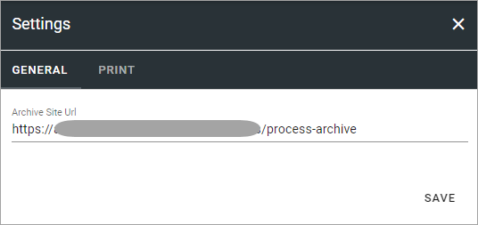
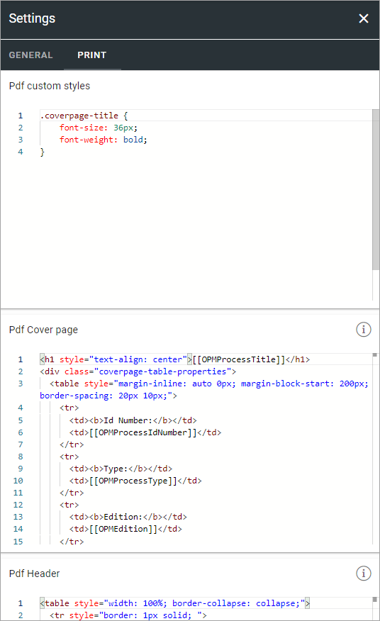

Settings (Process Management)
===============================

The following setting is available here on the GENERAL tab:

+ **Archive Site Url**: Part of the Process Management functionality that can be used is an Archive site, where a copy of all unpublished processes are placed. The link to the site can be added or edited here.

This is available on the PRINT tab (all settings are not shown in the image):

When a process is printed to a printer or to a PDF file, it's divided into pages and a number of HTML settings are used. Here you can edit these settings if needed.

+ PDF custom styles; Here you can add settings for the text, for example font size.
+ PDF Cover page; If you use a cover page, these settings are for that page. You can use placeholders for dynamic information, see below.
+ PDF Header; Contains settings for the header. You can use placeholders for dynamic information, see below.
+ PDF Footer; Contains settings for the footer. You can use placeholders for dynamic information, see below.

Using placeholders
*********************
For information on using placeholders for printing, see this page: :doc:`Using tokens in Omnia </general-assets/using-tokens-in-omnia/index>`
