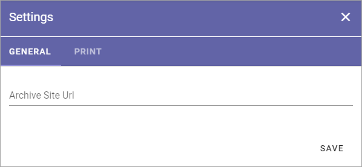
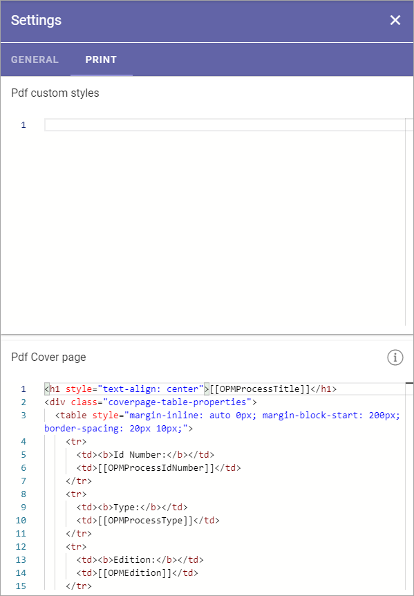

Settings (Process Management)
===============================

The following setting is available here on the GENERAL tab:

+ **Archive Site Url**: Part of the Process Management functionality that can be used is an Archive site, where a copy of all unpublished processes are placed. The link to the site can be added or edited here.

This is available on the PRINT tab:

(A description will be added soon).
