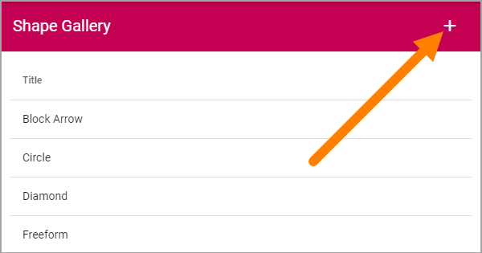
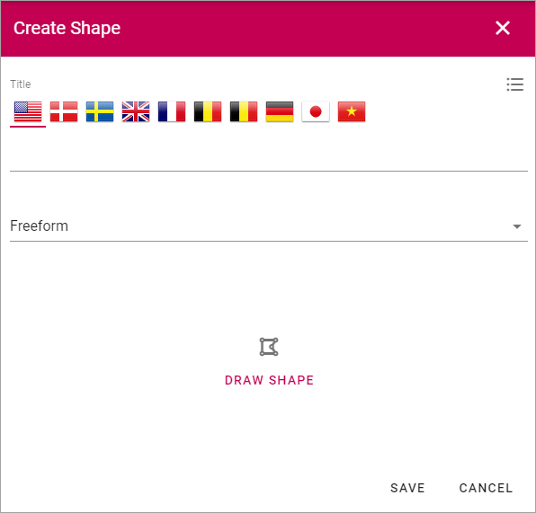
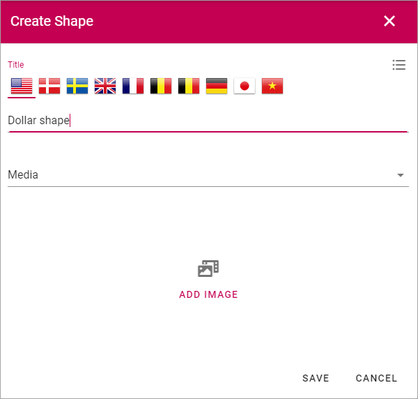

Shape Gallery
===============

A number of useful process shapes are installed per default. You can also add additional shapes.

.. image:: pm-shape-gallery.png

Note that when you add a shape to a Process Template, there's a number of settings you can do for the shape, see the heading "Settings for a shape" on this page: :doc:`The Drawing tab - authoring processes </working-with-processes/authoring-processes/working-with-drafts/drawing-tab/index>`

Edit or remove a shape
************************
A shape you have added can be edited or removed (the default shapes can not). Click the pen to edit or the dust bin to remove.

.. image:: pm-shape-edit-delete.png

Adding a new shape
********************
To add a new shape, click the plus.

Use the following settings:

+ **Title**: You can add a title for the new shape, in any or all available languages. Default language for the tenant is mandatory.
+ **Freeform/Media**: Decide how to add the shape; Select "Freeform" to draw the shape, "Media" to upload an image.

Adding a freeform shape
-----------------------
When you have selected "Freeform" do the following:

1. Click "DRAW SHAPE".
2. Click to set the first corner.
3. Move the mouse (do not hold the mouse button down) to the next corner and click.
4. Contintue drawing the shape this way.
5. To finish the shape, move the mouse to the first corner of the shape and click.
6. Click "OK".

.. image:: pm-shape-freeform-frame.png

7. Clicks "Save".

.. image:: pm-shape-freeform-save.png

Adding Media
------------
When you have selected "Media", continue this way:

1. "ADD IMAGE".

The Media Picker now starts and you use it to add an image as a shape from your computer or from any other source available.

.. image:: pm-shape-media-picker.png

For more information on how to use the Media Picker, see :doc:`Media Picker </general-assets/media-picker/index>`

2. Use the Media Picker to select an image.
3. Click "OK".
4. Click "Save".

.. image:: pm-shape-media-picker-dollar.png

