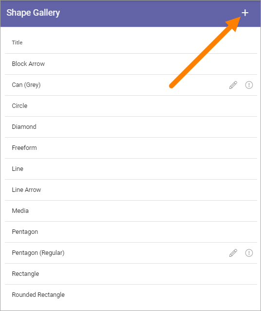
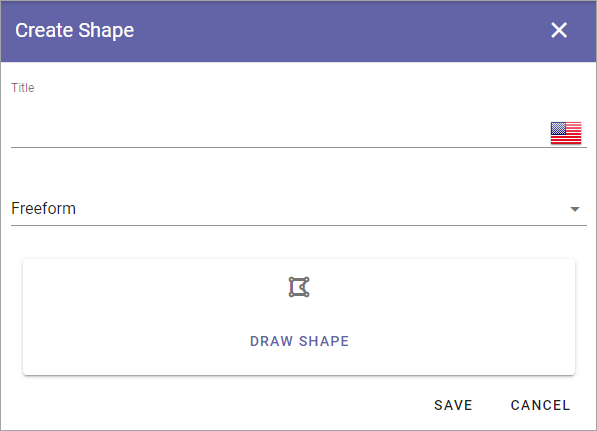
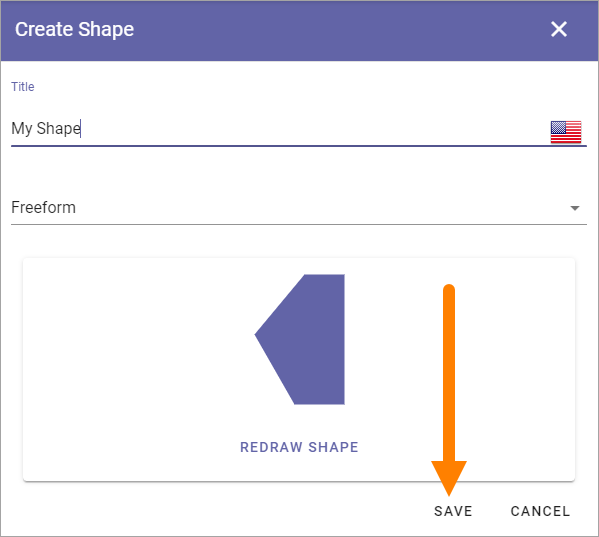
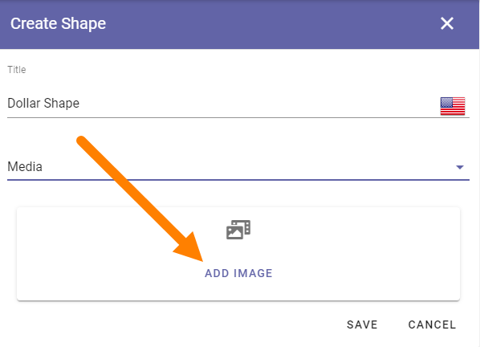
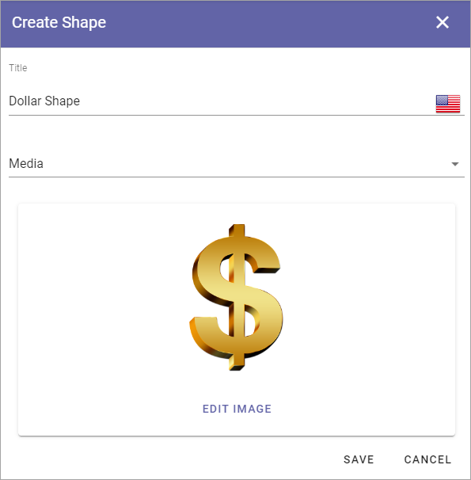

Shape gallery
===============

A number of useful process shapes are installed per default. You can also add additional shapes.

.. image:: pm-shape-gallery-new.png

In this example Can(Grey) and Pentagon (Regular) are added. That's why they can be edited.

Note that when you add a shape to a Process Template, there's a number of settings you can do for the shape, see the heading "Settings for a shape" on this page: :doc:`The Drawing tab - authoring processes </working-with-processes/authoring-processes/working-with-drafts/drawing-tab/index>`

Edit or remove a shape
************************
A shape you have added can be edited or removed (the default shapes can not). Click the pen to edit or the dust bin to remove.

.. image:: pm-shape-edit-delete-new.png

Regarding the other added shapes that can't be removed, you can point at the i icon for more informaion.

.. image:: pm-shape-edit-delete-icon.png

As you can see from the message, a shape that is used in a Process Template can't be removed.

Adding a new shape
********************
To add a new shape, click the plus.

Use the following settings:

+ **Title**: You can (should) add a title for the new shape, in any or all available languages. Default language for the tenant is mandatory.
+ **Freeform/Media**: Decide how to add the shape; Select "Freeform" to draw the shape, "Media" to upload an image.

Adding a freeform shape
-----------------------
When you have selected "Freeform" do the following:

1. Click "DRAW SHAPE".
2. Click to set the first corner.
3. Move the mouse (do not hold the mouse button down) to the next corner and click.
4. Contintue drawing the shape this way.
5. To finish the shape, move the mouse to the first corner of the shape and click.
6. Click "OK".

.. image:: pm-shape-freeform-new.png

7. Click "Save".

Adding Media
------------
When you have selected "Media", continue this way:

1. Click ADD IMAGE.

The Media Picker now starts and you use it to add an image as a shape from your computer or from any other source available. For more information, see :doc:`Media Picker </general-assets/media-picker/index>`

2. Use the Media Picker to select an image.
3. Click "OK" in the Media Picker.
4. Click "Save".

