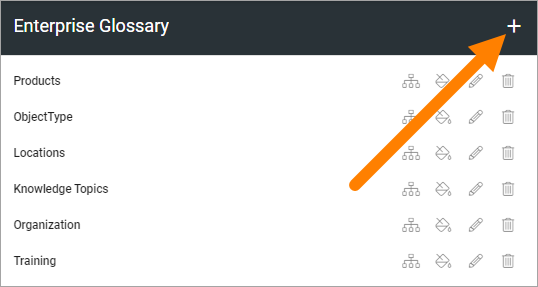
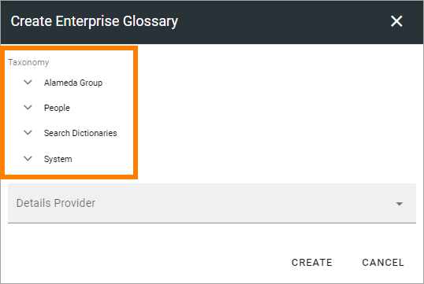
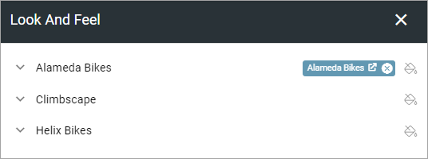
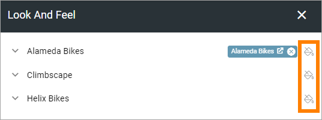
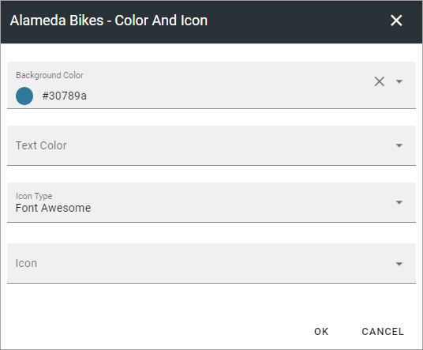
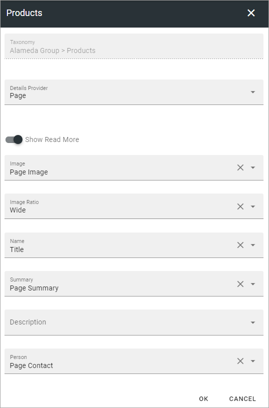

Enterprise glossary
====================

Enterprise glossary can be used for taxonomies/terms, to edit look and feel and/or to connect the term to a page for more information. Terms can even be created specifically to provide more information where it's needed. 

Also, if you plan to use the block "Taxonomy navigation" you need to set up the taxonomies to be used for navigation here.

Here's an example of a people rollup displaying three properties:

The location and organization properties can be clicked for more information, indicated by the icon to the right of the property name. Here's what such information can look like:

.. image:: glossary-example-info.png

In this example, there's a READ MORE link that can be used to go to the IT Helpdesk organization page.

Settings
****************
The existing glossary sets are listed here (for example):

.. image:: enterprise-glossary-list.png

You use the icons to (from left to right):

+ Edit taxonomy mapping.
+ Edit look and feel.
+ Edit settings for the information page (if used).
+ Delete the glossary set.

Create a new glossary set
----------------------------
To create a new glossary set, do the following:

1. Click the plus.

2. Map the glossary set to taxonomy.

If you don't want to connect the glossary set to an information page - for example if you just want to edit look and feel - you're done now.

**Note!** For a glossary set that will be used for taxonomy navigation, all mappings should be to pages.

To connect to an information page, do the following:

1. Select "Page" for Details provider.

.. image:: new-glossary-3.png

2. Set the settings needed. 

.. image:: new-glossary-4.png

+ **Show Read more**: This is a link to the information page. If you just want to show the summary and/or description from the page as information, deselect this option.
+ **Image**: Select the property to use for the image.
+ **Image ratio**: Select image ratio to be shown in the information dialog.
+ **Name**: Select the property for the page name to be shown in the information dialog (often Title).
+ **Summary**: There's two possible content fields in the information dialog. You can show one or both. Here you can decide to show the page summary, by selecting the property that holds that kind of information.
+ **Description**: You can also choose to show text from a description field, that usually holds more information. If you don't want to use a Read more link, you may want to show more information than just the summary. If you want to show a description, select the property here.
+ **Person**: Select property for the name to be shown in the information dialog (see below).

See below for an example of information connected to a term. 

When you are done:

3. Click create.

.. image:: new-glossary-5.png

Edit taxonomy mapping 
--------------------------
When you click the icon to edit taxonomy mapping, the following is shown (for example):

.. image:: edit-taxonomy-1.png

To remove the existing mapping, to be able to remap, click the x:

.. image:: edit-taxonomy-1b.png

For a preview of the information, click the taxonomy label:

.. image:: edit-taxonomy-1c.png

Here's a simple example of a preview:

.. image:: edit-taxonomy-preview.png

In this example, the information shown is the summary from the connected page. The user can click READ MORE to go to the page.

To edit the mapping, click the icon to the right:

.. image:: edit-taxonomy-2.png

Use the following to edit the mapping:

.. image:: edit-taxonomy-3.png

The page picker is used here. For more information, see the heading "Navigating and picking", on this page: :doc:`Page picker </general-assets/page-picker/index>`

Edit look and feel
----------------------
When you click the icon to edit look and feel, the following is shown (for example):

You can see a preview of the look and feel here (text color, background color etc).

To edit, click the icon to the right:

Use the fields to edit background color, text color, icon type and icon.

When you're done, click OK to save the changes (or CANCEL to ignore them.)

Edit settings for the information page
-----------------------------------------
When you click the icon to edit the settings for the information page, the following is shown (for example):

See above for a description of the fields.

Don't forget to click OK to save the changes.

