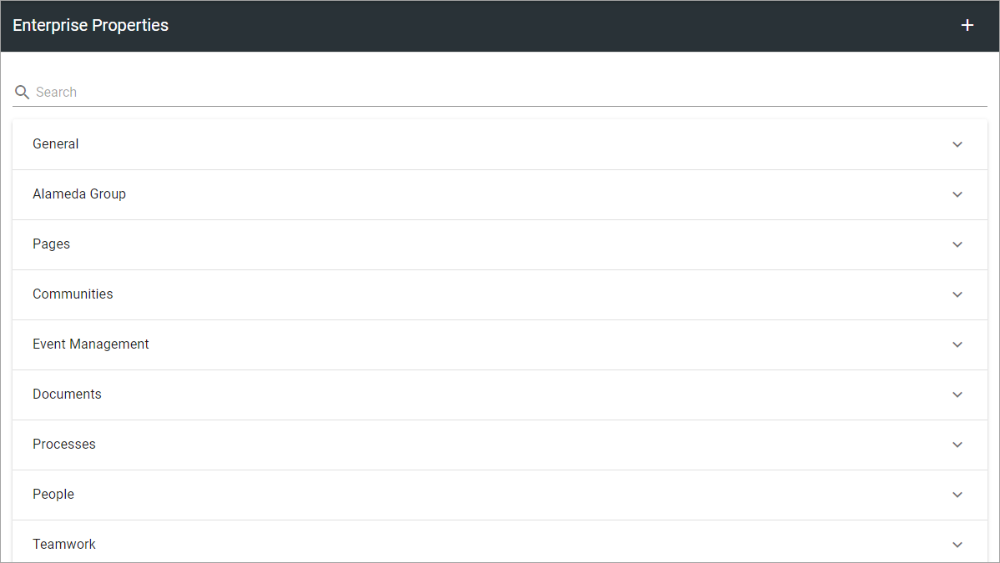
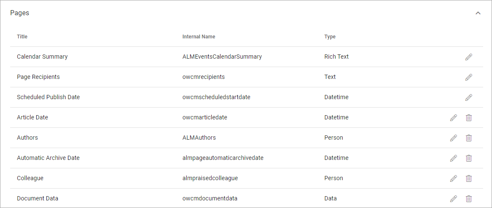
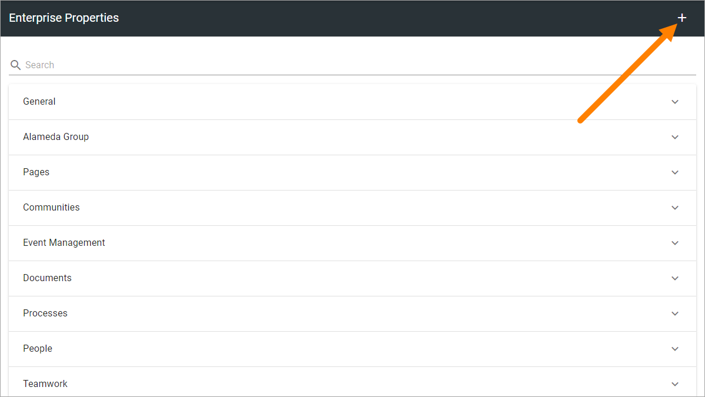
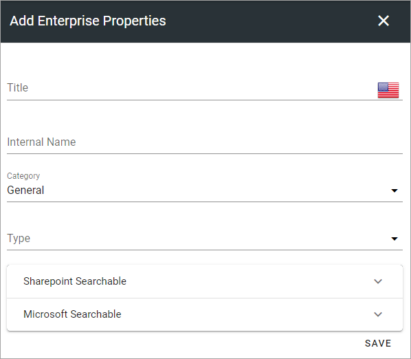
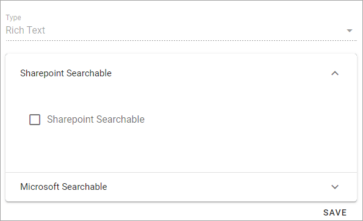

Enterprise Properties
=============================

Here you add ALL Properties that should be used within the Tenant. The list displays all existing properties organized after category, for example:

To find a property for editing, you can either search (note the search field at the top), or browse by category.

**Note!** In Omnia on-prem there is no support for Microsoft Search Mappings.

Open a category to see the list of properties. Here's an example:

Click the pen to edit a property. See below for editable settings. If it's possible to delete a property (meaning move it to the Property Recycle Bin) a dust bin is displayed.

**Note!** Term sets to be used as properties for targeting in Omnia, must be set to "Available for tagging" in Sharepoint, but we recommend that you set this for all Sharepoint term sets.

Adding a Property
*********************
To add a Property, click the plus.

Use the following settings:

+ **Title**: Add a Title (name) for the Property. Default language is mandatory. Add Titles in the other Tenant Languages as needed (Click the flag to change language).
+ **Internal name**: An internal name can, or should in some instances, be used instead of the Title, for example as a place holder. The internal name can not contain spaces. Note that the Internal Name can not be edited once the prroperty is created.
+ **Category**: Select category for the Property here. 
+ **Type**: Select the Property type. It can be Data, Datetime, Enterprise Keywords, Language, Media, Number, Person, Process, Rich text, Tags, Taxonomy, Text or Yes/No. Most of the Types are self explanatory. "Data" is a system field that users never enter anything to. "Rich text" can be formatted by the editor. "Text" is plain text that the editor can not format. Note that the Type can not be edited once the prroperty is created.

**Note!** Properties used for targeting must be of the "Taxonomy" type.

Some, but not all properties can be selected as Sharepoint Searchable and/or Microsoft Searchable. Then, open the option and select it, for example:

Editing a property
**********************
When editing a property, a few more settings can be available under Sharepoint Searchable. What is available for editing differs from property to property. Here's an example:

.. image:: tenant-properties-settings-edit-v7.png

**Note!** If you change setting for Sharepoint Searchable it's only valid for new pages created from here on. If you want this setting to be active for all existing pages as well, you must execute a full sync for all Publishing Apps using this property, using these buttons in the Publishing App settings:

.. image:: tenant-properties-settings-sync.png

