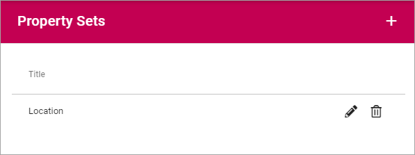
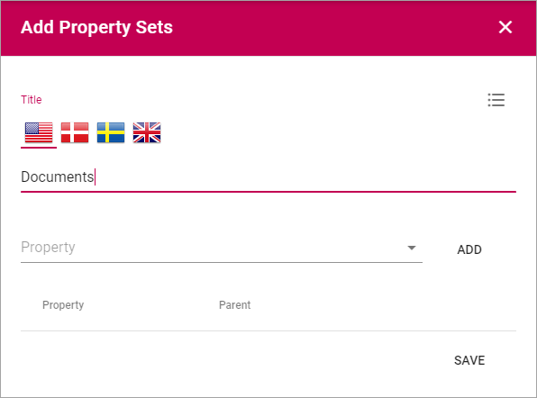
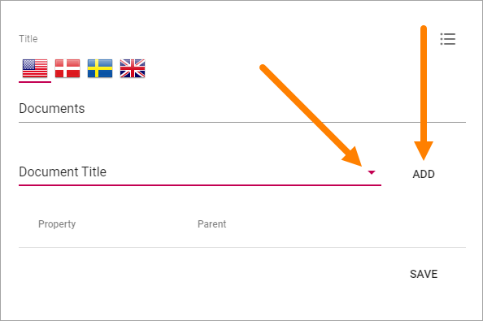
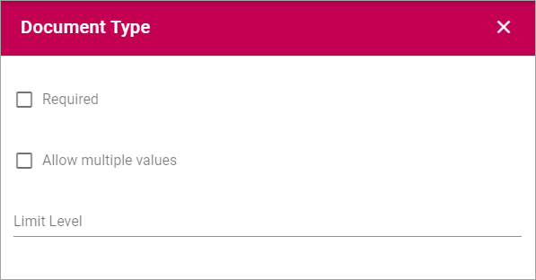

Properties
===========================================

The following is found here:

.. image:: properties.png

Tenant Properties
*********************
Here you add ALL Properties that should be used within the Tenant. If you, for example, would like to enable targeting, the Properties to be used for targeting must be added here.

.. image:: tenant-properties.png

Adding a Property
----------------------
To add a Property, click the plus.

.. image:: tenant-properties-click-plsu.png

Use the following settings:

.. image:: tenant-properties-settings-new.png

+ **Title**: Add a Title (name) for the Property. Default language is mandatory. Add Titles in the other Tenant Languages as needed.
+ **Internal name**: An internal name can or should in some instances be used instead of the Title, for example as a place holder. The internal name can not contain spaces.
+ **Type**: Select the Property type. It can be "Data", "Datetime", "Enterprise Keywords", "Media", "Person", "Rich text", "Taxonomy", "Text" or "Yes/No". Most of the Types are self explanatory. "Data" is a system field that users never enter anything to. "Rich text" can be formatted by the editor. "Text" is plain text that the editor can not format.

Deleting or editing a Property
---------------------------------
Use the dust bin to delete a property, or the pen to edit one:

.. image:: tenant-properties-delete-edit.png

Note that some Properties can not be deleted, but they can be edited. For them only the pen is shown.

Property Sets
***************
This is as the name says, an option where you can create sets of several Enterprise Properties and handle the set instead of each individual property.

Let's say you decide that all documents always should always be tagged with the same properties. You can then create a Property Set for that purpose.

When you enter, all existing Property Sets are shown in a list.

Click the pen to edit a Propety Set, or the dust bin to delete it.

Create a new Property Set
----------------------------
To create a new Property Set, do the following:

1. Click the plus.

.. image:: property-sets-click-plus.png

2. Add a title for the set.

A Title in the deafault tenant language is mandatory. Add Titles in other tenant languages as needed.

3. Select a property to add to the set and click "ADD".

4. Set the options for the added property, if it's required and, for some properties, if multiple values are allowed (and then also how many).

Here's an example for the property Document Type:

5. When all properties are added to the set, click "SAVE".

.. image:: property-sets-save.png

Targeting Properties
**********************
Here you define which Properties to use for Targeting. 

.. image:: targeting-properties.png

The Properties must be added to the Tenant Properties list to be able to be used here.

Add a Target Property
-----------------------
To add a Target Property definition, click the plus:

.. image:: targeting-properties-click-plus.png

Use the following settings:

.. image:: targeting-properties-settings.png

+ **Title**: Add the Title to be shown for editors, for the Property, when targeting.
+ **Property**: Select Tenant Property from the list.
+ **Type**: Select Type of targeting for this Property.

Delete or edit Target Property
--------------------------------
To delete a Target Property, click the dust bin, to edit it, click the pen:

.. image:: targeting-properties-delete-edit.png
