Properties
===========================================

**(Something has happened with the images on this page - working on it.)**

The following is found here:

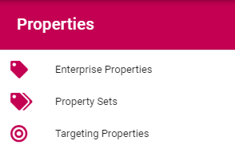

For working with Properties in Omnia v6, see: :doc:`Properties - Omnia v6 </admin-settings/tenant-settings/properties/properties-v6/index>`

Enterprise Properties
**********************
Here you add ALL Properties that should be used within the Tenant. If you, for example, would like to enable targeting, the Properties to be used for targeting must be added here.

.. image:: enterprise-properties.png

Adding a Property
----------------------
To add a Property, click the plus.

.. image:: enterprise-properties-click-plus.png

Use the following settings:

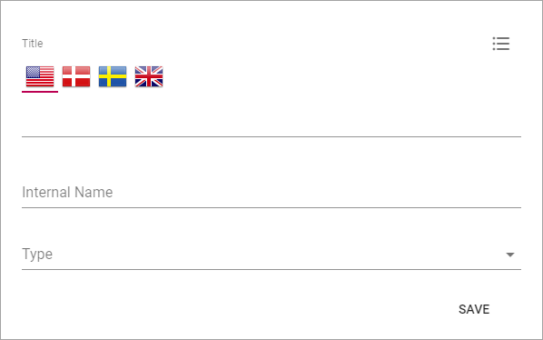

+ **Title**: Add a Title (name) for the Property. Default language is mandatory. Add Titles in the other Tenant Languages as needed.
+ **Internal name**: An internal name can or should in some instances be used instead of the Title, for example as a place holder. The internal name can not contain spaces.
+ **Type**: Select the Property type. It can be Data, Datetime, Enterprise Keywords, Language, Media, Number, Person, Process, Rich text, Tags, Taxonomy, Text or Yes/No. Most of the Types are self explanatory. "Data" is a system field that users never enter anything to. "Rich text" can be formatted by the editor. "Text" is plain text that the editor can not format.

**Note!** Properties used for targeting must be of the "Taxonomy" type.

Depending on Type chosen, additional settings can be shown, for example:

.. image:: tenant-properties-settings-more.png

+ **Queryable**: Select if it should be possible to use this property in a query. Some properties can not be queryable. If so, this option is gray. 
+ **Sharepoint Searchable**: Select if this property should be searchable by Sharepoint. 

Editing a property
--------------------
When editing a property, all settings you encounter when creating a property can be edited, and a few more. What is available for editing differs from property to property. Here's an example:

.. image:: tenant-properties-settings-edit.png

**Note!** If you change setting for Sharepoint Searchable it's only valid for new pages created from here on. If you want this setting to be active for all existing pages as well, you must execute a full sync for all Publishing Apps using this property, using these buttons in the Publishing App settings:

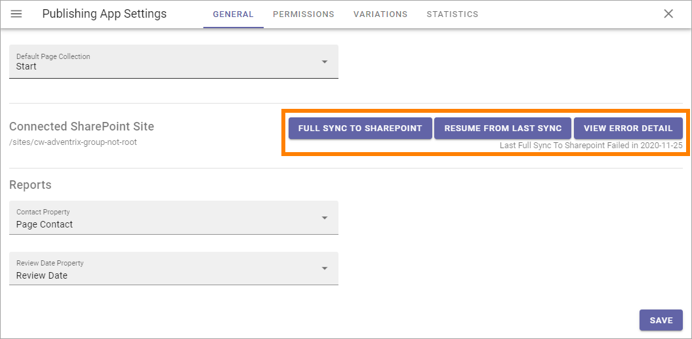

Mapping a user profile property
**********************************
In order to map an Omnia property to a user profile property, we need to first find the user profile property in sharepoint. In order to do that, lets look at this example:

Here we will try mapping the property Department:

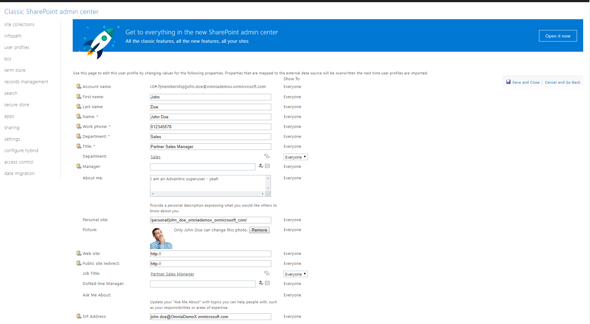

In order to access this view, follow these steps:

1. Visit the sharepoint admin center by typing in https://((insert the name of your tenant)-admin.sharepoint.com 
2. Click on user profiles in the left menu.
3. Click on Manager user profiles.
4. Type in the name of the user you wish to inspect.

In order for a user profile property to be used in omnia, it has to be mapped first, and in order for it to be mapped, we need to know the name of the property, which can be found in search:

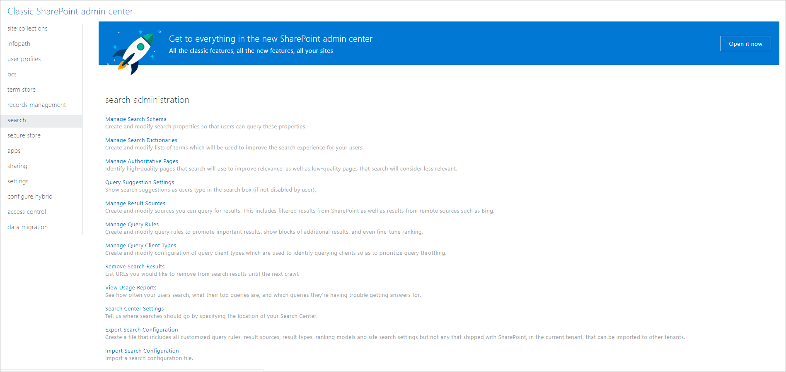

We then go in to Manage search Schema:

.. image:: sharepoint-managesearch.png

We then type in the name of the property we are looking for, which in this case is Department: 

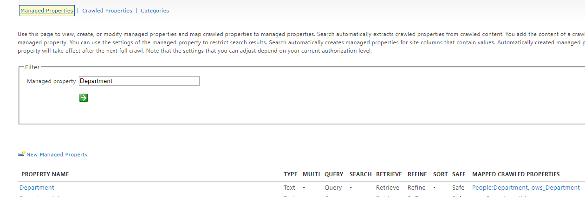

Here we can see on the left the name of the Managed property is indeed Department, and the crawled properties are People:Department and ows_department.

We also notice that department is of type Text, it is also queryable, retrievable and refinable but not searchable or sortable, which means that when we map it on omnia, it needs to have the same attrbutes if we want it have the same functionality
as it does now. Mapping it looks like the following: 

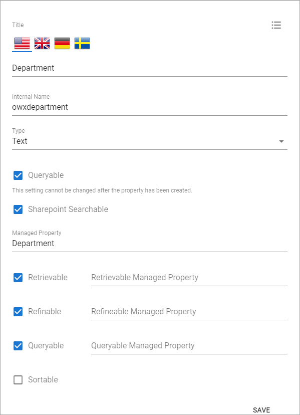

Department is now a usable property that functions as both a value displayer and a refiner in blocks like People roll up and features like the search.

Use the dust bin to delete a property, or the pen to edit one:

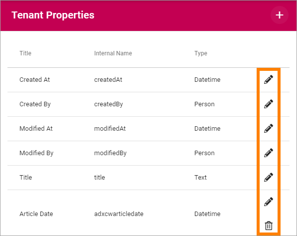

Note that some Properties can not be deleted, but they can be edited. For them only the pen is shown.

Property Sets
***************
This is as the name says, an option where you can create sets of several Enterprise Properties and handle the set instead of each individual property. As a first step Property Sets is implemented for Controlled Documents.

A list of useful Property Sets can already be in place, for example:

.. image:: property-sets.png

To edit a Property Set, click the pen. To delete a Property Set, click the dust bin.

When you edit a Property Set, something like the following can be shown:

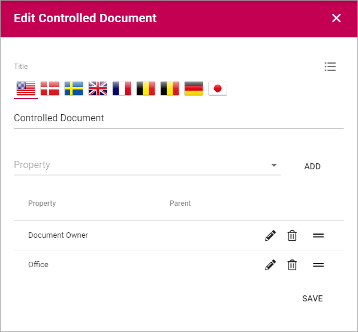

This set consists of two Properties; Document Owner and Office.

The settings are used the same way as when creating a new set, see below.

Creating a new Property Set
----------------------------
To create a new Property Set, do the following:

1. Click the plus.

.. image:: property-set-click-plus.png

Use the following settings:

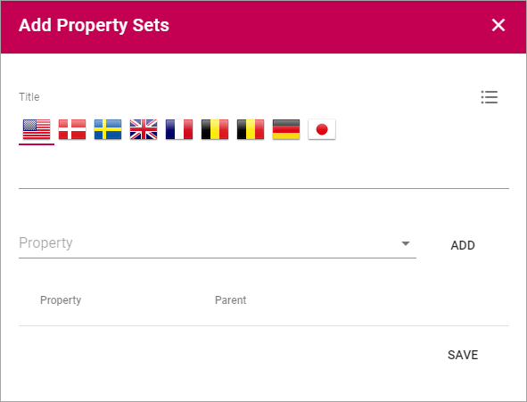

2. Add a Title for the Property Set. You can add a title in all langauges active in the tenant. Default language is mandatory.
3. Open the list and select a Property.
4. Click "Add".

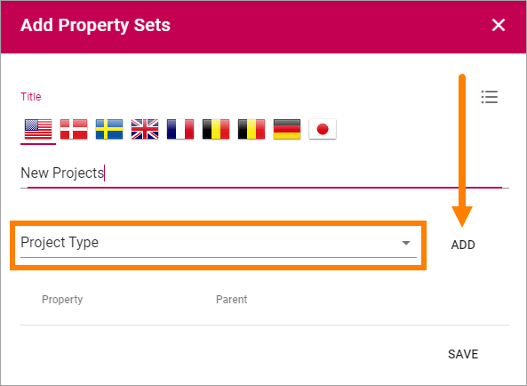

5. Set additional settings for the Property, if required.

.. image:: property-set-add-additional.png

6. Continue the same way until you have added all the properties for the set.
7. To change the order, grab a property by the icon to the far right, and drop the property where you want it.

.. image:: property-set-add-drag.png

8. When you're finished, click "Save".

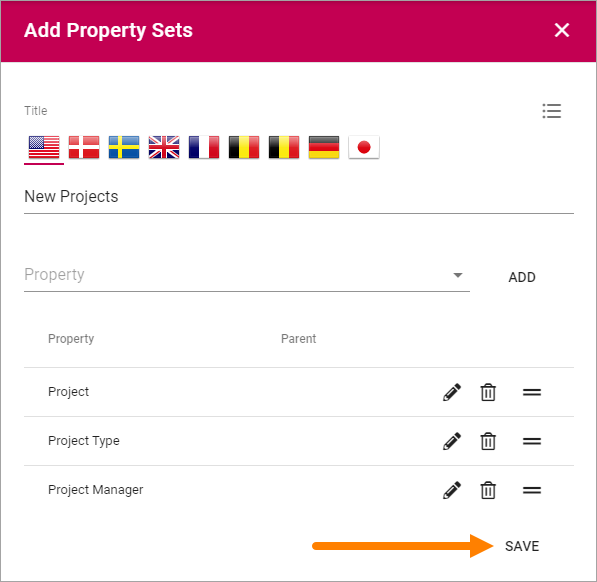

Targeting Properties
**********************
Here you define which Properties to use for Targeting. 

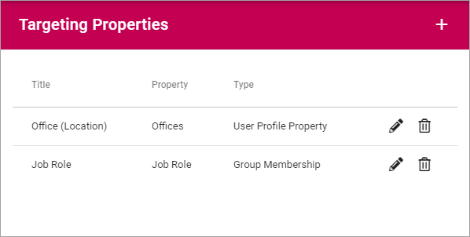

The Properties must be added to the Enterprise Properties list to be able to be used here, as well as be of the type "Taxonomy".

Add a Target Property
-----------------------
To add a Target Property definition, click the plus:

.. image:: targeting-properties-click-plus.png

Use the following settings:

.. image:: targeting-properties-settings.png

+ **Title**: Add the Title to be shown for editors, for the Property, when targeting.
+ **Property**: Select Tenant Property from the list.
+ **Type**: Select Type of targeting for this Property; Group Membership, User Profile Property or Azure AD Property.

Delete or edit Target Property
--------------------------------
To delete a Target Property, click the dust bin, to edit it, click the pen:

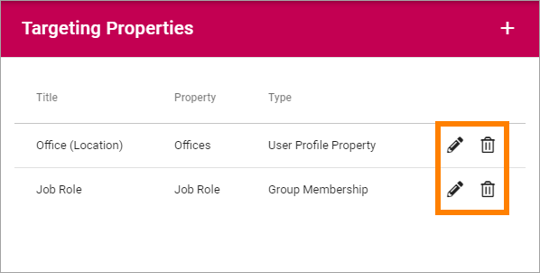
